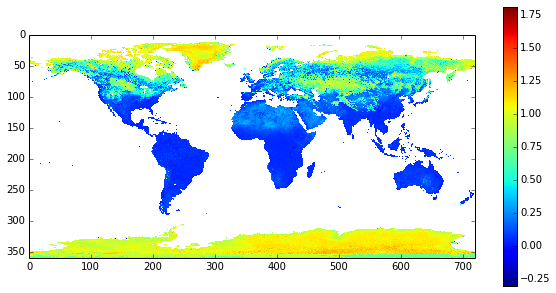
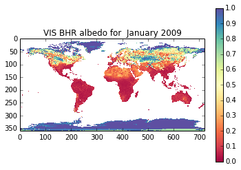
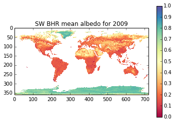
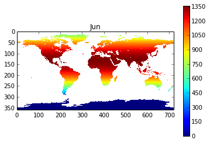

3. Plotting and Numerical Python
================================

3.1 In this session
-------------------

In this session, we will introduce and use some packages that you will
commonly use in scientific programming.

These are:

-  `numpy <http://www.numpy.org/>`__: NumPy is the fundamental package
   for scientific computing with Python
-  `matplotlib <http://matplotlib.org/>`__: Python 2D plotting library

We will also introduce some additional programming concepts, and set an
exercise that you can do and get feedback on.

3.2.1 Getting Started
~~~~~~~~~~~~~~~~~~~~~

To get started for this session, you should go to your ``Data`` area and
download or update your material for this course.

If you haven't previously downloaded the course, type the following at
the unix prompt (illustrated by ``berlin%`` here):

| ``berlin% cd Data``
| ``berlin% git clone https://github.com/profLewis/geogg122.git``
| ``berlin% cd geogg122/Chapter3_Scientific_Numerical_Python``

If you already have a clone of the course repository (which you should
have from last week):

| ``berlin% cd Data/geogg122``
| ``berlin% git reset --hard HEAD``
| ``berlin% git pull``
| ``berlin% cd Chapter3_Scientific_Numerical_Python``

This will update your local copy with any new notes or files. Any
additional files that you yourself have created should be still where
they were.

E3.1 Exercise: listing
----------------------

**Using Python, produce a listing of the files in the subdirectory
``data`` of ``geogg122/Chapter3_Scientific_Numerical_Python`` that end
with ``.nc`` and put this listing in a file called
``files/data/data.dat`` with each entry on a different line**

3.2 Getting and Plotting Some Data: netCDF format
-------------------------------------------------

3.2.1 GlobAlbedo data
~~~~~~~~~~~~~~~~~~~~~

Before we start to use these new packages, we will start by getting some
data for you to use and show you how to read it in and do some basic
plotting.

Today, we will be using the `ESA GlobAlbedo
data <http://www.globalbedo.org>`__.

These data come in different spatial resolutions, but here we will use
the global product at 0.5 degrees.

The files are acessible via ``http`` in the directory:

``http://www.globalbedo.org/GlobAlbedoXX/mosaics/YYYY/0.5/monthly``

The filenames are of the pattern:

``GlobAlbedo.YYYYMM.mosaic.5.nc.gz``

where ``YYYY`` is the year (e.g. 2009) and MM is the month (``01`` is
January, ``12`` is December).

``XX`` is a code which is given below.

The data are in ```netCDF``
format <http://netcdf4-python.googlecode.com/svn/trunk/docs/netCDF4-module.html>`__
which is a common binary data format.

.. code:: python

    # versioning (?) codes. At present these are:
    XX = {1998:95,1999:95,2000:97,2001:97,2002:26,2003:66,2004:54,2005:54,\
          2006:29,2007:25,2008:53,2009:56,2010:56,2011:78}
    
    # but check on http://www.globalbedo.org by trying to order some data
    
    year = 2009
    
    root = 'http://www.globalbedo.org/GlobAlbedo%d/mosaics/%d/0.5/monthly/'%(XX[year],year)
    
    # example filename : use formatting string:
    # %d%02d
    month = 1
    url = root + '/GlobAlbedo.%d%02d.mosaic.5.nc.gz'%(year,month)
    
    print url

.. parsed-literal::

    http://www.globalbedo.org/GlobAlbedo56/mosaics/2009/0.5/monthly//GlobAlbedo.200901.mosaic.5.nc.gz


3.2.2 Loading from within Python
~~~~~~~~~~~~~~~~~~~~~~~~~~~~~~~~

You *could* download the data youself (explained in the 'advanced'
section), but these files are available to you in this case in the
directory ``files/data`` for the year 2009.

.. code:: python

    !ls files/data/GlobAlbedo*.nc

.. parsed-literal::

    files/data/GlobAlbedo.200901.mosaic.5.nc
    files/data/GlobAlbedo.200902.mosaic.5.nc
    files/data/GlobAlbedo.200903.mosaic.5.nc
    files/data/GlobAlbedo.200904.mosaic.5.nc
    files/data/GlobAlbedo.200905.mosaic.5.nc
    files/data/GlobAlbedo.200906.mosaic.5.nc
    files/data/GlobAlbedo.200907.mosaic.5.nc
    files/data/GlobAlbedo.200908.mosaic.5.nc
    files/data/GlobAlbedo.200909.mosaic.5.nc
    files/data/GlobAlbedo.200910.mosaic.5.nc
    files/data/GlobAlbedo.200911.mosaic.5.nc
    files/data/GlobAlbedo.200912.mosaic.5.nc
    files/data/GlobAlbedo.201001.mosaic.5.nc
    files/data/GlobAlbedo.201002.mosaic.5.nc
    files/data/GlobAlbedo.201003.mosaic.5.nc
    files/data/GlobAlbedo.201004.mosaic.5.nc
    files/data/GlobAlbedo.201005.mosaic.5.nc
    files/data/GlobAlbedo.201006.mosaic.5.nc
    files/data/GlobAlbedo.201007.mosaic.5.nc
    files/data/GlobAlbedo.201008.mosaic.5.nc
    files/data/GlobAlbedo.201009.mosaic.5.nc
    files/data/GlobAlbedo.201010.mosaic.5.nc
    files/data/GlobAlbedo.201011.mosaic.5.nc
    files/data/GlobAlbedo.201012.mosaic.5.nc


We use the ``netCDF4`` module to read netCDF data:

.. code:: python

    from netCDF4 import Dataset
    
    root = 'files/data/'
    
    # example filename : use formatting string:
    # %d%02d
    year = 2009
    month = 1
    local_file = root + 'GlobAlbedo.%d%02d.mosaic.5.nc'%(year,month)
    print local_file
    
    # load the netCDF data from the file local_file
    nc = Dataset(local_file,'r')
    
    # the netCDF file has dimensions
    # stored as a dictionary
    print nc.dimensions.keys()
    
    # and variables also as a dictionary
    print nc.variables.keys()

.. parsed-literal::

    files/data/GlobAlbedo.200901.mosaic.5.nc
    [u'lat', u'lon']
    [u'DHR_VIS', u'DHR_NIR', u'DHR_SW', u'BHR_VIS', u'BHR_NIR', u'BHR_SW', u'DHR_sigmaVIS', u'DHR_sigmaNIR', u'DHR_sigmaSW', u'BHR_sigmaVIS', u'BHR_sigmaNIR', u'BHR_sigmaSW', u'Weighted_Number_of_Samples', u'Relative_Entropy', u'Goodness_of_Fit', u'Snow_Fraction', u'Data_Mask', u'Solar_Zenith_Angle', u'lat', u'lon']


Here, we will want to access ``'DHR_VIS'``, ``'DHR_NIR'`` and
``'DHR_SW'``, which are the bihemispherical reflectance (DHR: 'black sky
albedo' -- the albedo under directional illumination conditions) for
visible, near infrared and total shortwave wavebands:

.. code:: python

    # explicitly as:
    albedo = [nc.variables['DHR_VIS'],nc.variables['DHR_NIR'],nc.variables['DHR_SW']]
.. code:: python

    # or more neatly as:
    
    data_fields = ['DHR_VIS','DHR_NIR','DHR_SW']
    
    albedo = [nc.variables[f] for f in data_fields]
3.2.3 Plotting an image
~~~~~~~~~~~~~~~~~~~~~~~

We can plot image data using the package ``pylab`` (from
``matplotlib``).

If you are running this as a notebook, make sure you use:

``ipython notebook --pylab=inline`` if you want the images to appear in
the notebook.

First we have to import ``pylab``, which we will refer to a ``plt`` (se
``import pylab as plt``).

The basic function for plotting an image is ``plt.imshow``:

.. code:: python

    import pylab as plt
    
    plt.imshow(albedo[0])


.. parsed-literal::

    <matplotlib.image.AxesImage at 0x2b05430059d0>


.. image:: Scientific_Numerical_Python_files/Scientific_Numerical_Python_21_1.png


Thats fine, but we might apply a few modifications to make a better
plot:

.. code:: python

    import pylab as plt
    
    # change the figure size
    plt.figure(figsize=(10, 5))
    
    # use nearest neighbour interpolation
    plt.imshow(albedo[0],interpolation='nearest')
    
    # show a colour bar 
    plt.colorbar()


.. parsed-literal::

    <matplotlib.colorbar.Colorbar instance at 0x10bccb90>





Albedo should lie between 0 and 1, so there are clearly a few 'funnies'
that we might flag later.

For now, we might like to plot *only* values between 0 and 1
(thresholding at those values).

Also if we don't like this `colour map, we can try
another <http://wiki.scipy.org/Cookbook/Matplotlib/Show_colormaps>`__:

.. code:: python

    import pylab as plt
    
    # change the figure size
    plt.figure(figsize=(10,5))
    
    # use nearest neighbour interpolation
    plt.imshow(albedo[0],interpolation='nearest',cmap=plt.get_cmap('binary'),vmin=0.0,vmax=1.0)
    
    # show a colour bar 
    plt.colorbar()


.. parsed-literal::

    <matplotlib.colorbar.Colorbar instance at 0x1172e5a8>


.. image:: Scientific_Numerical_Python_files/Scientific_Numerical_Python_25_1.png


If we wanted to save the plot and put a title on:

.. code:: python

    import pylab as plt
    
    # set up a month dictionary
    month_list = ['January','February','March','April','May','June',\
                  'July','August','September','October','November','December']
    # make a dictionary from 2 lists
    month_dict = dict(zip(range(1,13),month_list))
    
    # change the figure size
    plt.figure(figsize=(10,5))
    # plt.clf(): clear the figure in case anything in it before
    plt.clf()
    
    plt.title('VIS BHR albedo for %s %d'%(month_dict[month],year))
    # use nearest neighbour interpolation
    plt.imshow(albedo[0],interpolation='nearest',cmap=plt.get_cmap('Spectral'),vmin=0.0,vmax=1.0)
    
    # show a colour bar 
    plt.colorbar()
    plt.savefig('files/data/albedo.jpg')


.. image:: Scientific_Numerical_Python_files/Scientific_Numerical_Python_27_0.png


E3.2 Exercise: Making Movies
~~~~~~~~~~~~~~~~~~~~~~~~~~~~

E3.2.1 Software
~~~~~~~~~~~~~~~

You can *sort of* make `movies in
pylab <http://matplotlib.org/faq/howto_faq.html#make-a-movie>`__, but
you generally have to make a system call to unix at some point, so it's
probably easier to do this all in unix with the utility
```convert`` <http://www.imagemagick.org/script/convert.php>`__.

At the unix prompt, chack that you have access to convert:

.. code:: bash

    berlin% which convert
    /usr/bin/convert

If this doesn't come up with anything useful, there is probably a
version in ``/usr/bin/convert`` or ``/usr/local/bin/convert`` (If you
don't have it on your local machine, install
```ImageMagick`` <http://www.imagemagick.org/script/index.php>`__ which
contains the command line tool ``convert``).

To use this, e.g.:

from the unix command line:

.. code:: bash

    berlin% cd ~/Data/geogg122/Chapter3_Scientific_Numerical_Python  
    berlin% convert files/data/albedo.jpg files/data/albedo.gif  

or from within a notebook:

.. code:: python

    !convert files/data/albedo.jpg files/data/albedo.gif
Or, more practically here, you can run a unix command directly from
Python:

.. code:: python

    import os
    cmd = 'convert files/data/albedo.jpg files/data/albedo.gif'
    os.system(cmd)


.. parsed-literal::

    0


This will convert the file ``files/data/albedo.jpg`` (in jpeg format) to
``files/data/albedo.gif`` (in gif format).

.. figure:: files/data/albedo.gif
   :alt: albedo

   albedo

We can also use ``convert`` to make animated gifs, which is one way of
making a movie.

E3.2.2 Looping over a set of images
~~~~~~~~~~~~~~~~~~~~~~~~~~~~~~~~~~~

You have all of the code you need above to be able to read a GlobAlbedo
file for a given month and waveband in Python and save a picture in jpeg
format, but to recap for ``BHR_VIS``:

.. code:: python

    from netCDF4 import Dataset
    import pylab as plt
    import os
    
    root = 'files/data/'
    
    month_list = ['January','February','March','April','May','June',\
                  'July','August','September','October','November','December']
    # make a dictionary from 2 lists
    month_dict = dict(zip(range(1,13),month_list))
    
    # example filename : use formatting string:
    # %d%02d
    year = 2009
    
    
    # set the month
    month = 1
    
    ''' Read the data '''
    local_file = root + 'GlobAlbedo.%d%02d.mosaic.5.nc'%(year,month)
    # load the netCDF data from the file f.filename
    nc = Dataset(local_file,'r')
    band = nc.variables['DHR_VIS']
    
    ''' Plot the data and save as picture jpeg format '''
    # make a string with the output file name
    out_file = root + 'GlobAlbedo.%d%02d.jpg'%(year,month)
    # plot
    plt.figure()
    plt.clf()
    # %9s forces the string to be 8 characters long
    plt.title('VIS BHR albedo for %8s %d'%(month_dict[month],year))
    # use nearest neighbour interpolation
    plt.imshow(band,interpolation='nearest',cmap=plt.get_cmap('Spectral'),vmin=0.0,vmax=1.0)
    # show a colour bar 
    plt.colorbar()
    plt.savefig(out_file)
    
    ''' Convert the file to gif '''
    # set up the unix command which is of the form 
    # convert input output
    # Here input will be out_file
    # and output we can get with out_file.replace('.jpg','.gif')
    # i.e. replacing where it says .jpg with .gif
    cmd = 'convert %s %s'%(out_file,out_file.replace('.jpg','.gif'))
    os.system(cmd)


.. parsed-literal::

    0





**Modify the code above to loop over each month, so that it generates a
set of gif format files for the TOTAL SHORTWAVE ALBEDO**

You should confirm that these exist, and that the file modification time
is when you ran it (not when I generated the files for these notes,
which is Oct 10 2013).

.. code:: python

    ls -l files/data/GlobAlbedo*gif

.. parsed-literal::

    -rw-rw-r-- 1 plewis plewis 340658 Oct 11 20:04 files/data/GlobAlbedo.2009.SW.1.gif
    -rw-rw-r-- 1 plewis plewis 340658 Oct 11 20:04 files/data/GlobAlbedo.2009.SW.gif
    -rw-rw-r-- 1 plewis plewis  26593 Oct 14 11:54 files/data/GlobAlbedo.200901.gif
    -rw-rw-r-- 1 plewis plewis  28139 Oct 11 20:04 files/data/GlobAlbedo.200902.gif
    -rw-rw-r-- 1 plewis plewis  28259 Oct 11 20:04 files/data/GlobAlbedo.200903.gif
    -rw-rw-r-- 1 plewis plewis  28249 Oct 11 20:04 files/data/GlobAlbedo.200904.gif
    -rw-rw-r-- 1 plewis plewis  28468 Oct 11 20:04 files/data/GlobAlbedo.200905.gif
    -rw-rw-r-- 1 plewis plewis  28672 Oct 11 20:04 files/data/GlobAlbedo.200906.gif
    -rw-rw-r-- 1 plewis plewis  28656 Oct 11 20:04 files/data/GlobAlbedo.200907.gif
    -rw-rw-r-- 1 plewis plewis  28275 Oct 11 20:04 files/data/GlobAlbedo.200908.gif
    -rw-rw-r-- 1 plewis plewis  28952 Oct 11 20:04 files/data/GlobAlbedo.200909.gif
    -rw-rw-r-- 1 plewis plewis  28450 Oct 11 20:04 files/data/GlobAlbedo.200910.gif
    -rw-rw-r-- 1 plewis plewis  28570 Oct 11 20:04 files/data/GlobAlbedo.200911.gif
    -rw-rw-r-- 1 plewis plewis  28438 Oct 11 20:04 files/data/GlobAlbedo.200912.gif
    

E3.2.3 Make the movie
~~~~~~~~~~~~~~~~~~~~~

The unix command to convert these files to an animated gif is:

.. code:: bash

    convert -delay 100  -loop 0  files/data/GlobAlbedo.2009??.gif files/data/GlobAlbedo.2009.SW.gif

**Run this (ideally, from within Python) to create the animated gif
GlobAlbedo.2009.SW.gif**

Again, confirm that *you* created this file (and it is not just a
version you downloaded):

.. code:: python

    ls -l files/data/GlobAlbedo.2009.SW.gif

.. parsed-literal::

    -rw-rw-r-- 1 plewis plewis 340658 Oct 11 20:04 files/data/GlobAlbedo.2009.SW.gif
    

.. figure:: files/data/GlobAlbedo.2009.SW.gif
   :alt: 

3.3 Numpy
---------

3.3.1 Numpy Arrays
~~~~~~~~~~~~~~~~~~

At the heart of the
```numpy`` <http://docs.scipy.org/doc/numpy/contents.html>`__ module is
a a powerful N-dimensional array object.

Among many other things, this allows us to do arithmetic (and other
operations) directly on arrays, rather than having to loop over each
element (as we did with lists for example).

Two main benefits of this are:

-  the code is much easier to read
-  running the code is much more efficient (because, 'under the hood' as
   it were of the programming language, we can do fast operations such
   as vector processing).

As our first example, let's read the shortwave albedo data we examined
above into a numpy array.

We will start with just one month of data:

.. code:: python

    from netCDF4 import Dataset
    import numpy as np
    
    root = 'files/data/'
    year = 2009
    
    
    # set the month
    month = 1
    
    ''' Read the data '''
    local_file = root + 'GlobAlbedo.%d%02d.mosaic.5.nc'%(year,month)
    # load the netCDF data from the file f.filename
    nc = Dataset(local_file,'r')
    band = np.array(nc.variables['DHR_SW'])
    
    # some interesting things about numpy arrays
    print "the array type is now",type(band)
    print "the shape of the array is",band.shape 
    print "the size of the array is",band.size
    print "the number of dimensions is",band.ndim
    print "the data type in the array is",band.dtype

.. parsed-literal::

    the array type is now <type 'numpy.ndarray'>
    the shape of the array is (360, 720)
    the size of the array is 259200
    the number of dimensions is 2
    the data type in the array is float32


A few things to notice here.

First, we imported the numpy module using

::

    import numpy as np

which means that locally, we refer to this module as ``np``.

Second, we converted from the format that was read from the netCDF file
to a numpy array with:

::

    band = np.array(nc.variables['DHR_SW'])

so this is one way to convert from other data types to numpy
representation (e.g. ``np.array([1,2,3])`` for a conversion from a
list).

Then we saw at the end of this code a number of commonly used methods
for the numpy class that provide us with information on the ``shape`` of
the array (N.B. this is (rows,cols) as you might notice from the plots
we generated), the total size (number of elements), number of
dimansions.

We also saw that we could access the array data type (``dtype``). This
is very different to a ``list`` or ``tuple`` then, because a numpy array
can *only* contain data of a single data type (but lists or tuples can
have different data types in each element).

astype
^^^^^^

We can convert *between* data types using ``astype``:

.. code:: python

    a = np.array([1,2,3])
    print a.dtype

.. parsed-literal::

    int64


.. code:: python

    b = a.astype(float)
    print b
    print b.dtype

.. parsed-literal::

    [ 1.  2.  3.]
    float64


slice
^^^^^

As you would expect, we can slice in a numpy array. All that is
different is that we set up a slice of each dimension, e.g.:

.. code:: python

    # see if you can work out why this is 
    # the size, shape and ndim it is
    
    print band[-3:-1,10:30:5]
    print band[-3:-1,10:30:5].shape
    print band[-3:-1,10:30:5].ndim

.. parsed-literal::

    [[ 0.65842855  0.57553321  0.8013677   0.80455124]
     [ 0.66181606  0.66181606  0.6632846   0.58462834]]
    (2, 4)
    2


If you want to specify **all elements in a given dimension** you need to
use at least one ``:``, e.g.

.. code:: python

    # what does this mean?
    
    print band[10:20,0]
    print band[10:20,0].shape

.. parsed-literal::

    [ nan  nan  nan  nan  nan  nan  nan  nan  nan  nan]
    (10,)


nan, inf
^^^^^^^^

Some of the data in the array ``band`` appear as ``nan`` ('not a
number'), which is how, in this dataset, non-valid pixels are specified.

``nan`` is also what you would get for undefined results from
arithmetic:

.. code:: python

    a = np.array([0., 1.])
    b = np.array([0., 0.])
    c = a/b
    print c
    print 'so 0./0. =',c[0]
    print 'so 1./0. =',c[1]

.. parsed-literal::

    [ nan  inf]
    so 0./0. = nan
    so 1./0. = inf


``inf`` here means 'infinity', which is what anything other than zero
divided by zero is.

We can check to see if some value is ``nan`` or ``inf`` e.g:

.. code:: python

    print 'is c nan?',np.isnan(c)
    print 'is c inf?',np.isinf(c)

.. parsed-literal::

    is c nan? [ True False]
    is c inf? [False  True]


Generally we would want to avoid processing array values that contained
``nan`` or ``inf`` as any arithmetic involving these is unlikely tell us
more than we already know:

.. code:: python

    print 'inf + 1\t\t=',np.inf + 1
    print 'inf - np.inf\t=',np.inf - np.inf
    print 'nan / 2 \t\t=',np.nan / 2

.. parsed-literal::

    inf + 1		= inf
    inf - np.inf	= nan
    nan / 2 		= nan


Or, trying to e.g. calculate the sum of values in the array ``band``:

.. code:: python

    print band.sum()

.. parsed-literal::

    nan


which is not really what we wanted.

We have seen above that ``np.isnan(c)`` and ``np.isinf(c)`` result in a
``bool`` array of the same shape as the input array.

We can use these to mask out things we don't want, e.g.

.. code:: python

    no_data = np.isnan(band)
    print no_data

.. parsed-literal::

    [[ True  True  True ...,  True  True  True]
     [ True  True  True ...,  True  True  True]
     [ True  True  True ...,  True  True  True]
     ..., 
     [False False False ..., False False False]
     [False False False ..., False False False]
     [False False False ..., False False False]]


This will be ``True`` where the data in ``band`` were ``nan`` ... but
what we might often want is the opposite of this, i.e. ``True`` where
the data are valid.

We might guess that we could simply type:

masked array
^^^^^^^^^^^^

There is a special type of object in ``numpy`` called a `masked
array <http://docs.scipy.org/doc/numpy/reference/maskedarray.html>`__.
With this array representation, operations are *only* performed where
the data mask is ``False``. We need to import the masked array module
``ma`` from numpy:

.. code:: python

    import numpy.ma as ma
    
    masked_band = ma.array(band)
    print masked_band.mask

.. parsed-literal::

    False


When we convert the representation from a normal ``numpy`` array to a
masked array using ``ma.array()``, the default mask is ``False`` (which
means no mask).

In this case, we want to set the mask to ``True`` where the data are
``nan``. We would normally do this when setting up the masked array:

.. code:: python

    masked_band = ma.array(band,mask=np.isnan(band))
    print "so the array is now\n",masked_band
    print "\nwith a mask\n",masked_band.mask

.. parsed-literal::

    so the array is now
    [[-- -- -- ..., -- -- --]
     [-- -- -- ..., -- -- --]
     [-- -- -- ..., -- -- --]
     ..., 
     [0.5722442269325256 0.5722442269325256 0.5722442269325256 ...,
      0.5790106058120728 0.5790106058120728 0.5790106058120728]
     [0.5722442269325256 0.5722442269325256 0.5722442269325256 ...,
      0.5790106058120728 0.5790106058120728 0.5790106058120728]
     [0.5722442269325256 0.5722442269325256 0.5722442269325256 ...,
      0.5790106058120728 0.5790106058120728 0.5790106058120728]]
    
    with a mask
    [[ True  True  True ...,  True  True  True]
     [ True  True  True ...,  True  True  True]
     [ True  True  True ...,  True  True  True]
     ..., 
     [False False False ..., False False False]
     [False False False ..., False False False]
     [False False False ..., False False False]]


3.3.2 Reading data from multiple files
~~~~~~~~~~~~~~~~~~~~~~~~~~~~~~~~~~~~~~

zeros, ones, empty
^^^^^^^^^^^^^^^^^^

Suppose we want to read in all 12 months of SW albedo data following on
from the example above.

.. code:: python

    from netCDF4 import Dataset
    import numpy as np
    
    root = 'files/data/'
    year = 2009
    
    # which months?
    months = xrange(1,13)
    
    # loop over month
    # but right now we'll just pretend that we're
    # doing that and consider what happens the first time 
    # we are in our loop
    #
    # set i as index counter
    # set the variable month to be 
    # months[0]
    i = 0
    month = months[i]
    
    # this then is the file we want
    local_file = root + 'GlobAlbedo.%d%02d.mosaic.5.nc'%(year,month)
    
    # load the netCDF data from the file local_file
    nc = Dataset(local_file,'r')
    band = np.array(nc.variables['DHR_SW'])
Looking at what would happen when we read the first file, we can see
that we don't actually know how large the whole dataset will be until we
have read our first file.

We know that we will want dimensions of ``(12,nrows,ncols)`` (or better
still, ``(len(months),nrows,ncols)`` in case we decide to change
months), but until we have read the data into the variable ``band``
with:

::

    band = np.array(nc.variables['DHR_SW'])

we don't know how many rows or columns the dataset has (well, we might
do ... but we want to try to design flexible code, where if the size of
the datasets changed, our code would still operate correctly!).

But, when we *have* first read some data, *then* we would be in a
position to say what the shape of the whole dataset should be. At that
point, we could use the method:

::

    np.empty(shape)

to (in essence) set aside ('allocate') some memory to store these data.
There are three main options for this:

-  ``np.zeros(shape)`` : set up an array with shape defined by ``shape``
   and initialise with 0
-  ``np.ones(shape)`` : set up an array with shape defined by ``shape``
   and initialise with 1
-  ``np.empty(shape)`` : set up an array with shape defined by ``shape``
   but don't initialise (so, in theory, a little faster, but can be
   filled with randon junk)

we can control the ``dtype`` of the array with a ``dtype`` option. e.g.:

.. code:: python

    print '-'*30;print '1-D arrays';print '-'*30;
    print 'np.zeros(1):',np.zeros(1)  # 1 : 1D array
    print 'np.zeros(2):',np.zeros(2)  # 2 : 1D array
    
    print '\n' + '-'*30;print '2- and 3-D arrays';print '-'*30;
    print 'np.zeros((1,2)):\n',np.zeros((1,2))  # default dtype is float
    print 'np.zeros((2,2)):\n',np.zeros((2,2))  # 2 X 2
    print 'np.zeros((2,2,3)):\n',np.zeros((2,2,3))  # 2 X 2 X 3
    
    print '\n' + '-'*30;print 'empty and ones';print '-'*30;
    print 'np.empty((1,2)):\n',np.empty((1,2))  # default dtype is float
    print 'np.ones((1,2)):\n',np.ones((1,2))  # default dtype is float
    
    print '\n' + '-'*30;print 'Changing the data type';print '-'*30;
    print 'np.ones((1,2),dtype=int):\n',np.ones((1,2),dtype=int)  #  dtype int
    print 'np.empty((1,2),dtype=int):\n',np.empty((1,2),dtype=int)  #  dtype int
    print 'np.ones((1,2),dtype=bool):\n',np.ones((1,2),dtype=bool)  #  dtype bool
    print 'np.zeros((1,2),dtype=bool):\n',np.zeros((1,2),dtype=bool)  #  dtype bool
    print 'np.empty((1,2),dtype=bool):\n',np.empty((1,2),dtype=bool)  #  dtype bool 
    
    print '\n' + '-'*30;print 'Note that we can have a string array';print '-'*30;
    print 'np.ones((1,2),dtype=str):\n',np.ones((1,2),dtype=str)  #  dtype str
    
    print '\n' + '-'*30;print 'Or even e.g. a list array';print '-'*30;
    print 'np.ones((2,2),dtype=list):\n',np.ones((2,2),dtype=list)  #  dtype list
    print 'np.empty((2,2),dtype=list):\n',np.empty((2,2),dtype=list)  #  dtype list


.. parsed-literal::

    ------------------------------
    1-D arrays
    ------------------------------
    np.zeros(1): [ 0.]
    np.zeros(2): [ 0.  0.]
    
    ------------------------------
    2- and 3-D arrays
    ------------------------------
    np.zeros((1,2)):
    [[ 0.  0.]]
    np.zeros((2,2)):
    [[ 0.  0.]
     [ 0.  0.]]
    np.zeros((2,2,3)):
    [[[ 0.  0.  0.]
      [ 0.  0.  0.]]
    
     [[ 0.  0.  0.]
      [ 0.  0.  0.]]]
    
    ------------------------------
    empty and ones
    ------------------------------
    np.empty((1,2)):
    [[  0.00000000e+000   1.56900585e-315]]
    np.ones((1,2)):
    [[ 1.  1.]]
    
    ------------------------------
    Changing the data type
    ------------------------------
    np.ones((1,2),dtype=int):
    [[1 1]]
    np.empty((1,2),dtype=int):
    [[        0 225037488]]
    np.ones((1,2),dtype=bool):
    [[ True  True]]
    np.zeros((1,2),dtype=bool):
    [[False False]]
    np.empty((1,2),dtype=bool):
    [[ True  True]]
    
    ------------------------------
    Note that we can have a string array
    ------------------------------
    np.ones((1,2),dtype=str):
    [['1' '1']]
    
    ------------------------------
    Or even e.g. a list array
    ------------------------------
    np.ones((2,2),dtype=list):
    [[1 1]
     [1 1]]
    np.empty((2,2),dtype=list):
    [[None None]
     [None None]]


So, once we have read one band, we could write:

.. code:: python

    from netCDF4 import Dataset
    import numpy as np
    
    root = 'files/data/'
    year = 2009
    
    # which months?
    months = xrange(1,13)
    
    # loop over month
    # but right now we'll just pretend that we're
    # doing that and consider what happens the first time 
    # we are in our loop
    #
    # set i as index counter
    # set the variable month to be 
    # months[0]
    i = 0
    month = months[i]
    
    # this then is the file we want
    local_file = root + 'GlobAlbedo.%d%02d.mosaic.5.nc'%(year,month)
    
    # load the netCDF data from the file local_file
    nc = Dataset(local_file,'r')
    band = np.array(nc.variables['DHR_SW'])
    if i == 0:  # first band read
        # set up a tuple (or list) saying what shape we want the data
        shape = (len(months),) + band.shape
        data = np.zeros(shape)
        
    print "I set up the array data of shape",data.shape,"with",data.ndim,"dimensions"

.. parsed-literal::

    I set up the array data of shape (12, 360, 720) with 3 dimensions


We also use slicing when assigning ('loading', if you like) data into a
larger array:

.. code:: python

    data[i,:,:] = band
But this will *only* work if what you are trying to load and where you
are tryng to load it are the same *shape*:

::

    data[i,:,:].shape == band.shape

which they are in this case.

Putting this all together then:

.. code:: python

    # this then is the file we want
    local_file = root + 'GlobAlbedo.%d%02d.mosaic.5.nc'%(year,month)
    
    # load the netCDF data from the file local_file
    nc = Dataset(local_file,'r')
    band = np.array(nc.variables['DHR_SW'])
    if i == 0:  # first band read
        # set up a tuple (or list) saying what shape we want the data
        shape = (len(months),) + band.shape
        data = np.empty(shape)
        
    # load band into the data array
    data[i,::] = band
And setting the loop around this:

.. code:: python

    from netCDF4 import Dataset
    import numpy as np
    
    root = 'files/data/'
    year = 2009
    
    # which months?
    months = xrange(1,13)
    
    # loop over month
    # use enumerate so we have an index counter
    for i,month in enumerate(months):
        # this then is the file we want
        local_file = root + 'GlobAlbedo.%d%02d.mosaic.5.nc'%(year,month)
        
        # load the netCDF data from the file local_file
        nc = Dataset(local_file,'r')
        band = np.array(nc.variables['DHR_SW'])
        if i == 0:  # first band read
            # set up a tuple (or list) saying what shape we want the data
            shape = (len(months),) + band.shape
            data = np.empty(shape)
            
        # load band into the data array
        data[i,::] = band
so now we have all of the data loaded into the array ``data``.

An alternative way of achieving this same effect is to use a list,
creating an empty list before going into the loop and appending ``band``
to the list each time we read a new band.

.. code:: python

    from netCDF4 import Dataset
    import numpy as np
    
    root = 'files/data/'
    year = 2009
    
    # which months?
    months = xrange(1,13)
    
    # empty list
    data = []
    
    # loop over month
    # use enumerate so we have an index counter
    for i,month in enumerate(months):
        # this then is the file we want
        local_file = root + 'GlobAlbedo.%d%02d.mosaic.5.nc'%(year,month)
        
        # load the netCDF data from the file local_file
        nc = Dataset(local_file,'r')
        # append what we read to the list called data
        data.append(np.array(nc.variables['DHR_SW']))
        
    # convert data to a numpy array (its a list of arrays at the moment)
    data = np.array(data)
In many ways, this is a simpler and 'cleaner' way of setting up a 3-D
array from reading multiple 2-D arrays. If the array is *very* large, it
can be less efficient (you have to convert a huge list to an array at
the end), but that is not normally something to worry about and this
approach is often preferable.

sum
^^^

To sum data in a numpy (or masked) array, we use the function ``sum``.

e.g.:

.. code:: python

    print data.sum(),data[0,0,0]

.. parsed-literal::

    nan nan


Thats not very useful in this case, because we have ``nan`` in the
dataset ... though if we use a masked array it *will* work as we expect.

``np.sum`` here adds all of the values in the array.

We could select *only* values that are >= 0 with the logical statement:

.. code:: python

    not_valid = np.isnan(data)
    print not_valid

.. parsed-literal::

    [[[ True  True  True ...,  True  True  True]
      [ True  True  True ...,  True  True  True]
      [ True  True  True ...,  True  True  True]
      ..., 
      [False False False ..., False False False]
      [False False False ..., False False False]
      [False False False ..., False False False]]
    
     [[ True  True  True ...,  True  True  True]
      [ True  True  True ...,  True  True  True]
      [ True  True  True ...,  True  True  True]
      ..., 
      [False False False ..., False False False]
      [False False False ..., False False False]
      [False False False ..., False False False]]
    
     [[ True  True  True ...,  True  True  True]
      [ True  True  True ...,  True  True  True]
      [ True  True  True ...,  True  True  True]
      ..., 
      [False False False ..., False False False]
      [False False False ..., False False False]
      [False False False ..., False False False]]
    
     ..., 
     [[ True  True  True ...,  True  True  True]
      [ True  True  True ...,  True  True  True]
      [ True  True  True ...,  True  True  True]
      ..., 
      [False False False ..., False False False]
      [False False False ..., False False False]
      [False False False ..., False False False]]
    
     [[ True  True  True ...,  True  True  True]
      [ True  True  True ...,  True  True  True]
      [ True  True  True ...,  True  True  True]
      ..., 
      [False False False ..., False False False]
      [False False False ..., False False False]
      [False False False ..., False False False]]
    
     [[ True  True  True ...,  True  True  True]
      [ True  True  True ...,  True  True  True]
      [ True  True  True ...,  True  True  True]
      ..., 
      [False False False ..., False False False]
      [False False False ..., False False False]
      [False False False ..., False False False]]]


so ``not_valid`` here is an array of the same size and shape as
``data``, with ``True`` where the value is not valid (``nan``) and
``False`` elsewhere.

We can use this to select *only* data elements in ``data`` which are
``False`` in not\_valid (not not\_valid is valid ...), or we could
change this into a ``valid`` array:

.. code:: python

    valid = not_valid == False
    
    ndata = data[valid]
    print ndata

.. parsed-literal::

    [ 0.69403636  0.74866891  0.80311614 ...,  0.58878124  0.58878124
      0.58878124]


Now, the array is a 1-D array. It has fewer elements that the original
``data`` array:

.. code:: python

    print 'original data size\t:',data.size
    print 'new data size\t\t:',ndata.size
    print 'data shape\t\t:',data.shape
    print 'new data shape\t\t:',ndata.shape

.. parsed-literal::

    original data size	: 3110400
    new data size		: 1040376
    data shape		: (12, 360, 720)
    new data shape		: (1040376,)


This is however, one way we can use ``np.sum`` to add up the values in
``data``:

.. code:: python

    print data[valid].sum()

.. parsed-literal::

    446890.0


mean
^^^^

Similarly, if we wanted the ``mean`` or standard deviation and we tried
to do this on the array that has ``nan`` in it:

.. code:: python

    print data.mean(),data.std()

.. parsed-literal::

    nan nan


but selecting only the values that are valid:

.. code:: python

    print data[valid].mean(),data[valid].std()

.. parsed-literal::

    0.429546835711 0.30692650158


we get what we might expect.

Remember that this is for *normal* (i.e. not masked) numpy arrays.
Hassles of this nature with ``nan`` in the dataset is one good reason to
use masked arrays.

axis selction
^^^^^^^^^^^^^

As used above, functions such as ``sum``, ``mean`` and ``std`` will give
you the sum, mean and standard deviation over *the whole array*.

Often though, we only want to apply these functions over a particular
dimension.

Recall that the shape of data is:

.. code:: python

    data.shape


.. parsed-literal::

    (12, 360, 720)


The first dimension here is 'month' then, the second is 'latitude' and
the third 'longitude'.

If we wanted to know the mean albedo for each month then then, we would
want to apply ``mean`` over axis 1 and 2:

In numpy, this is done by specifying ``axis`` in the function:

.. code:: python

    month_mean = data.mean(axis=(1,2))
    print month_mean.shape

.. parsed-literal::

    (12,)


Thats the correct shape, but if we look at the values:

.. code:: python

    print month_mean

.. parsed-literal::

    [ nan  nan  nan  nan  nan  nan  nan  nan  nan  nan  nan  nan]


we see that we get ``nan`` ...

That's hardly surprising, as this is the same issue we had earlier with
just calling ``sum`` or ``mean`` over the whole array.

Rather than end this section with a negative result, lets consider an
array without ``nan``.

We have previously generated the array ``valid``, which is a logical
array, but we could e.g. convert this to ``float``:

.. code:: python

    gdata = (valid).astype(float)
    print gdata.sum(axis=(1,2))
    print gdata.std(axis=(1,2)) 
    print gdata.mean(axis=(1,2))

.. parsed-literal::

    [ 86698.  86698.  86698.  86698.  86698.  86698.  86698.  86698.  86698.
      86698.  86698.  86698.]
    [ 0.47180942  0.47180942  0.47180942  0.47180942  0.47180942  0.47180942
      0.47180942  0.47180942  0.47180942  0.47180942  0.47180942  0.47180942]
    [ 0.33448302  0.33448302  0.33448302  0.33448302  0.33448302  0.33448302
      0.33448302  0.33448302  0.33448302  0.33448302  0.33448302  0.33448302]


There are many useful functions in ``numpy`` for manipulating array
data, from basic arithmetic through to these function here for some
basic stats.

They are all very easy to use and make for clear code, *but* if you have
masks in your dataset (as we often do with geospatial data), you need to
think carefully about how you want to process in the presence of masks.

It is often a good idea when you have masks to use a masked array.

E3.3 Exercise: 3D Masked Array
------------------------------

**Taking the code above as a starting point, generate a masked array of
the GlobAlbedo dataset for the year 2009.**

3.4 Average Albedo
------------------

If you run the exercise above, ``data`` should now be a masked array.

If you haven't (e.g. when going through this in the class), you can run
a function in the file
```files/python/masked.py`` <files/python/masked.py>`__ to do this now:

.. code:: python

    import sys
    sys.path.insert(0,'files/python')
    from masked import masked
    
    data = masked(dataset='BHR_SW')
    print type(data)
    print data.shape
    print data.ndim

.. parsed-literal::

    <class 'numpy.ma.core.MaskedArray'>
    (12, 360, 720)
    3


Now we have the albedo dataset for one year stacked in a 3-D masked
array array (assuming you sucessfully completed exercise E3.3 or ran the
code above), we can do some interesting things with it with numpy
(without the ``nan`` hassles above):

3.4.1 Annual Mean and Standard Deviation
~~~~~~~~~~~~~~~~~~~~~~~~~~~~~~~~~~~~~~~~

.. code:: python

    # calculate the mean albedo over the year
    # The axis=0 option tells numpy which
    # dimension to apply the function mean() over
    mean_albedo = data.mean(axis=0)
    
    # just confirm this is the ndim and shape we expect ...
    print mean_albedo.ndim
    print mean_albedo.shape

.. parsed-literal::

    2
    (360, 720)


.. code:: python

    # do a plot
    
    # change the figure size
    plt.figure()
    
    plt.title('SW BHR mean albedo for %d'%(year))
    # use nearest neighbour interpolation
    plt.imshow(mean_albedo,interpolation='none',\
               cmap=plt.get_cmap('Spectral'),vmin=0.0,vmax=1.0)
    
    # show a colour bar 
    plt.colorbar()


.. parsed-literal::

    <matplotlib.colorbar.Colorbar instance at 0x13065ea8>





.. code:: python

    #std
    std_albedo = data.std(axis=0)
    plt.figure()
    
    plt.title('SW BHR std albedo for %d'%(year))
    # use nearest neighbour interpolation
    plt.imshow(std_albedo,interpolation='none',\
               cmap=plt.get_cmap('Spectral'),vmin=0.0)
    
    # show a colour bar 
    plt.colorbar()


.. parsed-literal::

    <matplotlib.colorbar.Colorbar instance at 0x129f7a28>


.. image:: Scientific_Numerical_Python_files/Scientific_Numerical_Python_133_1.png


We can see form this that most of the intra-annual variation in total
shortwave albedo is at high latitudes (but *not* Greenland or
Antarctica, for instance).

Why do you think that is?

3.4.2 NDVI
~~~~~~~~~~

It might be interesting to look at NDVI data in this same way and to
examine a few more stats using ``numpy``. Even though this is a
broadband albedo dataset, we would expect NDVI to give some indication
of vegetation activity.

min, max
^^^^^^^^

.. code:: python

    import sys
    sys.path.insert(0,'files/python')
    from masked import masked
    
    vis = masked(dataset='BHR_VIS')
    nir = masked(dataset='BHR_NIR')
    
    ndvi = (nir-vis)/(nir+vis)
    # set negative and ndvi > 1 (error) to 0
    #ndvi[ndvi>1] = 0
    #ndvi[ndvi<0] = 0

.. code:: python

    mean_ndvi = ndvi.mean(axis=0)
    max_ndvi = ndvi.max(axis=0)
    min_ndvi = ndvi.min(axis=0)
    range_ndvi = max_ndvi - min_ndvi
    std_ndvi = ndvi.std(axis=0)
    
    # set up a dictionary
    datasets = {"mean NDVI 2009":mean_ndvi,\
                "max NDVI 2009":max_ndvi,\
                "min NDVI 2009":min_ndvi,\
                "NDVI range 2009":range_ndvi,\
                "std NDVI 2009":std_ndvi}     
    
    vmax = {"mean NDVI 2009":1.0,\
                "max NDVI 2009":1.,\
                "min NDVI 2009":1.,\
                "NDVI range 2009":1.,\
                "std NDVI 2009":0.25}    
    
    # plotting loop
    
    for k in datasets.keys():
        # note the order is not maintained
        # from when we set up the dictionary
        plt.figure()
        plt.title(k)
        plt.imshow(datasets[k],interpolation='none',\
                   cmap=plt.get_cmap('YlGn'),vmin=0.0,vmax=vmax[k])
        plt.colorbar()


.. image:: Scientific_Numerical_Python_files/Scientific_Numerical_Python_139_0.png


.. image:: Scientific_Numerical_Python_files/Scientific_Numerical_Python_139_1.png


.. image:: Scientific_Numerical_Python_files/Scientific_Numerical_Python_139_2.png


.. image:: Scientific_Numerical_Python_files/Scientific_Numerical_Python_139_3.png


.. image:: Scientific_Numerical_Python_files/Scientific_Numerical_Python_139_4.png


The mean and max NDVI is pretty much what you would expect (MODIS NDVI,
Nov-Dec, 2007 shown here):

.. figure:: http://upload.wikimedia.org/wikipedia/commons/thumb/a/a9/Globalndvi_tmo_200711_lrg.jpg/640px-Globalndvi_tmo_200711_lrg.jpg
   :alt: MODIS NDVI, 2007

   MODIS NDVI, 2007

but again we see the large variations in NDVI in the Northern
Hemisphere.

3.5 Solar Radiation
-------------------

One common use for albedo data is to calculate the amount of absorbed
solar radiation at the surface.

In this section, we will build a model and dataset of downwelling solar
radiation.

We can build a *simple* model of solar radiation:

Incoming solar radiation, :math:`A`, ignoring the effect of the
atmosphere, clouds, etc is given by

.. math::


   A = E_{0}\sin\theta

where :math:`E_{0}` is the solar constant (given as
:math:`1360Wm^{-2}`), and :math:`\theta` is the `solar elevation
angle <http://en.wikipedia.org/wiki/Solar_elevation_angle#Solar_elevation_angle>`__.
The solar elevation angle is approximately given by

.. math::


   \sin \theta = \cos h \cos \delta \cos \varphi + \sin \delta \sin \varphi

where :math:`h` is the `hour
angle <http://en.wikipedia.org/wiki/Hour_angle#Solar_hour_angle>`__,
:math:`\delta` is the `solar declination
angle <http://en.wikipedia.org/wiki/Position_of_the_Sun#Calculations>`__
and :math:`\varphi` is the latitude. The solar declination can be
approximated by

.. math::


   \delta = - \arcsin \left [ 0.39779 \cos \left ( 0.98565 \left (N + 10 \right ) + 1.914 \sin \left ( 0.98565 \left ( N - 2 \right ) \right ) \right ) \right ]

where :math:`N` is the day of year beginning with N=0 at 00:00:00 UTC on
January 1

We have the latitude associated with the dataset from:

.. code:: python

    lat = np.array(nc.variables['lat'])
    
    plt.plot(lat)
    plt.xlim(0,len(lat))
    plt.ylim(-90,90)
    plt.title('latitude')
    plt.xlabel('column number')
    plt.ylabel('latitude')


.. parsed-literal::

    <matplotlib.text.Text at 0x13e9c650>


.. image:: Scientific_Numerical_Python_files/Scientific_Numerical_Python_145_1.png


for day of year ``N`` then, we have a formula for solar declination.

Approximating ``N`` for each month by an average:

.. code:: python

    # mean days per month
    av_days = 365.25 / 12.
    half = av_days/2.
    N = np.arange(half,365.25,av_days)
    print N

.. parsed-literal::

    [  15.21875   45.65625   76.09375  106.53125  136.96875  167.40625
      197.84375  228.28125  258.71875  289.15625  319.59375  350.03125]


rad2deg, deg2rad, cos, sin, arcsin, arccos, pi
^^^^^^^^^^^^^^^^^^^^^^^^^^^^^^^^^^^^^^^^^^^^^^

we can approximate the solar declination as:

.. code:: python

    t0 = np.deg2rad (0.98565*(N-2))
    t1 = 0.39779*np.cos( np.deg2rad ( 0.98565*(N+10) + 1.914*np.sin ( t0 ) ) )
    delta = -np.arcsin ( t1 )
    
    plt.plot(N,np.rad2deg(delta))
    plt.xlabel('day of year')
    plt.ylabel('solar declination angle (degrees)')
    plt.xlim(0,365.25)


.. parsed-literal::

    (0, 365.25)


.. image:: Scientific_Numerical_Python_files/Scientific_Numerical_Python_150_1.png


Although we might think the formulae a little complicated, the
translation from the formula to numpy code is really very clear and
readable. In particular, by having ``N`` as an array object, we are able
to apply the formulae to the array and not have to obfuscate the code
with loops.

Note that the formulae above are given in *degrees*, but trignometric
functions in most programming languages work in *radians*.

In numpy, we can use the functions ``deg2rad`` and ``rad2deg`` to
convert between degrees and radians and *vice-versa* (alternatively,
multiply by ``np.pi/180.`` and ``180./np.pi`` respectively).

The trig functions cosine and sine are ``cos`` and ``sin`` respectively,
and their inverses ``arccos`` and ``arcsin``.

For our solar energy calculations, we will set the 'hour angle' to zero
(this is solar noon), so:

.. code:: python

    h = 0.0
To estimate the solar elevation angle then, we need to include the
latitude. At present, we have an array ``lat`` for latitude and ``N``
for day of year:

.. code:: python

    print 'lat:',lat.shape
    print 'N:',N.shape

.. parsed-literal::

    lat: (360,)
    N: (12,)


transpose
^^^^^^^^^

what we need is ``lat`` and ``N`` in the full 3-D array shape
``(12,360,720)``.

This involves repeating, which is probably easiest to accomplish with
lists:

.. code:: python

    N2 = np.array([[N] * data.shape[1]] * data.shape[2])
    print N2.shape

.. parsed-literal::

    (720, 360, 12)


but the list repetition makes the array the 'wrong way around' to whjat
we want, so we apply a transpose operation in numpy:

.. code:: python

    N2 = np.array([[N] * data.shape[1]] * data.shape[2]).T
    print N2.shape

.. parsed-literal::

    (12, 360, 720)


Similarly then with ``lat``, but we have to be a little more careful
with the transpose operations:

.. code:: python

    lat2 = np.array([np.array([lat] * data.shape[0]).T] * data.shape[2]).T
    print lat2.shape

.. parsed-literal::

    (12, 360, 720)


def: functions
^^^^^^^^^^^^^^

At this point, we might consider it useful to write a *function*.

These are of the form:

::

    def fn_name(args):
        ...
        return value
        

.. code:: python

    def declination(N):
        '''Calculate solar declination (in degrees)'''
        t0 = np.deg2rad (0.98565*(N-2))
        t1 = 0.39779*np.cos( np.deg2rad ( 0.98565*(N+10) + 1.914*np.sin ( t0 ) ) )
        delta = -np.arcsin ( t1 )
        return np.rad2deg(delta)
    
    
    def solar_elevation(delta,h,lat):
        '''solar elevation in degrees'''
        lat = np.deg2rad(lat)
        delta = np.deg2rad(delta)
        h = np.deg2rad(h)
        sin_theta = np.cos (h)*np.cos (delta)*np.cos(lat) + np.sin ( delta)*np.sin(lat)
        return np.rad2deg(np.arcsin(sin_theta))
        
zeros\_like, ones\_like
^^^^^^^^^^^^^^^^^^^^^^^

.. code:: python

    # create numpy arrays of the right shape
    
    N2 = np.array([[N] * data.shape[1]] * data.shape[2]).T
    lat2 = np.array([np.array([lat] * data.shape[0]).T] * data.shape[2]).T
    
    # zeros_like creates array of the same shape as N2 here
    # filled with zeros. Similarly ones_like
    h2 = np.zeros_like(N2) + h
copy
^^^^

.. code:: python

    # now put these things together
    
    # copy the arrays, so we don't overwrite the data
    
    delta = declination(N2.copy())
    e0 = 1360.
    sea = solar_elevation(delta,h2.copy(),lat2.copy())
    sin_theta = np.sin(np.deg2rad(sea))
    rad = e0*sin_theta
    # threshold at zero
    rad[rad < 0] = 0.0
    
    incoming_rad = rad
    # now mask this with data mask
    rad = ma.array(incoming_rad,mask=data.mask)
.. code:: python

    # plot to visualise the data and see it looks reasonable
    
    plt.figure()
    plt.title('Jan')
    plt.imshow(rad[0],interpolation='none',cmap=plt.get_cmap('jet'))
    plt.colorbar()
    
    plt.figure()
    plt.title('Jun')
    plt.imshow(rad[5],interpolation='none',cmap=plt.get_cmap('jet'))
    plt.colorbar()


.. parsed-literal::

    <matplotlib.colorbar.Colorbar instance at 0x13aad6c8>


.. image:: Scientific_Numerical_Python_files/Scientific_Numerical_Python_169_1.png





This sort of application really shows the power of manipulating arrays.

E3.5 Exercise: Solar Radiation Code: A chance for you to get feedback
---------------------------------------------------------------------

In the section above, we have developed some code to estimate solar
radiation and we have packaged some of it into functions.

**In a file called ``files/python/solar.py``, develop some Python code
that will**

1. Read GlobAlbedo data ``DHR_SW`` (shortwave directional-hemispherical
   reflectance) into a masked array ``data``
2. Generate a spatial Solar Radiation dataset ``rad`` of the same shape
   as ``data``
3. Calculate the amount of solar radiation *absorbed* at the surface (W
   m^-2)
4. Calculate the *latitudinal total* absorbed radiation for each month
   (W m^-2)
5. Calculate the *global total* absorbed radiation power for each month
   (W)

Where appropriate, produce images, graphs and/or movies of your results.

Comment on the patterns of absorbed solar radiation that you see.

All of your code should be commented as well as possible.

It should indicate which parts of the code you have simply taken from
the material above and which parts you have developed yourself.

If possible, use an ``ipython`` notebook to illustrate your code and its
operation. As a miniumum, submit your code and examples of its output.

If possible, wrap your codes into functions to group things that belong
together together.

You will probably want to save the arrays you generated (``np.savez``)
so that you can show your results later.

Hints:

-  *All* of the code you need for parts 1. and 2. can be found in the
   material above ... you just need to put it together
-  Recall that albedo is the proportion of radiation *reflected*.
-  Recall that in a lat/long projection the area represented by each
   pixel varies as a function of latitude.

We will *not* release model answers for this exercise at present.

Instead, we would like you to complete this exercise over the coming
week and submit it by the following Monday morning. If you do this,
there will be sessions run in (extended) office hours (9-12 Monday, 9-12
Tuesday, 9-10 Wednesday) when you will bve given feedback on your
submission. To get the most out of these feedback sessions, it would be
adviseable to request a time slot (You should be getting a doodle poll
email to that effect)

We *strongly* recommend that you attempt this exercise on your own.
Given the amount of material you are given here, this should be
achievable for all of you.

This work does *not* form part of your formal assessment. Instead it is
intended to provide you with an opportunity for feedback on how you are
getting on in the course at an early stage. So, you are *not* required
to do this. If you do not though, we cannot give yuou feedback.

Come along to the feedback session prepared to *explain* how your code
operates and how to run it (one reason why a notebook would be useful if
you can manage that).

3.6 Saving and loading numpy data
---------------------------------

savez, load
^^^^^^^^^^^

When we have gone to lots of effort (well, lots of processing time) to
do some calculation, we probably want to save the result.

In numpy, we can save one or more numpy arrays (and similar data types)
with ``np.savez()``.

So, e.g. to save the arrays ``data`` and ``rad``:

.. code:: python

    import numpy as np
    # there is a problem saving masked arrays at the moment, 
    # so convert and save the mask
    np.savez('files/data/solar_rad_data.npz',\
             rad=np.array(rad),data=np.array(data),mask=data.mask)
To load this again use ``np.load``, which returns a dictionary:

.. code:: python

    f = np.load('files/data/solar_rad_data.npz')
    data = ma.array(f['data'],mask=f['mask'])
    rad  = ma.array(f['rad'],mask=f['mask'])
loadtxt, savetxt
^^^^^^^^^^^^^^^^

As an aside here, we note that numpy also has convenient functions for
loading ASCII text (which is much simplerto use than the methods we
learned last session, but you need to know how to do it from scratch if
the data format is very awkward).

That said, we can deal with some awkward issues in a dataset:

.. code:: python

    !head -15 < files/data/heathrowdata.txt

.. parsed-literal::

    Heathrow (London Airport)
    Location 5078E 1767N 25m amsl
    Estimated data is marked with a * after the value.
    Missing data (more than 2 days missing in month) is marked by  ---.
    Sunshine data taken from an automatic Kipp & Zonen sensor marked with a #, otherwise sunshine data taken from a Campbell Stokes recorder.
       yyyy  mm   tmax    tmin      af    rain     sun
                  degC    degC    days      mm   hours
       1948   1    8.9     3.3    ---     85.0    ---
       1948   2    7.9     2.2    ---     26.0    ---
       1948   3   14.2     3.8    ---     14.0    ---
       1948   4   15.4     5.1    ---     35.0    ---
       1948   5   18.1     6.9    ---     57.0    ---
       1948   6   19.1    10.3    ---     67.0    ---
       1948   7   21.7    12.0    ---     21.0    ---
       1948   8   20.8    11.7    ---     67.0    ---


.. code:: python

    # read sun hours from the heathrow data file
    
    filename = 'files/data/heathrowdata.txt'
    
    # In this dataset, we need to know what
    # to do when we get '---' in the dataset
    # so we set up a 
    # translation dictionary
    def awkward(x):
        if x == '---':
            return np.nan
        return x
    
    trans = {6: awkward}
    
    # skip the first 7 rows
    # use the awkward translation for column 6
    # unpack gets the shape the right way around
    sun_hrs = np.loadtxt(filename,skiprows=7,usecols=[0,1,6],converters=trans,unpack=True)
    
    print sun_hrs.shape
    # plot decimal year and sun hours
    plt.plot(sun_hrs[0]+sun_hrs[1]/12.,sun_hrs[2])
    # zoom in to 1970 to 1990
    plt.xlim(1970,1990)

.. parsed-literal::

    (3, 785)


.. parsed-literal::

    (1970, 1990)


.. image:: Scientific_Numerical_Python_files/Scientific_Numerical_Python_182_2.png


We can save this to a text file with:

.. code:: python

    header = 'year month sun_hours'
    # note, we transpose it if we want the data as columns
    np.savetxt('files/data/sunshine.txt',sun_hrs.T,header=header)
.. code:: python

    !head -10 < files/data/sunshine.txt

.. parsed-literal::

    # year month sun_hours
    1.948000000000000000e+03 1.000000000000000000e+00 nan
    1.948000000000000000e+03 2.000000000000000000e+00 nan
    1.948000000000000000e+03 3.000000000000000000e+00 nan
    1.948000000000000000e+03 4.000000000000000000e+00 nan
    1.948000000000000000e+03 5.000000000000000000e+00 nan
    1.948000000000000000e+03 6.000000000000000000e+00 nan
    1.948000000000000000e+03 7.000000000000000000e+00 nan
    1.948000000000000000e+03 8.000000000000000000e+00 nan
    1.948000000000000000e+03 9.000000000000000000e+00 nan


E3.6 Exercise: awkward reading
------------------------------

The file ``files/data/elevation.dat`` look like:

.. code:: python

    !head -10 < files/data/elevation.dat

.. parsed-literal::

    2013/10/8 00:00:00 -44.2719952943
    2013/10/8 00:30:00 -43.5276412785
    2013/10/8 00:59:59 -41.9842746582
    2013/10/8 01:30:00 -39.7226999863
    2013/10/8 02:00:00 -36.8452198361
    2013/10/8 02:30:00 -33.459799008
    2013/10/8 03:00:00 -29.6691191507
    2013/10/8 03:30:00 -25.5652187709
    2013/10/8 03:59:59 -21.2281801291
    2013/10/8 04:30:00 -16.7272357302


**Write some code to read these data in using np.loadtxt**

Hint: You will need to write a function that decodes column 0 and 1, for
example:

.. code:: python

    def col0(x):
        # interpret column 1 as a sort of
        # decimal year
        # NB this is very rough ...
        # not all months have 30 days ...
        y,m,d = x.split('/')
        dec_year = y + (m-1)/12. + (d-1)/30.
        return dec_year
    
    # translation ... just for column 1 here
    # you'd need to define your own for column 2
    trans = {0 : col0}
