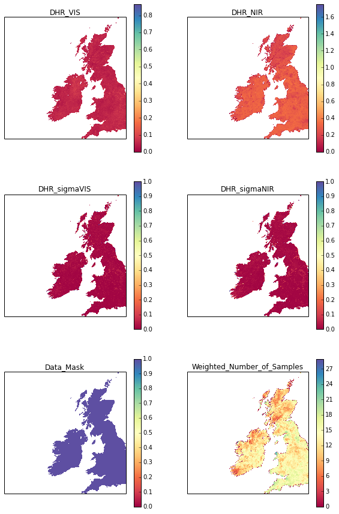

A3. Advanced notes: Scientific and Numerical Python
===================================================

A3.1 Pulling Compressed netCDF Files
------------------------------------

Sometimes, such as when we want to pull data from netCDF files from some
data site such as http://www.globalbedo.org, we might find that 'older
style' formats have been used, such as netCDF3 which might not have
internal compression.

To save storage space, it is common to compress such files extrenally
(i.e. to gzip a file).

That makes direct reading from a url a bit more tricky, and in such
cases, we may as well uncompress the file to a local temporary file.

Doing this in Python
~~~~~~~~~~~~~~~~~~~~

What we are going to do is to write a class to download a gzipped file
from a url and return a filename that can be read by other functions.

The file is available as `gzurl.py <files/python/gzurl.py>`__, in the
directory ``files/python``.

To be able to import this, we have to put ``files/python`` in the path
where Python looks for modules:

.. code:: python

    import sys,os
    # put local directory into the path
    sys.path.insert(0,os.path.abspath('files%spython'%os.sep))
    
    # import module
    from gzurl import gzurl
.. code:: python

    help(gzurl)

.. parsed-literal::

    Help on class gzurl in module gzurl:
    
    class gzurl(__builtin__.object)
     |  Download gzipped url to a local file or string
     |  
     |  Prof. P. Lewis, UCL, 
     |  Thu 10 Oct 2013 12:01:00 BST
     |  p.lewis@ucl.ac.uk
     |  
     |  Methods defined here:
     |  
     |  __del__(self)
     |      Destriuctor
     |      
     |      Tidy up
     |  
     |  __init__(self, url, filename=None, store=False, file=True)
     |      initialise class instance
     |      
     |      Parameters:
     |      
     |      url   : url of gzipped file
     |      
     |      Options:
     |      
     |      filename:
     |              specify a filename explicitly, rather than
     |              a temporary file (default None) 
     |      store : boolean flag to store the uncompressed
     |              data in self.data (default false)
     |      file  : boolean flag to store data to a file
     |              (default True)
     |  
     |  close(self)
     |      Tidy up
     |  
     |  read(self, url)
     |      read gzipped data from url
     |      and uncompress
     |  
     |  ----------------------------------------------------------------------
     |  Data descriptors defined here:
     |  
     |  __dict__
     |      dictionary for instance variables (if defined)
     |  
     |  __weakref__
     |      list of weak references to the object (if defined)
    


You can look through the file ```gzurl.py`` <files/python/gzurl.py>`__
at your leisure, but it is of interest to see how we have done this.

We need to load the following modules to do this:

``urllib2, io, gzip, tempfile``:

.. code:: python

    import urllib2, io, gzip, tempfile
The first thing we do is attempt to open a file specified from a url:

.. code:: python

    # codes for url specification on globalbedo.org
    years = range(1998,2012)
    codes = [95,95,97,97,26,66,54,54,29,25,53,56,56,78]
    XX = dict(zip(years,codes))
    
    year = 2009
    
    root = 'http://www.globalbedo.org/GlobAlbedo%d/mosaics/%d/0.5/monthly/'%\
            (XX[year],year)
        
    # filename formatting string: use %02d for month eg 01 for 1
    month = 1
    url = root + '/GlobAlbedo.%d%02d.mosaic.5.nc.gz'%(year,month)
    print url
    
    # open file from url
    f = urllib2.urlopen(url)

.. parsed-literal::

    http://www.globalbedo.org/GlobAlbedo56/mosaics/2009/0.5/monthly//GlobAlbedo.200901.mosaic.5.nc.gz


We then read data from that with the statement:

.. code:: python

    bdata = f.read()
    
    # which looks like this:
    bdata[:50]


.. parsed-literal::

    '\x1f\x8b\x08\x08\xf5\xe71R\x00\x03GlobAlbedo.200901.mosaic.5.nc\x00\xec\xdbwxTU\xfe\xc7q\x10'


We then create a buffered I/O stream from this using io.BytesIO, which
is the form we want the information in for the next part:

.. code:: python

    f = urllib2.urlopen(url)
    fileobj = io.BytesIO(f.read())
Next, we use the module ``gzip.GzipFile`` which simulates the methods of
a gzip file:

.. code:: python

    gzip.GzipFile(fileobj=fileobj)


.. parsed-literal::

    <gzip _io.BytesIO object at 0x105aea950 0x105bd2890>


And then we read from this:

.. code:: python

    f = urllib2.urlopen(url)
    data=gzip.GzipFile(fileobj=io.BytesIO(f.read())).read()
This is now binary of netCDF format in this case.

Next, we need to write these data to a file. In this case, we don't want
to really save the data anywhere, so we want to use a temporary file.

In Python, you can create a temporary file using the module tempfile,
which creates a temporary (unique) file on the system.

.. code:: python

    tmp = tempfile.NamedTemporaryFile(delete=False)
    print tmp.name

.. parsed-literal::

    /var/folders/pt/z0y8dmcd7d77cs_0hnygpwh80000gn/T/tmpN1LPzf


So we write the data to this file:

.. code:: python

    tmp.write(data)
Then, after we have done something with the data, we will want to tidy
up and delete the file:

.. code:: python

    tmp.unlink(tmp.name)
To use this module then:

.. code:: python

    import sys,os
    # put local directory into the path
    sys.path.insert(0,os.path.abspath('files%spython'%os.sep))
    # import local module gzurl
    from gzurl import gzurl
    from netCDF4 import Dataset
    
    # codes for url specification on globalbedo.org
    years = range(1998,2012)
    codes = [95,95,97,97,26,66,54,54,29,25,53,56,56,78]
    XX = dict(zip(years,codes))
    
    year = 2009
    
    root = 'http://www.globalbedo.org/GlobAlbedo%d/mosaics/%d/0.5/monthly/'%\
            (XX[year],year)
        
    print root
    
    # filename formatting string: use %02d for month eg 01 for 1
    month = 1
    url = root + '/GlobAlbedo.%d%02d.mosaic.5.nc.gz'%(year,month)
    
    # read the gzipped file
    f = gzurl(url)
    # read the netCDF file from f.filename
    nc = Dataset(f.filename,'r')
    # close f
    f.close()

.. parsed-literal::

    http://www.globalbedo.org/GlobAlbedo56/mosaics/2009/0.5/monthly/


Alternatively, to read all of the files into the directory files/data
for the year 2011 and keep them:

.. code:: python

    import sys,os
    # put local directory into the path
    sys.path.insert(0,os.path.abspath('files%spython'%os.sep))
    # import local module gzurl
    from gzurl import gzurl
    from netCDF4 import Dataset
    
    # codes for url specification on globalbedo.org
    years = range(1998,2012)
    codes = [95,95,97,97,26,66,54,54,29,25,53,56,56,78]
    XX = dict(zip(years,codes))
    
    year = 2009
    
    root = 'http://www.globalbedo.org/GlobAlbedo%d/mosaics/%d/0.5/monthly/'%\
            (XX[year],year)
    
    for month0 in range(12):  
        # filename formatting string: use %02d for month eg 01 for 1
        base = 'GlobAlbedo.%d%02d.mosaic.5.nc'%(year,month0+1)
        url = root + base + '.gz'
        # specify a local filename
        # work out how / why this works ...
        local = os.path.join('files{0}data{0}'.format(os.sep),base)
        
        # read the gzipped file
        print local
        f = gzurl(url,filename=local)
        # read the netCDF file from f.filename
        nc = Dataset(f.filename,'r')
        # close f
        f.close()

.. parsed-literal::

    files/data/GlobAlbedo.200901.mosaic.5.nc
    files/data/GlobAlbedo.200902.mosaic.5.nc
    files/data/GlobAlbedo.200903.mosaic.5.nc
    files/data/GlobAlbedo.200904.mosaic.5.nc
    files/data/GlobAlbedo.200905.mosaic.5.nc
    files/data/GlobAlbedo.200906.mosaic.5.nc
    files/data/GlobAlbedo.200907.mosaic.5.nc
    files/data/GlobAlbedo.200908.mosaic.5.nc
    files/data/GlobAlbedo.200909.mosaic.5.nc
    files/data/GlobAlbedo.200910.mosaic.5.nc
    files/data/GlobAlbedo.200911.mosaic.5.nc
    files/data/GlobAlbedo.200912.mosaic.5.nc


Doing this in unix
~~~~~~~~~~~~~~~~~~

That's not too complicated, but you might often do this sort of thing
from unix instead:

.. code:: python

    !rm -f files/data/GlobAlbedo.200901.mosaic.5.nc.gz 
    !wget -O files/data/GlobAlbedo.200901.mosaic.5.nc.gz \
      http://www.globalbedo.org/GlobAlbedo56/mosaics/2009/0.5/monthly/GlobAlbedo.200901.mosaic.5.nc.gz

.. parsed-literal::

    --2013-10-12 20:13:51--  http://www.globalbedo.org/GlobAlbedo56/mosaics/2009/0.5/monthly/GlobAlbedo.200901.mosaic.5.nc.gz
    Resolving www.globalbedo.org... 128.40.73.100
    Connecting to www.globalbedo.org|128.40.73.100|:80... connected.
    HTTP request sent, awaiting response... 200 OK
    Length: 4540366 (4.3M) [application/x-gzip]
    Saving to: `files/data/GlobAlbedo.200901.mosaic.5.nc.gz'
    
    100%[======================================>] 4,540,366   2.78M/s   in 1.6s    
    
    2013-10-12 20:13:52 (2.78 MB/s) - `files/data/GlobAlbedo.200901.mosaic.5.nc.gz' saved [4540366/4540366]
    


.. code:: python

    !gunzip -f files/data/GlobAlbedo.200901.mosaic.5.nc.gz
    !ls -l files/data/GlobAlbedo.200901.mosaic.5.nc

.. parsed-literal::

    -rw-r--r--  1 plewis  staff  18669672 12 Sep 17:12 files/data/GlobAlbedo.200901.mosaic.5.nc


A3.2 Logical combinations in numpy
----------------------------------

Let's read in a different GlobAlbedo dataset.

This time, we will read 8 day tile data (day of year: ``001``, ``009``
etc. every 8 days).

The tile we will read is ``h17v03`` which covers most of the UK.

.. code:: python

    import sys,os
    sys.path.insert(0,os.path.abspath('files%spython'%os.sep))
    from gzurl import gzurl
    from netCDF4 import Dataset
    
    years = range(1998,2012)
    codes = [95,95,97,97,26,66,54,54,29,25,53,56,56,78]
    XX = dict(zip(years,codes))
    
    year = 2009
    tile = 'h17v03'
    
    root = 'http://www.globalbedo.org/GlobAlbedo%d/tiles/%d/%s/'%\
            (XX[year],year,tile)
        
    # filename formatting string: use %03d for doy eg 001 for 1
    doy = 145
    url = root + 'GlobAlbedo.%d%03d.%s.nc.gz'%(year,doy,tile)
    # see if you can make sense of this complicated formatting
    filename = url.split('/')[-1].replace('.gz','')
    local_file = 'files{0}data{0}{1}'.format(os.sep,filename)
    
    # try to read local file
    try:
        nc = Dataset(local_file,'r')
    except:
        f = gzurl(url,filename=local_file)
        nc = Dataset(f.filename,'r')
        f.close()

.. code:: python

    # now pull some data
    
    vis = np.array(nc.variables['BHR_VIS'])
    nir = np.array(nc.variables['BHR_NIR'])
    ndvi = (nir - vis)/(nir + vis)

.. parsed-literal::

    -c:5: RuntimeWarning: invalid value encountered in divide


Now plot it:

.. code:: python

    import pylab as plt
    
    # figure size
    plt.figure(figsize=(8,8))
    # title
    plt.title('NDVI: Tile %s %d doy %03d'%(tile,year,doy))
    # colour map
    cmap = plt.get_cmap('Spectral')
    # plot the figure
    plt.imshow(ndvi,interpolation='none',cmap=cmap,vmin=0.,vmax=1.)
    # colour bar
    plt.colorbar()


.. parsed-literal::

    <matplotlib.colorbar.Colorbar instance at 0x10687ce60>


.. image:: advanced_files/advanced_38_1.png


We notice in this dataset that there are some 'funnies' (unreliable
data) around the coastline, which are probably due to negative
reflectance values.

We could try, for instance to build a mask for these, supposing them to
be some other 'invalid' number, but in this dataset, we have some other
data layers that can help:

.. code:: python

    nc.variables.keys()


.. parsed-literal::

    [u'metadata',
     u'DHR_VIS',
     u'DHR_NIR',
     u'DHR_SW',
     u'BHR_VIS',
     u'BHR_NIR',
     u'BHR_SW',
     u'DHR_sigmaVIS',
     u'DHR_sigmaNIR',
     u'DHR_sigmaSW',
     u'BHR_sigmaVIS',
     u'BHR_sigmaNIR',
     u'BHR_sigmaSW',
     u'Weighted_Number_of_Samples',
     u'Relative_Entropy',
     u'Goodness_of_Fit',
     u'Snow_Fraction',
     u'Data_Mask',
     u'Solar_Zenith_Angle',
     u'lat',
     u'lon',
     u'crs']


.. code:: python

    # better have a look at the individual bands as well
    # plot the vis and nir bands
    plt.figure(figsize=(8,8))
    plt.title('VIS: Tile %s %d doy %03d'%(tile,year,doy))
    cmap = plt.get_cmap('Spectral')
    plt.imshow(vis,interpolation='none',cmap=cmap,vmin=0.,vmax=1.)
    plt.colorbar()
    
    plt.figure(figsize=(8,8))
    plt.title('NIR: Tile %s %d doy %03d'%(tile,year,doy))
    cmap = plt.get_cmap('Spectral')
    plt.imshow(nir,interpolation='none',cmap=cmap,vmin=0.,vmax=1.)
    plt.colorbar()


.. parsed-literal::

    <matplotlib.colorbar.Colorbar instance at 0x107236d88>


.. image:: advanced_files/advanced_41_1.png


.. image:: advanced_files/advanced_41_2.png


Apart from a few minor outliers, these data look fine.

Let's try developing a mask from ``Data_Mask``:

.. code:: python

    mask = np.array(nc.variables['Data_Mask']).astype(bool)
    
    # plot it
    plt.figure(figsize=(8,8))
    plt.title('Data_Mask: Tile %s %d doy %03d'%(tile,year,doy))
    cmap = plt.get_cmap('Spectral')
    plt.imshow(mask,interpolation='none',cmap=cmap,vmin=0.,vmax=1.)
    plt.colorbar()


.. parsed-literal::

    <matplotlib.colorbar.Colorbar instance at 0x1068ab710>


.. image:: advanced_files/advanced_43_1.png


The mask is ``True`` where there are valid (land) data.

In a masked array, we want the opposite of this.

We can'r directly use ``not``, but we can use the bitwise operatoe
``~``:

Use the mask in a masked array:

.. code:: python

    import numpy.ma as ma
    
    vis = ma.array(vis,mask=~mask)
    nir = ma.array(nir,mask=~mask)
    ndvi = (nir - vis)/(nir + vis)
    
    plt.figure(figsize=(8,8))
    plt.title('NDVI: Tile %s %d doy %03d'%(tile,year,doy))
    cmap = plt.get_cmap('Spectral')
    plt.imshow(ndvi,interpolation='none',cmap=cmap,vmin=0.,vmax=1.)
    plt.colorbar()


.. parsed-literal::

    <matplotlib.colorbar.Colorbar instance at 0x1072aa290>


.. image:: advanced_files/advanced_45_1.png


The data mask hasn't solved the problem for NDVI then.

A problem might arise from a small number of negative reflectance values
in the dataset.

We can create masks for these:

.. code:: python

    mask1 = vis < 0.
    mask2 = nir < 0
    print 'number of -ve VIS pixels',np.sum(mask1)
    print 'number of -ve NIR pixels',np.sum(mask2)

.. parsed-literal::

    number of -ve VIS pixels 317
    number of -ve NIR pixels 934


and we can combine them with a bitwise operator, ``|`` (or) or ``&``
(and) in this case (reversing the conditions):

.. code:: python

    mask = np.array(nc.variables['Data_Mask']).astype(bool) & (vis > 0) & (nir > 0)
    
    # plot it
    plt.figure(figsize=(8,8))
    plt.title('Data_Mask: Tile %s %d doy %03d'%(tile,year,doy))
    cmap = plt.get_cmap('Spectral')
    plt.imshow(mask,interpolation='none',cmap=cmap,vmin=0.,vmax=1.)
    plt.colorbar()


.. parsed-literal::

    <matplotlib.colorbar.Colorbar instance at 0x107c865f0>


.. image:: advanced_files/advanced_49_1.png


.. code:: python

    vis = ma.array(vis,mask=~mask)
    nir = ma.array(nir,mask=~mask)
    ndvi = (nir - vis)/(nir + vis)
    
    plt.figure(figsize=(8,8))
    plt.title('NDVI: Tile %s %d doy %03d'%(tile,year,doy))
    cmap = plt.get_cmap('Spectral')
    plt.imshow(ndvi,interpolation='none',cmap=cmap,vmin=0.,vmax=1.)
    plt.colorbar()


.. parsed-literal::

    <matplotlib.colorbar.Colorbar instance at 0x107320830>


.. image:: advanced_files/advanced_50_1.png


This hasn't entirely sorted it either.

Next have a look at a few more fields before going further:

.. code:: python

    # demonstration of multiple subplots
    
    datasets = np.array([['DHR_VIS','DHR_NIR'],\
                         ['DHR_sigmaVIS','DHR_sigmaNIR'],\
                         ['Data_Mask','Weighted_Number_of_Samples']])
    
    # load up all datasets in dict data
    data = {}
    
    dlist = datasets.copy().flatten()
    
    for d in dlist:
        data[d] = np.array(nc.variables[d])
    
    mask =  data['Data_Mask'].astype(bool) &( \
            (data['DHR_VIS'] > 0.) | \
            (data['DHR_NIR'] > 0.))
        
    s = datasets.shape
    
    # how big for each subplot ?
    big = 5
    
    # set the figure size
    plt.figure(figsize=(s[1]*big,s[0]*big))
    
    # colorbars for subplots are a bit tricky
    # here's one way of sorting this
    # using dataset shapes
    from matplotlib import gridspec
    gs = gridspec.GridSpec(s[0],s[1])
    
    # colour map
    cmap = plt.get_cmap('Spectral')
    
    
    for i,d0 in enumerate(datasets):
        for j,d in enumerate(d0):
    
            data[d] = ma.array(data[d],mask=~mask)
            
            axes = plt.subplot(gs[i,j])
            axes.set_title(d)
            # no axis ticks
            axes.set_xticks([])
            axes.set_yticks([])
            
            im = axes.imshow(data[d],cmap=cmap,interpolation='none',vmin=0.)
            plt.colorbar(im)
    
            
    ndvi = (data['DHR_NIR'] - data['DHR_VIS'])/(data['DHR_NIR'] + data['DHR_VIS'])
    
    plt.figure(figsize=(8,8))
    plt.title('NDVI: Tile %s %d doy %03d'%(tile,year,doy))
    cmap = plt.get_cmap('Spectral')
    plt.imshow(ndvi,interpolation='none',cmap=cmap,vmin=0.,vmax=1.)
    plt.colorbar()


.. parsed-literal::

    <matplotlib.colorbar.Colorbar instance at 0x116dd8ab8>





.. image:: advanced_files/advanced_52_2.png


So it looks as though we need to filter on
``'Weighted_Number_of_Samples'`` as well, and perhaps on uncertainty:

.. code:: python

    # demonstration of multiple subplots
    
    datasets = np.array([['DHR_VIS','DHR_NIR'],\
                         ['DHR_sigmaVIS','DHR_sigmaNIR'],\
                         ['Data_Mask','Weighted_Number_of_Samples']])
    
    # load up all datasets in dict data
    data = {}
    
    dlist = datasets.copy().flatten()
    
    for d in dlist:
        data[d] = np.array(nc.variables[d])
    
    mask =  data['Data_Mask'].astype(bool) & \
            (data['Weighted_Number_of_Samples'] > 0.5) & \
            (data['DHR_sigmaVIS'] <= 0.8) & \
            (data['DHR_sigmaNIR'] <= 0.8) & \
            (data['DHR_VIS'] >= 0.) & \
            (data['DHR_NIR'] >= 0.)
        
    s = datasets.shape
    
    # how big for each subplot ?
    big = 5
    
    # set the figure size
    plt.figure(figsize=(s[1]*big,s[0]*big))
    
    # colorbars for subplots are a bit tricky
    # here's one way of sorting this
    # using dataset shapes
    from matplotlib import gridspec
    gs = gridspec.GridSpec(s[0],s[1])
    
    # colour map
    cmap = plt.get_cmap('Spectral')
    
    
    for i,d0 in enumerate(datasets):
        for j,d in enumerate(d0):
    
            data[d] = ma.array(data[d],mask=~mask)
            
            axes = plt.subplot(gs[i,j])
            axes.set_title(d)
            # no axis ticks
            axes.set_xticks([])
            axes.set_yticks([])
            
            im = axes.imshow(data[d],cmap=cmap,interpolation='none',vmin=0.)
            plt.colorbar(im)


.. image:: advanced_files/advanced_54_0.png


.. code:: python

    ndvi = (data['DHR_NIR'] - data['DHR_VIS'])/(data['DHR_NIR'] + data['DHR_VIS'])
    
    plt.figure(figsize=(13,13))
    plt.title('NDVI: Tile %s %d doy %03d'%(tile,year,doy))
    cmap = plt.get_cmap('Spectral')
    plt.imshow(ndvi,interpolation='none',cmap=cmap,vmin=0.,vmax=1.)
    plt.colorbar()


.. parsed-literal::

    <matplotlib.colorbar.Colorbar instance at 0x115bb1cb0>


.. image:: advanced_files/advanced_55_1.png


Thats quite a bit better, but still not perfect.

**Experiment with the conditions of the masking to see how you can get
rid of the odd pixels (the 'red' ones in the above). Do *not* filter on
``ndvi`` itself, as we *might* be interested in negative ``ndvi`` values
in some cases.**

Once you think you have some useful filtering conditions, try it out on
some different dates and tiles.

Some other things to try:

-  Write parts of the code as functions.
-  Put the code developed into a file and run it from the unix command
   line.

A3.3 Solar Radiation model
--------------------------

If you followed the advanced material for the previous chapter, you will
have noted the use of ``pyephem`` as a module that we can use for
calculating the solar zenith angle.

There is a similar package ``pysolar`` that is a little easier to use
for solar radiation calculations.

We will install a package ``pysolar`` into your user area:

at a unix prompt, type:

.. code:: python

    !easy_install --user pysolar

.. parsed-literal::

    Searching for pysolar
    Best match: Pysolar 0.5
    Processing Pysolar-0.5-py2.7.egg
    Pysolar 0.5 is already the active version in easy-install.pth
    
    Using /Users/plewis/.local/lib/python2.7/site-packages/Pysolar-0.5-py2.7.egg
    Processing dependencies for pysolar
    Finished processing dependencies for pysolar


If all goes well, the text that comes up at the terminal should tell you
that this has installed (e.g. in
``/home/plewis/.local/lib/python2.7/site-packages/Pysolar-0.5-py2.7.egg``).

We can test to see if we can load and run this package:

.. code:: python

    # from https://github.com/pingswept/pysolar/wiki/examples
    import Pysolar
    from datetime import datetime
    
    # UCL lat/lon
    lat = 51.5248
    lon = -0.1336
    
    hour = 12
    minute = 0
    second = 0
    month = 10 # ie October
    day = 13 
    year = 2013
    
    d = datetime(year, month, day, hour, minute, second) 
    altitude_deg = Pysolar.GetAltitude(lat, lon, d)
    zenith = 90. - altitude_deg
    # W m^-2
    solar = Pysolar.solar.radiation.GetRadiationDirect(d, altitude_deg)
    print zenith,solar

.. parsed-literal::

    59.5052193764 834.866993323


.. code:: python

    def solar(year, month, day, hour, lat_deg, lon_deg, minute=0, second=0):
        '''Return solar zenith and clear sky radiation
           for given lat, lon and time/date
        '''
        from datetime import datetime
        import Pysolar
        
        d = datetime(year, month, day, hour, minute, second) 
        altitude_deg = Pysolar.GetAltitude(lat_deg, lon_deg, d)
        # W m^-2
        solar_rad = Pysolar.solar.radiation.GetRadiationDirect(d, altitude_deg)
        return 90. - altitude_deg,solar_rad
.. code:: python

    # or import from local module
    
    import sys,os
    # put local directory into the path
    sys.path.insert(0,os.path.abspath('files%spython'%os.sep))
    
    from solar import solar
.. code:: python

    import numpy as np
    
    # UCL lat/lon
    lat = 51.5248
    lon = -0.1336
    
    second = 0
    month = 10 # ie October
    day = 13 
    year = 2013
    
    radiation_fields = '#hour zenith solar_rad month day lat lon'
    
    radiation = []
    for hour in xrange(24):
        for minute in xrange(60):
            thr = hour + minute/60.
            # append data line as tuple
            radiation.append((thr,) + \
                             solar(year, month, day, hour, lat, lon, minute=minute) +\
                             (month, day, lat, lon))
    # convert to numpy array
    # transpose so access eg zenith as 
    # radiation[0]
    radiation = np.array(radiation).T
.. code:: python

    # so we have radiation as 
    print radiation.shape
    print radiation.ndim
    print radiation

.. parsed-literal::

    (7, 1440)
    2
    [[  0.00000000e+00   1.66666667e-02   3.33333333e-02 ...,   2.39500000e+01
        2.39666667e+01   2.39833333e+01]
     [  1.36158787e+02   1.36145826e+02   1.36131901e+02 ...,   1.36561804e+02
        1.36551449e+02   1.36540121e+02]
     [  0.00000000e+00   0.00000000e+00   0.00000000e+00 ...,   0.00000000e+00
        0.00000000e+00   0.00000000e+00]
     ..., 
     [  1.30000000e+01   1.30000000e+01   1.30000000e+01 ...,   1.30000000e+01
        1.30000000e+01   1.30000000e+01]
     [  5.15248000e+01   5.15248000e+01   5.15248000e+01 ...,   5.15248000e+01
        5.15248000e+01   5.15248000e+01]
     [ -1.33600000e-01  -1.33600000e-01  -1.33600000e-01 ...,  -1.33600000e-01
       -1.33600000e-01  -1.33600000e-01]]


.. code:: python

    import pylab as plt
    
    plt.title('Solar radiation at UCL')
    plt.xlabel('hour')
    plt.ylabel('solar radiation / Wm^-2')
    plt.plot(radiation[0],radiation[2])


.. parsed-literal::

    [<matplotlib.lines.Line2D at 0x10681fed0>]


.. image:: advanced_files/advanced_66_1.png


.. code:: python

    import pylab as plt
    
    plt.title('Solar zenith UCL')
    plt.xlabel('hour')
    plt.ylabel('solar zenith / degrees')
    plt.plot(radiation[0],radiation[1])


.. parsed-literal::

    [<matplotlib.lines.Line2D at 0x1068bde50>]


.. image:: advanced_files/advanced_67_1.png


E3.3 Exercise: Solar radiation modelling

This is a better modelling of solar radiation that we did in the main
part of the class today.

There are several things we could do with this.

For example, if we know the albedo, we can calculate the absorbed
radiation as previously done (if we assume for the moment albedo is
constant with solar zenith angle ... which it isn't, generally), but can
now extend over the whole day and integrate to get the total energy per
metre squared.

From above, we have `power <http://en.wikipedia.org/wiki/Watt>`__ per
unit area, in Watts per metre squared.

This is the same as `energy <http://en.wikipedia.org/wiki/Joule>`__ per
unit area per second (i.e. the same as J/(m s)).

So if we sum up the solar radiation from above over the day and multiply
by the time interval in seconds (time interval above is 1 minute, so 60
seconds), we get:

.. code:: python

    power_density = radiation[2].sum() * 60
    print 'power per unit area = %.3f MJ / m^2'%(power_density/10**6)

.. parsed-literal::

    power per unit area = 23.687 MJ / m^2


and we could now look at e.g. variations in this over the year (NB this
will take some time to calculate if you step every day and minute, so we
step every 30 minutes here):

.. code:: python

    import numpy as np
    
    def radiation(year, month, day, lat, lon,minute_step=30):
        rad = []
        for hour in xrange(24):
            for minute in xrange(0,60,minute_step):
                thr = hour + minute/60.
                # append data line as tuple
                rad.append((thr,) + \
                         solar(year, month, day, hour, lat, lon, minute=minute) +\
                         (month, day, lat, lon))
        # convert to numpy array
        # transpose so access eg zenith as 
        # rad[0]
        rad = np.array(rad).T
        return rad
    
    def days_in_month(month,year=2013):
        ''' number of days in month'''
        import calendar
        return calendar.monthrange(year,month)[1]
    
    # UCL lat/lon
    lat = 51.5248
    lon = -0.1336
    
    year = 2013
    
    minute_step = 30
    
    pd = []
    for month in xrange(12):
        ndays = days_in_month(month+1,year=year)
        print month,ndays
        for day in xrange(ndays):
            rad = radiation(year, month+1, day+1, lat, lon,minute_step=minute_step)
            pd.append([month+day/float(ndays),rad[2].sum() * 60 * minute_step])
    pd = np.array(pd).T

.. parsed-literal::

    0 31
    1 28
    2 31
    3 30
    4 31
    5 30
    6 31
    7 31
    8 30
    9 31
    10 30
    11 31


.. code:: python

    import pylab as plt
    
    plt.title('Power per unit area, UCL')
    plt.xlabel('month')
    plt.ylabel('Power per unit area / MJ m^-2')
    plt.plot(pd[0],pd[1]/10**6)


.. parsed-literal::

    [<matplotlib.lines.Line2D at 0x106abdc50>]


.. image:: advanced_files/advanced_73_1.png


or, if we want to sum over a month:

.. code:: python

    # UCL lat/lon
    lat = 51.5248
    lon = -0.1336
    
    year = 2013
    
    pd = []
    
    for month in xrange(12):
        pd_month = []
        ndays = days_in_month(month+1,year=year)
        print month,ndays
        for day in xrange(ndays):
            rad = radiation(year, month+1, day+1, lat, lon)
            pd_month.append([rad[2].sum() * 60 * 30])
        pd_month = np.array(pd_month).T
        pd.append([month,pd_month.sum()])
    pd = np.array(pd).T

.. parsed-literal::

    0 31
    1 28
    2 31
    3 30
    4 31
    5 30
    6 31
    7 31
    8 30
    9 31
    10 30
    11 31


.. code:: python

    import pylab as plt
    
    plt.title('Monthly total Power per unit area, UCL')
    plt.xlabel('month')
    plt.ylabel('Power per unit area / MJ m^-2')
    plt.plot(pd[0],pd[1]/10**6)


.. parsed-literal::

    [<matplotlib.lines.Line2D at 0x107234d10>]


.. image:: advanced_files/advanced_76_1.png


E3.3 Improved Solar Radiation Modelling
---------------------------------------

Using the material above and the global albedo datasets from the main
class material, **calculate an improved estimate of the total absorbed
power per unit area per month (MJ per m^2 per month) for the Earth land
surface**.

You should do this with a function that will take as input the year and
returns the monthly total absorbed power density (MJ m^-2 per month) and
the monthly total power density (MJ m^-2 per month).

You might have an optional argument ``minute_step`` to control the
resolution of the calculation as above.

You could then use this to derive latitudinal variations in annual and
latitudinal total absorbed power per unit area.
