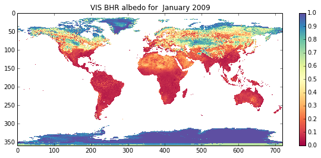

E3 Answers to Exercise
======================

E3.1 Exercise: listing
----------------------

**Using Python, produce a listing of the files in the subdirectory
``data`` of ``geogg122/Chapter3_Scientific_Numerical_Python`` that end
with ``.nc`` and put this listing in a file called ``data/data.dat``
with each entry on a different line**

A3.1 Answer: listing
--------------------

Hopefully, you should already be in the directory
``geogg122/Chapter3_Scientific_Numerical_Python``, if not, you may like
to go there before starting this exercise.

If you were to do this from unix, you would get the listing with:

.. code:: python

    ls -l data/*.nc

.. parsed-literal::

    -rw-rw-r--. 1 plewis plewis 18669672 Sep 30 11:56 data/GlobAlbedo.200901.mosaic.5.nc
    -rw-rw-r--. 1 plewis plewis 18669672 Sep 30 11:56 data/GlobAlbedo.200902.mosaic.5.nc
    -rw-rw-r--. 1 plewis plewis 18669672 Sep 30 11:56 data/GlobAlbedo.200903.mosaic.5.nc
    -rw-rw-r--. 1 plewis plewis 18669672 Sep 30 11:56 data/GlobAlbedo.200904.mosaic.5.nc
    -rw-rw-r--. 1 plewis plewis 18669672 Sep 30 11:56 data/GlobAlbedo.200905.mosaic.5.nc
    -rw-rw-r--. 1 plewis plewis 18669672 Sep 30 11:56 data/GlobAlbedo.200906.mosaic.5.nc
    -rw-rw-r--. 1 plewis plewis 18758652 Sep 30 11:56 data/GlobAlbedo.200907.mosaic.5.nc
    -rw-rw-r--. 1 plewis plewis 18669672 Sep 30 11:56 data/GlobAlbedo.200908.mosaic.5.nc
    -rw-rw-r--. 1 plewis plewis 18669672 Sep 30 11:56 data/GlobAlbedo.200909.mosaic.5.nc
    -rw-rw-r--. 1 plewis plewis 18669672 Sep 30 11:56 data/GlobAlbedo.200910.mosaic.5.nc
    -rw-rw-r--. 1 plewis plewis 18669672 Sep 30 11:56 data/GlobAlbedo.200911.mosaic.5.nc
    -rw-rw-r--. 1 plewis plewis 18669672 Sep 30 11:56 data/GlobAlbedo.200912.mosaic.5.nc
    -rw-rw-r--. 1 plewis plewis 18758652 Sep 30 11:56 data/GlobAlbedo.201001.mosaic.5.nc
    -rw-rw-r--. 1 plewis plewis 18669672 Sep 30 11:56 data/GlobAlbedo.201002.mosaic.5.nc
    -rw-rw-r--. 1 plewis plewis 18669672 Sep 30 11:56 data/GlobAlbedo.201003.mosaic.5.nc
    -rw-rw-r--. 1 plewis plewis 18669672 Sep 30 11:56 data/GlobAlbedo.201004.mosaic.5.nc
    -rw-rw-r--. 1 plewis plewis 18669672 Sep 30 11:56 data/GlobAlbedo.201005.mosaic.5.nc
    -rw-rw-r--. 1 plewis plewis 18669672 Sep 30 11:56 data/GlobAlbedo.201006.mosaic.5.nc
    -rw-rw-r--. 1 plewis plewis 18669672 Sep 30 11:56 data/GlobAlbedo.201007.mosaic.5.nc
    -rw-rw-r--. 1 plewis plewis 18758652 Sep 30 11:56 data/GlobAlbedo.201008.mosaic.5.nc
    -rw-rw-r--. 1 plewis plewis 18669672 Sep 30 11:56 data/GlobAlbedo.201009.mosaic.5.nc
    -rw-rw-r--. 1 plewis plewis 18669672 Sep 30 11:56 data/GlobAlbedo.201010.mosaic.5.nc
    -rw-rw-r--. 1 plewis plewis 18669672 Sep 30 11:56 data/GlobAlbedo.201011.mosaic.5.nc
    -rw-rw-r--. 1 plewis plewis 18669672 Sep 30 11:56 data/GlobAlbedo.201012.mosaic.5.nc


or similar.

To do this in Python, you should use ``glob``, and the same 'pattern':

.. code:: python

    import glob
    
    files = glob.glob('data/*.nc')
    print files

.. parsed-literal::

    ['data/GlobAlbedo.201008.mosaic.5.nc', 'data/GlobAlbedo.200903.mosaic.5.nc', 'data/GlobAlbedo.200905.mosaic.5.nc', 'data/GlobAlbedo.201007.mosaic.5.nc', 'data/GlobAlbedo.201011.mosaic.5.nc', 'data/GlobAlbedo.200902.mosaic.5.nc', 'data/GlobAlbedo.201006.mosaic.5.nc', 'data/GlobAlbedo.201004.mosaic.5.nc', 'data/GlobAlbedo.200904.mosaic.5.nc', 'data/GlobAlbedo.200911.mosaic.5.nc', 'data/GlobAlbedo.201012.mosaic.5.nc', 'data/GlobAlbedo.201005.mosaic.5.nc', 'data/GlobAlbedo.200912.mosaic.5.nc', 'data/GlobAlbedo.201003.mosaic.5.nc', 'data/GlobAlbedo.200907.mosaic.5.nc', 'data/GlobAlbedo.200909.mosaic.5.nc', 'data/GlobAlbedo.201001.mosaic.5.nc', 'data/GlobAlbedo.201009.mosaic.5.nc', 'data/GlobAlbedo.201010.mosaic.5.nc', 'data/GlobAlbedo.200906.mosaic.5.nc', 'data/GlobAlbedo.201002.mosaic.5.nc', 'data/GlobAlbedo.200908.mosaic.5.nc', 'data/GlobAlbedo.200901.mosaic.5.nc', 'data/GlobAlbedo.200910.mosaic.5.nc']


This is a list. We want to write this to a file called
``data/data.dat``.

First we open it, then simply use ``writelines`` to write the list of
strings, the close the file.

.. code:: python

    filename = 'data/data.dat'
    
    # open in write mode
    fp = open(filename,'w')
    fp.writelines(files)
    fp.close()
Hopefully, that all worked well, but just to check from unix:

.. code:: python

    cat data/data.dat

.. parsed-literal::

    data/GlobAlbedo.201008.mosaic.5.ncdata/GlobAlbedo.200903.mosaic.5.ncdata/GlobAlbedo.200905.mosaic.5.ncdata/GlobAlbedo.201007.mosaic.5.ncdata/GlobAlbedo.201011.mosaic.5.ncdata/GlobAlbedo.200902.mosaic.5.ncdata/GlobAlbedo.201006.mosaic.5.ncdata/GlobAlbedo.201004.mosaic.5.ncdata/GlobAlbedo.200904.mosaic.5.ncdata/GlobAlbedo.200911.mosaic.5.ncdata/GlobAlbedo.201012.mosaic.5.ncdata/GlobAlbedo.201005.mosaic.5.ncdata/GlobAlbedo.200912.mosaic.5.ncdata/GlobAlbedo.201003.mosaic.5.ncdata/GlobAlbedo.200907.mosaic.5.ncdata/GlobAlbedo.200909.mosaic.5.ncdata/GlobAlbedo.201001.mosaic.5.ncdata/GlobAlbedo.201009.mosaic.5.ncdata/GlobAlbedo.201010.mosaic.5.ncdata/GlobAlbedo.200906.mosaic.5.ncdata/GlobAlbedo.201002.mosaic.5.ncdata/GlobAlbedo.200908.mosaic.5.ncdata/GlobAlbedo.200901.mosaic.5.ncdata/GlobAlbedo.200910.mosaic.5.nc

which isn't quite what we wanted: we need to insert a newline character
at the end of each string before writing.

There are several ways to do this, e.g.:

.. code:: python

    files = glob.glob('data/*.nc')
    
    for i,file in enumerate(files):
        files[i] = file + '\n'
    print files

.. parsed-literal::

    ['data/GlobAlbedo.201008.mosaic.5.nc\n', 'data/GlobAlbedo.200903.mosaic.5.nc\n', 'data/GlobAlbedo.200905.mosaic.5.nc\n', 'data/GlobAlbedo.201007.mosaic.5.nc\n', 'data/GlobAlbedo.201011.mosaic.5.nc\n', 'data/GlobAlbedo.200902.mosaic.5.nc\n', 'data/GlobAlbedo.201006.mosaic.5.nc\n', 'data/GlobAlbedo.201004.mosaic.5.nc\n', 'data/GlobAlbedo.200904.mosaic.5.nc\n', 'data/GlobAlbedo.200911.mosaic.5.nc\n', 'data/GlobAlbedo.201012.mosaic.5.nc\n', 'data/GlobAlbedo.201005.mosaic.5.nc\n', 'data/GlobAlbedo.200912.mosaic.5.nc\n', 'data/GlobAlbedo.201003.mosaic.5.nc\n', 'data/GlobAlbedo.200907.mosaic.5.nc\n', 'data/GlobAlbedo.200909.mosaic.5.nc\n', 'data/GlobAlbedo.201001.mosaic.5.nc\n', 'data/GlobAlbedo.201009.mosaic.5.nc\n', 'data/GlobAlbedo.201010.mosaic.5.nc\n', 'data/GlobAlbedo.200906.mosaic.5.nc\n', 'data/GlobAlbedo.201002.mosaic.5.nc\n', 'data/GlobAlbedo.200908.mosaic.5.nc\n', 'data/GlobAlbedo.200901.mosaic.5.nc\n', 'data/GlobAlbedo.200910.mosaic.5.nc\n']


.. code:: python

    files = glob.glob('data/*.nc')
    
    # or:
    files = [file + '\n' for file in files]
    
    print files

.. parsed-literal::

    ['data/GlobAlbedo.201008.mosaic.5.nc\n', 'data/GlobAlbedo.200903.mosaic.5.nc\n', 'data/GlobAlbedo.200905.mosaic.5.nc\n', 'data/GlobAlbedo.201007.mosaic.5.nc\n', 'data/GlobAlbedo.201011.mosaic.5.nc\n', 'data/GlobAlbedo.200902.mosaic.5.nc\n', 'data/GlobAlbedo.201006.mosaic.5.nc\n', 'data/GlobAlbedo.201004.mosaic.5.nc\n', 'data/GlobAlbedo.200904.mosaic.5.nc\n', 'data/GlobAlbedo.200911.mosaic.5.nc\n', 'data/GlobAlbedo.201012.mosaic.5.nc\n', 'data/GlobAlbedo.201005.mosaic.5.nc\n', 'data/GlobAlbedo.200912.mosaic.5.nc\n', 'data/GlobAlbedo.201003.mosaic.5.nc\n', 'data/GlobAlbedo.200907.mosaic.5.nc\n', 'data/GlobAlbedo.200909.mosaic.5.nc\n', 'data/GlobAlbedo.201001.mosaic.5.nc\n', 'data/GlobAlbedo.201009.mosaic.5.nc\n', 'data/GlobAlbedo.201010.mosaic.5.nc\n', 'data/GlobAlbedo.200906.mosaic.5.nc\n', 'data/GlobAlbedo.201002.mosaic.5.nc\n', 'data/GlobAlbedo.200908.mosaic.5.nc\n', 'data/GlobAlbedo.200901.mosaic.5.nc\n', 'data/GlobAlbedo.200910.mosaic.5.nc\n']


.. code:: python

    # or all at once if you like:
    
    files = [file + '\n' for file in glob.glob('data/*.nc')]
    
    print files

.. parsed-literal::

    ['data/GlobAlbedo.201008.mosaic.5.nc\n', 'data/GlobAlbedo.200903.mosaic.5.nc\n', 'data/GlobAlbedo.200905.mosaic.5.nc\n', 'data/GlobAlbedo.201007.mosaic.5.nc\n', 'data/GlobAlbedo.201011.mosaic.5.nc\n', 'data/GlobAlbedo.200902.mosaic.5.nc\n', 'data/GlobAlbedo.201006.mosaic.5.nc\n', 'data/GlobAlbedo.201004.mosaic.5.nc\n', 'data/GlobAlbedo.200904.mosaic.5.nc\n', 'data/GlobAlbedo.200911.mosaic.5.nc\n', 'data/GlobAlbedo.201012.mosaic.5.nc\n', 'data/GlobAlbedo.201005.mosaic.5.nc\n', 'data/GlobAlbedo.200912.mosaic.5.nc\n', 'data/GlobAlbedo.201003.mosaic.5.nc\n', 'data/GlobAlbedo.200907.mosaic.5.nc\n', 'data/GlobAlbedo.200909.mosaic.5.nc\n', 'data/GlobAlbedo.201001.mosaic.5.nc\n', 'data/GlobAlbedo.201009.mosaic.5.nc\n', 'data/GlobAlbedo.201010.mosaic.5.nc\n', 'data/GlobAlbedo.200906.mosaic.5.nc\n', 'data/GlobAlbedo.201002.mosaic.5.nc\n', 'data/GlobAlbedo.200908.mosaic.5.nc\n', 'data/GlobAlbedo.200901.mosaic.5.nc\n', 'data/GlobAlbedo.200910.mosaic.5.nc\n']


or several other ways ...

Putting this together:

.. code:: python

    import glob
    
    files = [file + '\n' for file in glob.glob('data/*.nc')]
    
    filename = 'data/data.dat'
    
    # open in write mode
    fp = open(filename,'w')
    fp.writelines(files)
    fp.close()
then checking:

.. code:: python

    cat data/data.dat

.. parsed-literal::

    data/GlobAlbedo.201008.mosaic.5.nc
    data/GlobAlbedo.200903.mosaic.5.nc
    data/GlobAlbedo.200905.mosaic.5.nc
    data/GlobAlbedo.201007.mosaic.5.nc
    data/GlobAlbedo.201011.mosaic.5.nc
    data/GlobAlbedo.200902.mosaic.5.nc
    data/GlobAlbedo.201006.mosaic.5.nc
    data/GlobAlbedo.201004.mosaic.5.nc
    data/GlobAlbedo.200904.mosaic.5.nc
    data/GlobAlbedo.200911.mosaic.5.nc
    data/GlobAlbedo.201012.mosaic.5.nc
    data/GlobAlbedo.201005.mosaic.5.nc
    data/GlobAlbedo.200912.mosaic.5.nc
    data/GlobAlbedo.201003.mosaic.5.nc
    data/GlobAlbedo.200907.mosaic.5.nc
    data/GlobAlbedo.200909.mosaic.5.nc
    data/GlobAlbedo.201001.mosaic.5.nc
    data/GlobAlbedo.201009.mosaic.5.nc
    data/GlobAlbedo.201010.mosaic.5.nc
    data/GlobAlbedo.200906.mosaic.5.nc
    data/GlobAlbedo.201002.mosaic.5.nc
    data/GlobAlbedo.200908.mosaic.5.nc
    data/GlobAlbedo.200901.mosaic.5.nc
    data/GlobAlbedo.200910.mosaic.5.nc


which *is* what we wanted.

E3.2 Read Image Data into 3D List
---------------------------------

Write some python code that directly reads the data layers
``'DHR_VIS','DHR_NIR','DHR_SW'`` into a list for a given month and year.

A3.2 Read Image Data into 3D List
---------------------------------

We start off with the code from the class and attempt to modify this for
our purposes:

.. code:: python

    import gdal
    
    # form a generic string of the form
    # NETCDF:"data/GlobAlbedo.200901.mosaic.5.nc":DHR_VIS
    
    file_template = 'NETCDF:"%s":%s'
    
    # now make a list of the datset names we want
    # so we can loop over this 
    
    selected_layers = ['DHR_VIS','DHR_NIR','DHR_SW']
    
    # ----------------------------------
    
    # try it out:
    
    
    root = 'data/'
    
    # example filename : use formatting string:
    # %d%02d
    year = 2009
    month = 1
    filename = root + 'GlobAlbedo.%d%02d.mosaic.5.nc'%(year,month)
    print filename
    
    
    # set up an empty dictionary to load the data into
    data = {}
    
    # use enumerate here to loop over
    # the list selected_layers and also have
    # access to an index i
    
    for i, layer in enumerate ( selected_layers ):
        this_file = file_template % ( filename, layer )
        print "Opening Layer %d: %s" % (i, this_file )
        g = gdal.Open ( this_file )
        
        # test that the opening worked
        # and raise an error otherwise
        
        if g is None:
            raise IOError
        data[layer] = g.ReadAsArray() 
        print "\t>>> Read %s!" % layer
    
    
    # post-hoc load into array called albedo
    albedo = [data[f] for f in selected_layers]


.. parsed-literal::

    data/GlobAlbedo.200901.mosaic.5.nc
    Opening Layer 0: NETCDF:"data/GlobAlbedo.200901.mosaic.5.nc":DHR_VIS
    	>>> Read DHR_VIS!
    Opening Layer 1: NETCDF:"data/GlobAlbedo.200901.mosaic.5.nc":DHR_NIR
    	>>> Read DHR_NIR!
    Opening Layer 2: NETCDF:"data/GlobAlbedo.200901.mosaic.5.nc":DHR_SW
    	>>> Read DHR_SW!


Now, instead of loading the data into a dictionary ``{}``, we simply
append onto a list:

.. code:: python

    import gdal
    
    # NETCDF:"data/GlobAlbedo.200901.mosaic.5.nc":DHR_VIS
    file_template = 'NETCDF:"%s":%s'
    
    selected_layers = ['DHR_VIS','DHR_NIR','DHR_SW']
    
    root = 'data/'
    
    # example filename : use formatting string:
    # %d%02d
    year = 2009
    month = 1
    filename = root + 'GlobAlbedo.%d%02d.mosaic.5.nc'%(year,month)
    
    
    # set up an empty list to load the data into
    data = []
    
    # loop over
    # the list selected_layers 
    
    for layer in ( selected_layers ):
        this_file = file_template % ( filename, layer )
        g = gdal.Open ( this_file )
        
        # test that the opening worked
        # and raise an error otherwise
        
        if g is None:
            raise IOError
            
        # it is a list, so we will just append the entry here
        data.append(g.ReadAsArray()) 
        
    # check it workwed
    print 'previously, we had:',albedo
    print '...... we now have:',data

.. parsed-literal::

    previously, we had: [array([[        nan,         nan,         nan, ...,         nan,
                    nan,         nan],
           [        nan,         nan,         nan, ...,         nan,
                    nan,         nan],
           [        nan,         nan,         nan, ...,         nan,
                    nan,         nan],
           ..., 
           [ 0.69980866,  0.69980866,  0.69980866, ...,  0.70370543,
             0.70370543,  0.70370543],
           [ 0.69980866,  0.69980866,  0.69980866, ...,  0.70370543,
             0.70370543,  0.70370543],
           [ 0.69980866,  0.69980866,  0.69980866, ...,  0.70370543,
             0.70370543,  0.70370543]], dtype=float32), array([[        nan,         nan,         nan, ...,         nan,
                    nan,         nan],
           [        nan,         nan,         nan, ...,         nan,
                    nan,         nan],
           [        nan,         nan,         nan, ...,         nan,
                    nan,         nan],
           ..., 
           [ 0.45321581,  0.45321581,  0.45321581, ...,  0.46333486,
             0.46333486,  0.46333486],
           [ 0.45321581,  0.45321581,  0.45321581, ...,  0.46333486,
             0.46333486,  0.46333486],
           [ 0.45321581,  0.45321581,  0.45321581, ...,  0.46333486,
             0.46333486,  0.46333486]], dtype=float32), array([[        nan,         nan,         nan, ...,         nan,
                    nan,         nan],
           [        nan,         nan,         nan, ...,         nan,
                    nan,         nan],
           [        nan,         nan,         nan, ...,         nan,
                    nan,         nan],
           ..., 
           [ 0.57224423,  0.57224423,  0.57224423, ...,  0.57901061,
             0.57901061,  0.57901061],
           [ 0.57224423,  0.57224423,  0.57224423, ...,  0.57901061,
             0.57901061,  0.57901061],
           [ 0.57224423,  0.57224423,  0.57224423, ...,  0.57901061,
             0.57901061,  0.57901061]], dtype=float32)]
    ...... we now have: [array([[        nan,         nan,         nan, ...,         nan,
                    nan,         nan],
           [        nan,         nan,         nan, ...,         nan,
                    nan,         nan],
           [        nan,         nan,         nan, ...,         nan,
                    nan,         nan],
           ..., 
           [ 0.69980866,  0.69980866,  0.69980866, ...,  0.70370543,
             0.70370543,  0.70370543],
           [ 0.69980866,  0.69980866,  0.69980866, ...,  0.70370543,
             0.70370543,  0.70370543],
           [ 0.69980866,  0.69980866,  0.69980866, ...,  0.70370543,
             0.70370543,  0.70370543]], dtype=float32), array([[        nan,         nan,         nan, ...,         nan,
                    nan,         nan],
           [        nan,         nan,         nan, ...,         nan,
                    nan,         nan],
           [        nan,         nan,         nan, ...,         nan,
                    nan,         nan],
           ..., 
           [ 0.45321581,  0.45321581,  0.45321581, ...,  0.46333486,
             0.46333486,  0.46333486],
           [ 0.45321581,  0.45321581,  0.45321581, ...,  0.46333486,
             0.46333486,  0.46333486],
           [ 0.45321581,  0.45321581,  0.45321581, ...,  0.46333486,
             0.46333486,  0.46333486]], dtype=float32), array([[        nan,         nan,         nan, ...,         nan,
                    nan,         nan],
           [        nan,         nan,         nan, ...,         nan,
                    nan,         nan],
           [        nan,         nan,         nan, ...,         nan,
                    nan,         nan],
           ..., 
           [ 0.57224423,  0.57224423,  0.57224423, ...,  0.57901061,
             0.57901061,  0.57901061],
           [ 0.57224423,  0.57224423,  0.57224423, ...,  0.57901061,
             0.57901061,  0.57901061],
           [ 0.57224423,  0.57224423,  0.57224423, ...,  0.57901061,
             0.57901061,  0.57901061]], dtype=float32)]


E3.3 Read More Image Data into a 4D List
----------------------------------------

You should now have some code that reads the 3 albedo datasets into a 3D
list (3 x 360 x 720) for a given month and year.

Put a loop around this code to make a 4D list dataset (12 x 3 x 360 x
720) for all months in a given year.

A3.3 Read More Image Data into a 4D List
----------------------------------------

Let's start from the code we have above:

.. code:: python

    import gdal
    
    # NETCDF:"data/GlobAlbedo.200901.mosaic.5.nc":DHR_VIS
    file_template = 'NETCDF:"%s":%s'
    
    selected_layers = ['DHR_VIS','DHR_NIR','DHR_SW']
    
    root = 'data/'
    
    # example filename : use formatting string:
    # %d%02d
    year = 2009
    month = 1
    filename = root + 'GlobAlbedo.%d%02d.mosaic.5.nc'%(year,month)
    
    
    # set up an empty list to load the data into
    data = []
    
    # loop over
    # the list selected_layers 
    
    for layer in ( selected_layers ):
        this_file = file_template % ( filename, layer )
        g = gdal.Open ( this_file )
        
        # test that the opening worked
        # and raise an error otherwise
        
        if g is None:
            raise IOError
            
        # it is a list, so we will just append the entry here
        data.append(g.ReadAsArray()) 
All we really need to do is to replace where it sets ``month = 1`` by a
(``for``) loop, remembering to indent the code appropriately, and put an
'outer' list (called ``alldata`` here) which we put each of the ``data``
lists into.

.. code:: python

    import gdal
    
    # NETCDF:"data/GlobAlbedo.200901.mosaic.5.nc":DHR_VIS
    file_template = 'NETCDF:"%s":%s'
    
    selected_layers = ['DHR_VIS','DHR_NIR','DHR_SW']
    
    root = 'data/'
    
    # example filename : use formatting string:
    # %d%02d
    year = 2009
    
    # important to put the alldata empty list
    # setup outside of the loop, ie before
    # we start looping over month
    
    alldata = []
    
    for month in range(1,13):
      print "I'm reading month",month,"of year",year
      filename = root + 'GlobAlbedo.%d%02d.mosaic.5.nc'%(year,month)
       
      # just the data for this month in the list data  
      data = []
    
      for layer in ( selected_layers ):
        this_file = file_template % ( filename, layer )
        g = gdal.Open ( this_file )
        
        # test that the opening worked
        # and raise an error otherwise
        
        if g is None:
            raise IOError
            
        # it is a list, so we will just append the entry here
        data.append(g.ReadAsArray()) 
      # now (note indentation!!)
      # append to the alldata list
      alldata.append(data)
        
    # now check how big ...
    
    print 'dataset dimensions',len(alldata),'x',len(alldata[0]),'x',\
                    len(alldata[0][0]),'x',len(alldata[0][0][0])

.. parsed-literal::

    I'm reading month 1 of year 2009
    I'm reading month 2 of year 2009
    I'm reading month 3 of year 2009
    I'm reading month 4 of year 2009
    I'm reading month 5 of year 2009
    I'm reading month 6 of year 2009
    I'm reading month 7 of year 2009
    I'm reading month 8 of year 2009
    I'm reading month 9 of year 2009
    I'm reading month 10 of year 2009
    I'm reading month 11 of year 2009
    I'm reading month 12 of year 2009
    dataset dimensions 12 x 3 x 360 x 720


E3.2 Exercise: Making Movies
----------------------------

E3.2.1 Software
~~~~~~~~~~~~~~~

You can *sort of* make `movies in
pylab <http://matplotlib.org/faq/howto_faq.html#make-a-movie>`__, but
you generally have to make a system call to unix at some point, so it's
probably easier to do this all in unix with the utility
```convert`` <http://www.imagemagick.org/script/convert.php>`__.

At the unix prompt, chack that you have access to convert:

.. code:: bash

    berlin% which convert
    /usr/bin/convert

If this doesn't come up with anything useful, there is probably a
version in ``/usr/bin/convert`` or ``/usr/local/bin/convert`` (If you
don't have it on your local machine, install
```ImageMagick`` <http://www.imagemagick.org/script/index.php>`__ which
contains the command line tool ``convert``).

To use this, e.g.:

from the unix command line:

.. code:: bash

    berlin% cd ~/Data/geogg122/Chapter3_Scientific_Numerical_Python  
    berlin% convert data/albedo.jpg files/data/albedo.gif  

or from within a notebook:

.. code:: python

    !convert data/albedo.jpg data/albedo.gif
Or, more practically here, you can run a unix command directly from
Python:

.. code:: python

    import os
    cmd = 'convert data/albedo.jpg data/albedo.gif'
    os.system(cmd)


.. parsed-literal::

    0


This will convert the file ``data/albedo.jpg`` (in jpeg format) to
``data/albedo.gif`` (in gif format).

.. figure:: files/data/albedo.gif
   :alt: albedo

   albedo

We can also use ``convert`` to make animated gifs, which is one way of
making a movie.

E3.2.2 Looping over a set of images
~~~~~~~~~~~~~~~~~~~~~~~~~~~~~~~~~~~

You have all of the code you need above to be able to read a GlobAlbedo
file for a given month and waveband in Python and save a picture in jpeg
format, but to recap for ``BHR_VIS``:

.. code:: python

    import gdal
    import pylab as plt
    import os
    import calendar
    
    layer = 'BHR_VIS'
    
    # form a generic string of the form
    # NETCDF:"data/GlobAlbedo.200901.mosaic.5.nc":DHR_VIS
    
    file_template = 'NETCDF:"%s":%s'
    
    root = 'data/'
    
    # example filename : use formatting string:
    # %d%02d
    year = 2009
    
    # set the month (1-based, i.e. 1 == January)
    month = 1
    
    filename = root + 'GlobAlbedo.%d%02d.mosaic.5.nc'%(year,month)
    
    g = gdal.Open (  file_template % ( filename, layer ) )
    
    if g is None:
      raise IOError
    data = g.ReadAsArray()
    
    
    ''' Plot the data and save as picture jpeg format '''
    # make a string with the output file name
    out_file = root + 'GlobAlbedo.%d%02d.jpg'%(year,month)
    # plot
    plt.figure(figsize=(10,4))
    plt.clf()
    # %9s forces the string to be 8 characters long
    plt.title('VIS BHR albedo for %8s %d'%(calendar.month_name[month],year))
    # use nearest neighbour interpolation
    # load the array data 
    plt.imshow(data,interpolation='nearest',cmap=plt.get_cmap('Spectral'),vmin=0.0,vmax=1.0)
    # show a colour bar 
    plt.colorbar()
    plt.savefig(out_file)
    
    # convert to gif
    # set up the unix command which is of the form
    # convert input output
    # Here input will be out_file
    # and output we can get with out_file.replace('.jpg','.gif')
    # i.e. replacing where it says .jpg with .gif
    cmd = 'convert %s %s'%(out_file,out_file.replace('.jpg','.gif'))
    os.system(cmd)


.. parsed-literal::

    0





**Modify the code above to loop over each month, so that it generates a
set of gif format files for the TOTAL SHORTWAVE ALBEDO**

You should confirm that these exist, and that the file modification time
is when you ran it (not when I generated the files for these notes,
which is Oct 10 2013).

.. code:: python

    ls -l data/GlobAlbedo.??????.gif

.. parsed-literal::

    -rw-rw-r--. 1 plewis plewis 50845 Oct  3 12:13 data/GlobAlbedo.200901.gif
    -rw-rw-r--. 1 plewis plewis 28139 Sep 30 11:56 data/GlobAlbedo.200902.gif
    -rw-rw-r--. 1 plewis plewis 28259 Sep 30 11:56 data/GlobAlbedo.200903.gif
    -rw-rw-r--. 1 plewis plewis 28249 Sep 30 11:56 data/GlobAlbedo.200904.gif
    -rw-rw-r--. 1 plewis plewis 28468 Sep 30 11:56 data/GlobAlbedo.200905.gif
    -rw-rw-r--. 1 plewis plewis 28672 Sep 30 11:56 data/GlobAlbedo.200906.gif
    -rw-rw-r--. 1 plewis plewis 28656 Sep 30 11:56 data/GlobAlbedo.200907.gif
    -rw-rw-r--. 1 plewis plewis 28275 Sep 30 11:56 data/GlobAlbedo.200908.gif
    -rw-rw-r--. 1 plewis plewis 28952 Sep 30 11:56 data/GlobAlbedo.200909.gif
    -rw-rw-r--. 1 plewis plewis 28450 Sep 30 11:56 data/GlobAlbedo.200910.gif
    -rw-rw-r--. 1 plewis plewis 28570 Sep 30 11:56 data/GlobAlbedo.200911.gif
    -rw-rw-r--. 1 plewis plewis 28438 Sep 30 11:56 data/GlobAlbedo.200912.gif
    

A3.2.2 Answer: Looping over a set of images
~~~~~~~~~~~~~~~~~~~~~~~~~~~~~~~~~~~~~~~~~~~

Really all you need to do here is to make ``month`` appear in a loop,
e.g. using:

``for month in range(1,13):``

and then make sure that all of the code below is in that loop (i.e.
indented) as below.

and finally, make sure you change the title

You should *also* however, go through the code above line by line,
making sure you appreciate what is going on at each stage and why we
have done these things (in this order).

.. code:: python

    # lets try something out to see how we can loop easily in this case
    # we know that the mionth names are contained in calendar.month_name
    # so we might try to just loop over that
    
    import calendar
    
    for month_name in calendar.month_name:
      print month_name

.. parsed-literal::

    
    January
    February
    March
    April
    May
    June
    July
    August
    September
    October
    November
    December


.. code:: python

    # but we might also want access to the month index, so we might use
    # enumerate
    
    import calendar
    
    for month,month_name in enumerate(calendar.month_name):
      print month,month_name

.. parsed-literal::

    0 
    1 January
    2 February
    3 March
    4 April
    5 May
    6 June
    7 July
    8 August
    9 September
    10 October
    11 November
    12 December


.. code:: python

    # but thats not quite right ... we don't want
    # the blank zero entry so we only
    # loop over the slice [1:] in month_name
    
    import calendar
    
    for month,month_name in enumerate(calendar.month_name[1:]):
      print month,month_name

.. parsed-literal::

    0 January
    1 February
    2 March
    3 April
    4 May
    5 June
    6 July
    7 August
    8 September
    9 October
    10 November
    11 December


.. code:: python

    # but now we have a zero index for January
    # which isnt what we want
    # we could just add one to this when we use it
    # but that is a bit ugly ...
    # so instead, use a feature of enumerate()
    
    import calendar
    
    for month,month_name in enumerate(calendar.month_name[1:],start=1):
      print month,month_name

.. parsed-literal::

    1 January
    2 February
    3 March
    4 April
    5 May
    6 June
    7 July
    8 August
    9 September
    10 October
    11 November
    12 December


So, lets put that together with the other code:

.. code:: python

    import gdal
    import pylab as plt
    import os
    import calendar
    
    # set the layer we want
    layer = 'BHR_SW'
    
    # form a generic string of the form
    # NETCDF:"data/GlobAlbedo.200901.mosaic.5.nc":BHR_SW
    
    file_template = 'NETCDF:"%s":%s'
    
    root = 'data/'
    
    # example filename : use formatting string:
    # %d%02d
    year = 2009
    
    # set the month (1-based, i.e. 1 == January)
    # its a good idea to use enumerate here 
    # but we want the numbers to start at 1
    # so we set start=1 in the enumerate call
    for month,month_name in enumerate(calendar.month_name[1:],start=1):
      '''
      Loop over each month
      
      setting month = 1,2,..12
              month_name= 'January', ... 'December'
              (unless we change the locale!)
      '''
        
      filename = root + 'GlobAlbedo.%d%02d.mosaic.5.nc'%(year,month)
      g = gdal.Open (  file_template % ( filename, layer ) )
    
      if g is None:
       raise IOError
       
      # note that we are re-using the varioable data
      # each time in the loop as we haver no need to store it as yet
            
      data = g.ReadAsArray()
    
      ''' Plot the data and save as picture jpeg format '''
      # make a string with the output file name
      out_file = root + 'GlobAlbedo.%d%02d.jpg'%(year,month)
      # plot  
      plt.figure(figsize=(10,4))
      plt.clf()
      # %9s forces the string to be 8 characters long
      plt.title('SW BHR albedo for %8s %d'%(month_name,year))
      # use nearest neighbour interpolation
      # load the array data 
      plt.imshow(data,interpolation='nearest',cmap=plt.get_cmap('Spectral'),vmin=0.0,vmax=1.0)
      # show a colour bar 
      plt.colorbar()
      plt.savefig(out_file)
    
      # convert to gif
      # set up the unix command which is of the form
      # convert input output
      # Here input will be out_file
      # and output we can get with out_file.replace('.jpg','.gif')
      # i.e. replacing where it says .jpg with .gif
      cmd = 'convert %s %s'%(out_file,out_file.replace('.jpg','.gif')) 
      os.system(cmd)


.. image:: answers_files/answers_56_0.png


.. image:: answers_files/answers_56_1.png


.. image:: answers_files/answers_56_2.png


.. image:: answers_files/answers_56_3.png


.. image:: answers_files/answers_56_4.png


.. image:: answers_files/answers_56_5.png


.. image:: answers_files/answers_56_6.png


.. image:: answers_files/answers_56_7.png


.. image:: answers_files/answers_56_8.png


.. image:: answers_files/answers_56_9.png


.. image:: answers_files/answers_56_10.png


.. image:: answers_files/answers_56_11.png


E3.2.3 Make the movie
~~~~~~~~~~~~~~~~~~~~~

The unix command to convert these files to an animated gif is:

.. code:: bash

    convert -delay 100 -loop 0 data/GlobAlbedo.2009??.gif data/GlobAlbedo.2009.SW.gif

**Run this (ideally, from within Python) to create the animated gif
GlobAlbedo.2009.SW.gif**

Again, confirm that *you* created this file (and it is not just a
version you downloaded):

.. code:: python

    ls -l data/GlobAlbedo.2009.SW.gif

.. parsed-literal::

    -rw-rw-r--. 1 plewis plewis 340658 Sep 30 11:56 data/GlobAlbedo.2009.SW.gif
    

A3.2.3 Answer: Make the movie
~~~~~~~~~~~~~~~~~~~~~~~~~~~~~

You could just type the command at the unix prompt ... but to do it
using a ``system`` call from within Python, e.g.:

.. code:: python

    import os
    
    # this is quite a neat way of generating the string for the input files
    out_file = 'data/GlobAlbedo.%d.SW.gif'%year
    in_files = out_file.replace('.SW.gif','??.gif')
    
    cmd = 'convert -delay 100 -loop 0 %s %s'%(in_files,out_file)
    # check the cmd is ok
    print cmd

.. parsed-literal::

    convert -delay 100 -loop 0 data/GlobAlbedo.2009??.gif data/GlobAlbedo.2009.SW.gif


.. code:: python

    # good ... so now run it
    os.system(cmd)


.. parsed-literal::

    0


.. figure:: files/data/GlobAlbedo.2009.SW1.gif
   :alt: 

To view the animated gif you have generated, open it in a browser (or
view in the notebook):

E3.3 Exercise: 3D Masked Array
------------------------------

.. code:: python

    from netCDF4 import Dataset
    import numpy as np
    
    root = 'files/data/'
    year = 2009
    
    # which months?
    months = xrange(1,13)
    
    # empty list
    data = []
    
    # loop over month
    # use enumerate so we have an index counter
    for i,month in enumerate(months):
        # this then is the file we want
        local_file = root + 'GlobAlbedo.%d%02d.mosaic.5.nc'%(year,month)
        
        # load the netCDF data from the file local_file
        nc = Dataset(local_file,'r')
        # append what we read to the list called data
        data.append(np.array(nc.variables['DHR_SW']))
        
    # convert data to a numpy array (its a list of arrays at the moment)
    data = np.array(data)
N.B. Do this exercise before proceeding to the next section.

**Taking the code above as a starting point, generate a masked array of
the GlobAlbedo dataset for the year 2009.**

A3.3 Answer: 3D Masked Array
----------------------------

To recap, to make a masked array, we use some code such as:

.. code:: python

    import numpy.ma as ma
    
    band = np.array(nc.variables['DHR_SW'])
    
    masked_band = ma.array(band,mask=np.isnan(band))
    print masked_band.mask

.. parsed-literal::

    [[ True  True  True ...,  True  True  True]
     [ True  True  True ...,  True  True  True]
     [ True  True  True ...,  True  True  True]
     ..., 
     [False False False ..., False False False]
     [False False False ..., False False False]
     [False False False ..., False False False]]


So we can do this for each band as we loop over each month:

.. code:: python

    from netCDF4 import Dataset
    import numpy as np
    import numpy.ma as ma
    
    root = 'files/data/'
    year = 2009
    
    # which months?
    months = xrange(1,13)
    
    # empty list
    data = []
    
    # loop over month
    # use enumerate so we have an index counter
    for i,month in enumerate(months):
        # this then is the file we want
        local_file = root + 'GlobAlbedo.%d%02d.mosaic.5.nc'%(year,month)
        
        # load the netCDF data from the file local_file
        nc = Dataset(local_file,'r')
        # load into the variable 'band'
        band = np.array(nc.variables['DHR_SW'])
        # convert to a masked array
        masked_band = ma.array(band,mask=np.isnan(band))
        # append what we read to the list called data
        data.append(masked_band)
        
    # convert data to a numpy array (its a list of arrays at the moment)
    data = np.array(data)
That's a good start, but we used:

::

    data = np.array(data)

at the end, which means that we have a 3D numpy array ... rather than a
masked array:

.. code:: python

    print type(data)
    print data.shape
    print data.ndim

.. parsed-literal::

    <type 'numpy.ndarray'>
    (12, 360, 720)
    3


so we need to replace this with a function to make it into a masked
array:

.. code:: python

    from netCDF4 import Dataset
    import numpy as np
    import numpy.ma as ma
    
    root = 'files/data/'
    year = 2009
    
    # which months?
    months = xrange(1,13)
    
    # empty list
    data = []
    
    # loop over month
    # use enumerate so we have an index counter
    for i,month in enumerate(months):
        # this then is the file we want
        local_file = root + 'GlobAlbedo.%d%02d.mosaic.5.nc'%(year,month)
        
        # load the netCDF data from the file local_file
        nc = Dataset(local_file,'r')
        # load into the variable 'band'
        band = np.array(nc.variables['DHR_SW'])
        # convert to a masked array
        masked_band = ma.array(band,mask=np.isnan(band))
        # append what we read to the list called data
        data.append(masked_band)
        
    # convert data to a numpy array (its a list of arrays at the moment)
    data = ma.array(data)
.. code:: python

    print type(data)
    print data.shape
    print data.ndim

.. parsed-literal::

    <class 'numpy.ma.core.MaskedArray'>
    (12, 360, 720)
    3


we might notice that now, the data mask (``data.mask``) is a 3D mask:

.. code:: python

    print data.mask.shape
    print data.mask.ndim

.. parsed-literal::

    (12, 360, 720)
    3


and we might just check that the mask is the same for all months:

First, lets sum the masks over axis 0 (i.e. over all months):

.. code:: python

    sum = (data.mask).sum(axis=0)
    print sum.shape

.. parsed-literal::

    (360, 720)


.. code:: python

    print sum

.. parsed-literal::

    [[12 12 12 ..., 12 12 12]
     [12 12 12 ..., 12 12 12]
     [12 12 12 ..., 12 12 12]
     ..., 
     [ 0  0  0 ...,  0  0  0]
     [ 0  0  0 ...,  0  0  0]
     [ 0  0  0 ...,  0  0  0]]


This should be 12 (where ``mask`` is ``True``) or 0 (where mask is
``False``). How can we chack that quickly?

Fortunately, there is a convenient numpy function ``np.unique`` that
will give you the unique values in an array:

.. code:: python

    np.unique(sum)


.. parsed-literal::

    array([ 0, 12])


The only values in here are 12 and 0, so the masks must be consistent!
