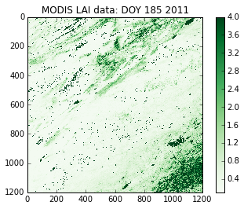
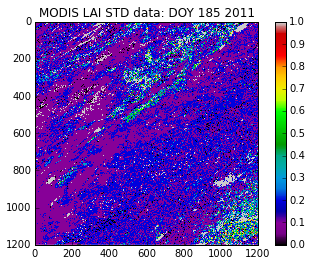
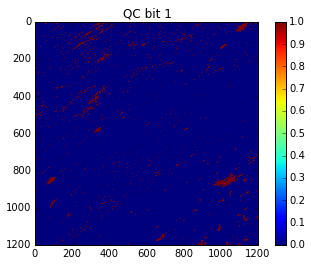
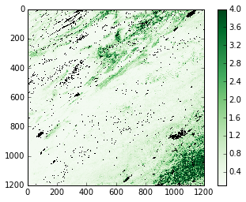
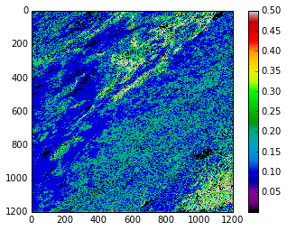
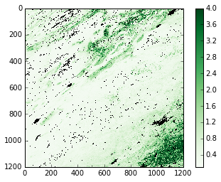

Chapter 4. Geospatial data
==========================

In this session, we will introduced the ``gdal`` geospatial module which
can read a wide range of scientific data formats. You will find that
using it to read data is quite similar to the work we did last week on
netCDF datasets.

The main challenges are also much the same: very often, you need to be
able to read data from a 'stack' of image files and generate a useful 3D
(space and time) dataset from these. Once you have the data in such a
form, there are *many* things we can do with it, and very many of these
are convenient to do using array-based expressions such as in numpy
(consider the simplicity of the expression
``absorbed = rad * (1 - albedo)`` from last week's exercise).

That said, it can sometimes be quite an effort to prepare datasets in
this form. Last week, we developed a 'valid data' mask from the
GlobAlbedo dataset, as invalid data were stored as ``nan``. Very often
though, scientific datasets have more complex 'Quality Control' (QC)
information, that gives per-pixel information describing the quality of
the product at that location (e.g. it was very cloudy so the results are
not so good).

To explore this, we will first consider the `MODIS Leaf Area Index
(LAI) <http://modis.gsfc.nasa.gov/data/dataprod/dataproducts.php?MOD_NUMBER=15>`__
product taht is mapped at 1 km resolution, every 8 days from the year
2000.

We will learn how to read in these data (in ``hdf`` format) using
``gdal``, and how to interpret the QC information in such products to
produce valid data masks. As an exercise, you will wrap some code around
that to form a 3D masked array of the dataset.

Next, we will consider how to download such data. This should be a
reinforcement of material from last week, but it is useful to know how
to conveniently access NASA data products. A challenge in the exercise
then is to download a different dataset (MODIS snow cover) for the UK,
and form a masked 3D dataset from this.

Finally, we will introduce vector datasets and show you python tools
that allow you (among many other things) to build a mask in the
projection and sampling of your spatial dataset (MODIS LAI in this
case).

There are many features and as many complexities to the Python tools we
will deal with today, but in this material, we cover some very typical
tasks you will want to do. They all revolve around generating masked 3D
datasets from NASA MODIS datasets, which is a very useful form of global
biophysical information over the last decade+. We also provide much
material for further reading and use when you are more confident in your
programming.

A final point here is that the material we cover today is very closely
related to what you will need to do in the first section of your
assessed practical that we will introduce next week, so you really need
to get to grips with this now.

There is not as much 'new' material as in previous weeks now, but we
assume that you have understood, and can make use of, material from
those lectures.

First, we will examine data from a NASA MODIS product on Leaf Area Index
(LAI).

-  4.1 `MODIS LAI product <#4.1-MODIS-LAI-product>`__
-  4.2 `Downloading data <#4.2-Downloading-data>`__
-  4.3 `Vector masking <#4.3-Vector-masking>`__

4.1 MODIS LAI product
---------------------

GDAL covers a much wider set of file formats and methods than the netCDF
library that we previously used.

Basic operation involves:

-  load gdal
-  open a spatial dataset (an hdf format file here)
-  specify which subsets you want.

We can explore the subsets in the file with ``GetSubDatasets()``:

.. code:: python

    # how to find out which datasets are in the file
    
    import gdal # Import GDAL library bindings
    
    # The file that we shall be using
    # Needs to be on current directory
    filename = 'files/data/MCD15A2.A2011185.h09v05.005.2011213154534.hdf'
    
    g = gdal.Open(filename)
    # g should now be a GDAL dataset, but if the file isn't found
    # g will be none. Let's test this:
    if g is None:
        print "Problem opening file %s!" % filename
    else:
        print "File %s opened fine" % filename
        
        
    subdatasets = g.GetSubDatasets()
    for fname, name in subdatasets:
        print name
        print "\t", fname
    


.. parsed-literal::

    File files/data/MCD15A2.A2011185.h09v05.005.2011213154534.hdf opened fine
    [1200x1200] Fpar_1km MOD_Grid_MOD15A2 (8-bit unsigned integer)
    	HDF4_EOS:EOS_GRID:"files/data/MCD15A2.A2011185.h09v05.005.2011213154534.hdf":MOD_Grid_MOD15A2:Fpar_1km
    [1200x1200] Lai_1km MOD_Grid_MOD15A2 (8-bit unsigned integer)
    	HDF4_EOS:EOS_GRID:"files/data/MCD15A2.A2011185.h09v05.005.2011213154534.hdf":MOD_Grid_MOD15A2:Lai_1km
    [1200x1200] FparLai_QC MOD_Grid_MOD15A2 (8-bit unsigned integer)
    	HDF4_EOS:EOS_GRID:"files/data/MCD15A2.A2011185.h09v05.005.2011213154534.hdf":MOD_Grid_MOD15A2:FparLai_QC
    [1200x1200] FparExtra_QC MOD_Grid_MOD15A2 (8-bit unsigned integer)
    	HDF4_EOS:EOS_GRID:"files/data/MCD15A2.A2011185.h09v05.005.2011213154534.hdf":MOD_Grid_MOD15A2:FparExtra_QC
    [1200x1200] FparStdDev_1km MOD_Grid_MOD15A2 (8-bit unsigned integer)
    	HDF4_EOS:EOS_GRID:"files/data/MCD15A2.A2011185.h09v05.005.2011213154534.hdf":MOD_Grid_MOD15A2:FparStdDev_1km
    [1200x1200] LaiStdDev_1km MOD_Grid_MOD15A2 (8-bit unsigned integer)
    	HDF4_EOS:EOS_GRID:"files/data/MCD15A2.A2011185.h09v05.005.2011213154534.hdf":MOD_Grid_MOD15A2:LaiStdDev_1km


In the previous code snippet we have done a number of different things:

1. Import the GDAL library
2. Open a file with GDAL, storing a handler to the file in ``g``
3. Test that ``g`` is not ``None`` (as this indicates failure opening
   the file. Try changing ``filename`` above to something else)
4. We then use the ``GetSubDatasets()`` method to read out information
   on the different subdatasets available from this file (compare to the
   output of ``gdalinfo`` on the shelf earlier)
5. Loop over the retrieved subdatasets to print the name (human-readable
   information) and the GDAL filename. This last item is the filename
   that you need to use to tell GDAL to open a particular data layer of
   the 6 layers present in this example

Let's say that we want to access the LAI information. By contrasting the
output of the above code (or ``gdalinfo``) to the contents of the
`LAI/fAPAR product information
page <https://lpdaac.usgs.gov/products/modis_products_table/leaf_area_index_fraction_of_photosynthetically_active_radiation/8_day_l4_global_1km/mod15a2>`__,
we find out that we want the layers for ``Lai_1km``, ``FparLai_Qc``,
``FparExtra_QC`` and ``LaiStdDev_1km``.

To read these individual datasets, we need to open each of them
individually using GDAL, and the GDAL filenames used above:

.. code:: python

    # How to access specific datasets in gdal
    
    # Let's create a list with the selected layer names
    selected_layers = [  "Lai_1km", "FparLai_QC", "LaiStdDev_1km" ]
    
    # We will store the data in a dictionary
    # Initialise an empty dictionary
    data = {}
    
    # for convenience, we will use string substitution to create a 
    # template for GDAL filenames, which we'll substitute on the fly:
    file_template = 'HDF4_EOS:EOS_GRID:"%s":MOD_Grid_MOD15A2:%s'
    # This has two substitutions (the %s parts) which will refer to:
    # - the filename
    # - the data layer
    
    for i, layer in enumerate ( selected_layers ):
        this_file = file_template % ( filename, layer )
        print "Opening Layer %d: %s" % (i+1, this_file )
        g = gdal.Open ( this_file )
        
        if g is None:
            raise IOError
        data[layer] = g.ReadAsArray() 
        print "\t>>> Read %s!" % layer
        

.. parsed-literal::

    Opening Layer 1: HDF4_EOS:EOS_GRID:"files/data/MCD15A2.A2011185.h09v05.005.2011213154534.hdf":MOD_Grid_MOD15A2:Lai_1km
    	>>> Read Lai_1km!
    Opening Layer 2: HDF4_EOS:EOS_GRID:"files/data/MCD15A2.A2011185.h09v05.005.2011213154534.hdf":MOD_Grid_MOD15A2:FparLai_QC
    	>>> Read FparLai_QC!
    Opening Layer 3: HDF4_EOS:EOS_GRID:"files/data/MCD15A2.A2011185.h09v05.005.2011213154534.hdf":MOD_Grid_MOD15A2:LaiStdDev_1km
    	>>> Read LaiStdDev_1km!


In the previous code, we have seen a way of neatly creating the
filenames required by GDAL to access the independent datasets: a
template string that gets substituted with the ``filename`` and the
``layer`` name. Note that the presence of double quotes in the template
requires us to use single quotes around it. The data is now stored in a
dictionary, and can be accessed as e.g. ``data['Lai_1km']`` which is a
numpy array:

.. code:: python

    type(data['Lai_1km'])


.. parsed-literal::

    numpy.ndarray


.. code:: python

    print data['Lai_1km']

.. parsed-literal::

    [[ 3  3  2 ...,  6  8 21]
     [ 4  3  6 ...,  8 18 14]
     [ 3 12 11 ..., 12  8  8]
     ..., 
     [ 2  3  2 ..., 18 11 17]
     [ 2  3  3 ..., 16 19 15]
     [ 3  2  2 ..., 15 16 15]]


Now we have to translate the LAI values into meaningful quantities.
According to the
`LAI <https://lpdaac.usgs.gov/products/modis_products_table/leaf_area_index_fraction_of_photosynthetically_active_radiation/8_day_l4_global_1km/mod15a2>`__
webpage, there is a scale factor of 0.1 involved for LAI and SD LAI:

.. code:: python

    lai = data['Lai_1km'] * 0.1
    lai_sd = data['LaiStdDev_1km'] * 0.1
.. code:: python

    print "LAI"
    print lai
    print "SD"
    print lai_sd

.. parsed-literal::

    LAI
    [[ 0.3  0.3  0.2 ...,  0.6  0.8  2.1]
     [ 0.4  0.3  0.6 ...,  0.8  1.8  1.4]
     [ 0.3  1.2  1.1 ...,  1.2  0.8  0.8]
     ..., 
     [ 0.2  0.3  0.2 ...,  1.8  1.1  1.7]
     [ 0.2  0.3  0.3 ...,  1.6  1.9  1.5]
     [ 0.3  0.2  0.2 ...,  1.5  1.6  1.5]]
    SD
    [[ 0.2  0.2  0.1 ...,  0.2  0.1  0.3]
     [ 0.2  0.2  0.2 ...,  0.2  0.3  0.2]
     [ 0.   0.1  0.2 ...,  0.1  0.2  0.2]
     ..., 
     [ 0.1  0.1  0.1 ...,  0.3  0.   0.1]
     [ 0.1  0.1  0.1 ...,  0.2  0.2  0.1]
     [ 0.1  0.1  0.1 ...,  0.1  0.2  0.1]]


.. code:: python

    # plot the LAI
    
    import pylab as plt
    
    # colormap
    cmap = plt.cm.Greens
    
    plt.imshow(lai,interpolation='none',vmin=0.1,vmax=4.,cmap=cmap)
    plt.title('MODIS LAI data: DOY 185 2011')
    plt.colorbar()


.. parsed-literal::

    <matplotlib.colorbar.Colorbar instance at 0x2adc680e1830>





.. code:: python

    # plot the LAI std
    
    import pylab as plt
    
    # colormap
    cmap = plt.cm.spectral
    # this sets the no data colour. 'k' is black
    
    plt.imshow(lai_sd,interpolation='none',vmax=1.,cmap=cmap)
    plt.title('MODIS LAI STD data: DOY 185 2011')
    plt.colorbar()


.. parsed-literal::

    <matplotlib.colorbar.Colorbar instance at 0x2adc6954c098>





It is not possible to produce LAI estimates if it is persistently
cloudy, so the dataset may contain some gaps.

These are identified in the dataset using the QC (Quality Control)
information.

We should then examine this.

The codes for this are also given on the LAI product page. They are
described as bit combinations:

.. raw:: html

   <table>
   <tr>
   <th>

Bit No.

.. raw:: html

   </th>    <th>

Parameter Name

.. raw:: html

   </th><th> 

Bit Combination

.. raw:: html

   </th><th>

Explanation

.. raw:: html

   </th>
   <tr>
   <td>

0

.. raw:: html

   </td><td>

MODLAND\_QC bits

.. raw:: html

   </td><td>   

0

.. raw:: html

   </td><td>  

Good quality (main algorithm with or without saturation)

.. raw:: html

   </td>
   </tr>
   <tr>
   <td>

 

.. raw:: html

   </td><td>

 

.. raw:: html

   </td><td>  

1

.. raw:: html

   </td><td>

Other Quality (back-up algorithm or fill values)

.. raw:: html

   </td>
   </tr>

   <tr>
   <td>

1

.. raw:: html

   </td><td>

Sensor

.. raw:: html

   </td><td>    

0

.. raw:: html

   </td><td>  

TERRA

.. raw:: html

   </td>
   </tr>
   <tr>
   <td>

 

.. raw:: html

   </td><td>

 

.. raw:: html

   </td><td>  

1

.. raw:: html

   </td><td>

AQUA

.. raw:: html

   </td>
   </tr>

   <tr>
   <td>

2

.. raw:: html

   </td><td>

DeadDetector

.. raw:: html

   </td><td>  

0

.. raw:: html

   </td><td>  

Detectors apparently fine for up to 50% of channels 1 2

.. raw:: html

   </td>
   </tr>
   <tr>
   <td>

 

.. raw:: html

   </td><td>

 

.. raw:: html

   </td><td>  

1

.. raw:: html

   </td><td>

Dead detectors caused >50% adjacent detector retrieval

.. raw:: html

   </td>
   </tr>

   <tr>
   <td>

3-4

.. raw:: html

   </td><td>

CloudState

.. raw:: html

   </td><td> 

00

.. raw:: html

   </td><td> 

Significant clouds NOT present (clear)

.. raw:: html

   </td>
   </tr>
   <tr>
   <td>

 

.. raw:: html

   </td><td>

 

.. raw:: html

   </td><td>  

01

.. raw:: html

   </td><td>

Significant clouds WERE present

.. raw:: html

   </td>
   </tr>
   <tr>
   <td>

 

.. raw:: html

   </td><td>

 

.. raw:: html

   </td><td>  

10

.. raw:: html

   </td><td>

Mixed clouds present on pixel

.. raw:: html

   </td>
   </tr>
   <tr>
   <td>

 

.. raw:: html

   </td><td>

 

.. raw:: html

   </td><td>  

11

.. raw:: html

   </td><td>

Cloud state not defined assumed clear

.. raw:: html

   </td>
   </tr>

   <tr>
   <td>

5-7

.. raw:: html

   </td><td>

CF\_QC

.. raw:: html

   </td><td>  

000

.. raw:: html

   </td><td>    

Main (RT) method used best result possible (no saturation)

.. raw:: html

   </td>
   </tr>
   <tr>
   <td>

 

.. raw:: html

   </td><td>

 

.. raw:: html

   </td><td>  

001

.. raw:: html

   </td><td>

Main (RT) method used with saturation. Good very usable

.. raw:: html

   </td>
   </tr>
   <tr>
   <td>

 

.. raw:: html

   </td><td>

 

.. raw:: html

   </td><td>  

010

.. raw:: html

   </td><td>

Main (RT) method failed due to bad geometry empirical algorithm used

.. raw:: html

   </td>
   </tr>
   <tr>
   <td>

 

.. raw:: html

   </td><td>

 

.. raw:: html

   </td><td>  

011

.. raw:: html

   </td><td> 

Main (RT) method failed due to problems other than geometry empirical
algorithm used

.. raw:: html

   </td>
   </tr>
   <tr>
   <td>

 

.. raw:: html

   </td><td>

 

.. raw:: html

   </td><td>  

100

.. raw:: html

   </td><td> 

Pixel not produced at all value coudn’t be retrieved (possible reasons:
bad L1B data unusable MODAGAGG data)

.. raw:: html

   </td>
   </tr>
   </table>

In using this information, it is up to the use which data he/she wants
to pass through for any further processing. There are clearly
trade-offs: if you look for only the highest quality data, then the
number of samples is likely to be lower than if you were more tolerant.
But if you are too tolerant, you will get spurious results. You may find
useful information on how to convert from actual QA flags to diagnostics
in `this page <http://gis.cri.fmach.it/modis-ndvi-evi/>`__ (they focus
on NDVI/EVI, but the theory is the same).

But let's just say that we want to use only the highest quality data.

This means we want bit 0 to be 0 ...

Let's have a look at the QC data:

.. code:: python

    qc = data['FparLai_QC'] # Get the QC data which is an unsigned 8 bit byte
    print qc , qc.dtype

.. parsed-literal::

     [[2 2 0 ..., 0 2 2]
     [2 2 0 ..., 2 0 2]
     [0 2 0 ..., 0 0 0]
     ..., 
     [0 0 2 ..., 0 8 0]
     [0 0 0 ..., 0 0 2]
     [0 2 0 ..., 2 2 2]] uint8


We see various byte values:

.. code:: python

    np.unique(qc)


.. parsed-literal::

    array([  0,   2,   8,  10,  16,  18,  32,  34,  40,  42,  48,  50,  97,
            99, 105, 107, 113, 115, 157], dtype=uint8)


.. code:: python

    # translated into binary using bin()
    for i in np.unique(qc):
        print i,bin(i)

.. parsed-literal::

    0 0b0
    2 0b10
    8 0b1000
    10 0b1010
    16 0b10000
    18 0b10010
    32 0b100000
    34 0b100010
    40 0b101000
    42 0b101010
    48 0b110000
    50 0b110010
    97 0b1100001
    99 0b1100011
    105 0b1101001
    107 0b1101011
    113 0b1110001
    115 0b1110011
    157 0b10011101


We could try to come up with an interpretation of each of these ... or
we could try to mask the qc bytes to see bit 0 only if that's what we
are interested in. This is quite possibly a new concept for most of you,
but it is very common that when interpreting QC data in data products,
you need to think about bit masking. You will find more details on this
in the advanced section of Chapter 1, but we will consider the minimum
we need right now.

Byte data are formed of 8 bits, e.g.:

``105 ==  (1 * 2**6) +          (1 * 2**5) +          (0 * 2**4) +          (1 * 2**3) +          (0 * 2**2) +          (0 * 2**1) +          (1 * 2**0)``

So, in binary, we represent the decimal number ``105`` by ``1101001`` as
we saw above.

The QC values are to be interpreted in this manner.

If we want *only* bit 1, we can perform a *bitwise* operation with the
byte data.

In this case, it would be an 'and' operation (``&``) with the value
``1``:

.. code:: python

    # suppose we consider the value 105
    # which from above, we know to have 
    # bit 0 set as 1
    test = 105
    bit_zero = test & 1
    print bit_zero

.. parsed-literal::

    1


.. code:: python

    # suppose we consider the value 104
    # which we could work out has bit 1 as 0
    test = 104
    bit_zero = test & 1
    print bit_zero

.. parsed-literal::

    0


.. code:: python

    # other bit fields are a 'little' more complicated
    tests = np.unique(qc)
    
    
    for t in tests:
        # if we want bit field 5-7
        # we form a binary mask
        mask57 = 0b11100000
        # but 0
        mask0 =  0b00000001
        # and use & as before and right shift 5 (>> 5)
        qa57 = (t & mask57) >> 5
        qa0  = (t & mask0) >> 0
        print t,qa57,qa0,bin(t)

.. parsed-literal::

    0 0 0 0b0
    2 0 0 0b10
    8 0 0 0b1000
    10 0 0 0b1010
    16 0 0 0b10000
    18 0 0 0b10010
    32 1 0 0b100000
    34 1 0 0b100010
    40 1 0 0b101000
    42 1 0 0b101010
    48 1 0 0b110000
    50 1 0 0b110010
    97 3 1 0b1100001
    99 3 1 0b1100011
    105 3 1 0b1101001
    107 3 1 0b1101011
    113 3 1 0b1110001
    115 3 1 0b1110011
    157 4 1 0b10011101


So, for example (examining the table above) ``105`` is interpreted at
``0b011`` in fields 5 to 7 (which is 3 in decimal). This indicates that
'Main (RT) method failed due to problems other than geometry empirical
algorithm used'. Here, bit zero is set to ``1``, so this is a 'bad'
pixel.

In this case, we are only interested in bit 0, which is an easier task
than inmterpreting all of the bits.

.. code:: python

    # the good data are where qc bit 1 is 0
    
    qc = data['FparLai_QC'] # Get the QC data
    # find bit 0
    qc = qc & 1
    
    plt.imshow(qc)
    plt.title('QC bit 1')
    plt.colorbar()


.. parsed-literal::

    <matplotlib.colorbar.Colorbar instance at 0xc6b71b8>





We can use this mask to generate a masked array. Masked arrays, as we
have seen before, are like normal arrays, but they have an associated
mask.

Remember that the mask in a masked array should be ``False`` for good
data, so we can directly use ``qc`` as defined above.

We shall also choose another colormap (there are `lots to choose
from <http://wiki.scipy.org/Cookbook/Matplotlib/Show_colormaps>`__), and
set values outside the 0.1 and 4 to be shown as black pixels.

.. code:: python

    # colormap
    cmap = plt.cm.Greens
    cmap.set_bad ( 'k' )
    # this sets the no data colour. 'k' is black
    
    # generate the masked array
    laim = np.ma.array ( lai, mask=qc )
    
    # and plot it
    plt.imshow ( laim, cmap=cmap, interpolation='none', vmin=0.1, vmax=4)
    plt.colorbar()


.. parsed-literal::

    <matplotlib.colorbar.Colorbar instance at 0x2adc6b8dd5a8>





Similarly, we can do a similar thing for Standard Deviation

.. code:: python

    cmap = plt.cm.spectral
    cmap.set_bad ( 'k' )
    stdm = np.ma.array ( lai_sd, mask=qc )
    plt.imshow ( stdm, cmap=cmap, interpolation='none', vmin=0.001, vmax=0.5)
    plt.colorbar()


.. parsed-literal::

    <matplotlib.colorbar.Colorbar instance at 0x2adc70725878>





For convenience, we might wrap all of this up into a function:

.. code:: python

    import gdal
    import numpy as np
    import numpy.ma as ma
    
    
    def getLAI(filename, \
               qc_layer = 'FparLai_QC',\
               scale = [0.1, 0.1],\
               selected_layers = ["Lai_1km", "LaiStdDev_1km"]):
               
        # get the QC layer too
        selected_layers.append(qc_layer)
        scale.append(1)
        # We will store the data in a dictionary
        # Initialise an empty dictionary
        data = {}
        # for convenience, we will use string substitution to create a 
        # template for GDAL filenames, which we'll substitute on the fly:
        file_template = 'HDF4_EOS:EOS_GRID:"%s":MOD_Grid_MOD15A2:%s'
        # This has two substitutions (the %s parts) which will refer to:
        # - the filename
        # - the data layer
        for i,layer in enumerate(selected_layers):
            this_file = file_template % ( filename, layer )
            g = gdal.Open ( this_file )
            
            if g is None:
                raise IOError
            
            data[layer] = g.ReadAsArray() * scale[i]
    
        qc = data[qc_layer] # Get the QC data
        # find bit 0
        qc = qc & 1
        
        odata = {}
        for layer in selected_layers[:-1]:
            odata[layer] = ma.array(data[layer],mask=qc)
        
        return odata
        
.. code:: python

    filename = 'files/data/MCD15A2.A2011185.h09v05.005.2011213154534.hdf'
    
    lai_data = getLAI(filename)
    
    # colormap
    cmap = plt.cm.Greens
    cmap.set_bad ( 'k' )
    # this sets the no data colour. 'k' is black
    
    # and plot it
    plt.imshow ( lai_data['Lai_1km'], cmap=cmap, interpolation='nearest', vmin=0.1, vmax=4)
    plt.colorbar()


.. parsed-literal::

    <matplotlib.colorbar.Colorbar instance at 0x2adc709ffe18>





Exercise 4.1
------------

You are given the MODIS LAI data files for the year 2012 in the
directory ``files/data`` for the UK (MODIS tile h17v03).

Read these LAI datasets into a masked array, using QA bit 0 to mask the
data (i.e. good quality data only) and generate a movie of LAI.

You should end up with something like:

.. figure:: files/images/lai_uk02.gif
   :alt: 

4.2 Downloading data
--------------------

For the exercise and notes above, you were supplied with several
datasets that had been previously downloaded.

4.2.1 Reverb
~~~~~~~~~~~~

These NASA data can be accessed in several ways (except on Wednesdays
when they go down for maintainance (or when there is a Government
shutdown ...)). The most direct way is to use
`Reverb <http://reverb.echo.nasa.gov/reverb/#utf8=%E2%9C%93&spatial_map=satellite&spatial_type=rectangle>`__
to explore and access data. If you do this, you can, for example `search
for MODIS snow cover MOD10 datasets covering the
UK <http://reverb.echo.nasa.gov/reverb/#utf8=%E2%9C%93&spatial_map=satellite&spatial_type=rectangle&spatial=47.517%2C%202.813%2C%2056.907%2C%20-10.547&keywords=modis%20snow%20cover%20mod10&temporal_start=2013-02-21%2000%3A00%3A00&temporal_end=2013-03-21%2023%3A59%3A59>`__
for some given time period. If you follow this through, e.g. selecting
`MODIS/Terra Snow Cover Daily L3 Global 500m SIN Grid
V005 <http://reverb.echo.nasa.gov/reverb/granules?utf8=%E2%9C%93&new_view=true&spatial_map=satellite&spatial_type=rectangle&spatial=47.517%2C+2.813%2C+56.907%2C+-10.547&keywords=modis+snow+cover+mod10&temporal_start=2013-02-21+00%3A00%3A00&temporal_end=2013-03-21+23%3A59%3A59&datasets=C92711294-NSIDC_ECS>`__
and then search for 'granules', you should get access to the datasets
you want (select e.g. one of the files for gid ``h17v03`` and save to
cart). You then view the items in your cart, click 'download' and then
'save'.

This should give you a text file with some urls in it, e.g.:

``ftp://n4ftl01u.ecs.nasa.gov/DP0/MOST/MOD10A1.005/2013.02.21/MOD10A1.A2013052.h17v03.005.2013054054219.hdf ftp://n4ftl01u.ecs.nasa.gov/DP0/MOST/MOD10A1.005/2013.02.21/MOD10A1.A2013052.h17v03.005.2013054054219.hdf.xml ftp://n4ftl01u.ecs.nasa.gov/DP0/BRWS/Browse.001/2013.02.23/BROWSE.MOD10A1.A2013052.h17v03.005.2013054054219.1.jpg http://browse.echo.nasa.gov/NSIDC_ECS/2013/02/23/:BR:Browse.001:46841269:1.BINARY``

Here, we can note that one of them is a jpeg file:

.. figure:: ftp://n4ftl01u.ecs.nasa.gov/DP0/BRWS/Browse.001/2013.02.23/BROWSE.MOD10A1.A2013052.h17v03.005.2013054054219.1.jpg
   :alt: 

which is the quicklook (BROWSE file) for that tile / date.

The hdf dataset is, in this case
``ftp://n4ftl01u.ecs.nasa.gov/DP0/MOST/MOD10A1.005/2013.02.21/MOD10A1.A2013052.h17v03.005.2013054054219.hdf``.

From this, we see that the data server is ``n4ftl01u.ecs.nasa.gov`` and
that the MODIS snow products for the MODIS Terra instrument are in the
directory:

``ftp://n4ftl01u.ecs.nasa.gov/DP0/MOST``.

If we explored that, we would find the datasets from the MODIS Aqua
platform were in:

``ftp://n4ftl01u.ecs.nasa.gov/DP0/MOSA``.

The directories below that give the date and filename.

4.2.2 FTP access
~~~~~~~~~~~~~~~~

Now we have discovered something about the directory structure on the
server, we could explore this to get the datasets we want (rather than
having to go through Reverb).

Some of the datasets on Reverb are acessible only through ``http``, but
the snow products (at present) are availble by ``ftp``.

In either case, if we want to run some 'batch' process to download many
files (e.g. all files for a year for some tile), the first thing we need
is the set of urls for the files we want.

We won't go into detail here about how to get this, but it is covered in
the advanced section (at the very least, you could always get the set of
urls from Reverb).

So, let's suppose now that we have a file containing some urls that we
want to pull:

.. code:: python

    !head -10 < files/data/robot_snow.2012.txt

.. parsed-literal::

    ftp://n4ftl01u.ecs.nasa.gov/MOSA/MYD10A1.005/2012.01.01/MYD10A1.A2012001.h00v08.005.2012006235251.hdf
    ftp://n4ftl01u.ecs.nasa.gov/MOSA/MYD10A1.005/2012.01.01/MYD10A1.A2012001.h00v09.005.2012006235244.hdf
    ftp://n4ftl01u.ecs.nasa.gov/MOSA/MYD10A1.005/2012.01.01/MYD10A1.A2012001.h00v10.005.2012006234603.hdf
    ftp://n4ftl01u.ecs.nasa.gov/MOSA/MYD10A1.005/2012.01.01/MYD10A1.A2012001.h01v08.005.2012006234607.hdf
    ftp://n4ftl01u.ecs.nasa.gov/MOSA/MYD10A1.005/2012.01.01/MYD10A1.A2012001.h01v09.005.2012006234607.hdf
    ftp://n4ftl01u.ecs.nasa.gov/MOSA/MYD10A1.005/2012.01.01/MYD10A1.A2012001.h01v10.005.2012006235245.hdf
    ftp://n4ftl01u.ecs.nasa.gov/MOSA/MYD10A1.005/2012.01.01/MYD10A1.A2012001.h01v11.005.2012006234656.hdf
    ftp://n4ftl01u.ecs.nasa.gov/MOSA/MYD10A1.005/2012.01.01/MYD10A1.A2012001.h02v06.005.2012006235323.hdf
    ftp://n4ftl01u.ecs.nasa.gov/MOSA/MYD10A1.005/2012.01.01/MYD10A1.A2012001.h02v08.005.2012006234419.hdf
    ftp://n4ftl01u.ecs.nasa.gov/MOSA/MYD10A1.005/2012.01.01/MYD10A1.A2012001.h02v09.005.2012006234416.hdf


This is a file containing the filenames of *all* ``MOD10A1`` (daily snow
cover) files for a given year, pulled from the ftp server. It is
possible to do this in Python (see advanced section), but actually must
easier and faster with an ftp script
`\`files/python/zat-snow <files/python/zat-snow>`__. You don't need to
run this, as it has already been run for you and the results put in the
files:

.. code:: python

    ls -l files/data/robot_snow*txt

.. parsed-literal::

    -rw-rw-r-- 1 plewis plewis  9034752 Oct 22 09:25 files/data/robot_snow.2000.txt
    -rw-rw-r-- 1 plewis plewis 10820568 Oct 22 09:25 files/data/robot_snow.2001.txt
    -rw-rw-r-- 1 plewis plewis 16321938 Oct 22 09:25 files/data/robot_snow.2002.txt
    -rw-rw-r-- 1 plewis plewis 22423068 Oct 22 09:25 files/data/robot_snow.2003.txt
    -rw-rw-r-- 1 plewis plewis  7633374 Oct 22 09:25 files/data/robot_snow.2004.txt
    -rw-rw-r-- 1 plewis plewis 18872448 Oct 22 09:25 files/data/robot_snow.2005.txt
    -rw-rw-r-- 1 plewis plewis 11433078 Oct 22 09:25 files/data/robot_snow.2006.txt
    -rw-rw-r-- 1 plewis plewis 22663686 Oct 22 09:25 files/data/robot_snow.2007.txt
    -rw-rw-r-- 1 plewis plewis 22668990 Oct 22 09:25 files/data/robot_snow.2008.txt
    -rw-rw-r-- 1 plewis plewis 22705317 Oct 22 09:25 files/data/robot_snow.2009.txt
    -rw-rw-r-- 1 plewis plewis 22712370 Oct 22 09:25 files/data/robot_snow.2010.txt
    -rw-rw-r-- 1 plewis plewis 17129166 Oct 22 09:25 files/data/robot_snow.2011.txt
    -rw-rw-r-- 1 plewis plewis 22756824 Oct 22 09:25 files/data/robot_snow.2012.txt
    -rw-rw-r-- 1 plewis plewis 18104898 Oct 22 09:25 files/data/robot_snow.2013.txt
    

We can do similar things for http, but that is a little more complicated
(again, see advanced notes or
```files/zat > files/data/robot.txt`` <files/zat>`__ for the MODIS LAI
product.

.. code:: python

    !head -10 < files/data/robot.txt

.. parsed-literal::

    http://e4ftl01.cr.usgs.gov/MODIS_Composites/MOTA/MCD15A2.005/2002.07.04/MCD15A2.A2002185.h00v08.005.2007172150237.hdf
    http://e4ftl01.cr.usgs.gov/MODIS_Composites/MOTA/MCD15A2.005/2002.07.04/MCD15A2.A2002185.h00v09.005.2007172150920.hdf
    http://e4ftl01.cr.usgs.gov/MODIS_Composites/MOTA/MCD15A2.005/2002.07.04/MCD15A2.A2002185.h00v10.005.2007172151610.hdf
    http://e4ftl01.cr.usgs.gov/MODIS_Composites/MOTA/MCD15A2.005/2002.07.04/MCD15A2.A2002185.h01v07.005.2007172152152.hdf
    http://e4ftl01.cr.usgs.gov/MODIS_Composites/MOTA/MCD15A2.005/2002.07.04/MCD15A2.A2002185.h01v08.005.2007172150246.hdf
    http://e4ftl01.cr.usgs.gov/MODIS_Composites/MOTA/MCD15A2.005/2002.07.04/MCD15A2.A2002185.h01v09.005.2007172150923.hdf
    http://e4ftl01.cr.usgs.gov/MODIS_Composites/MOTA/MCD15A2.005/2002.07.04/MCD15A2.A2002185.h01v10.005.2007177210359.hdf
    http://e4ftl01.cr.usgs.gov/MODIS_Composites/MOTA/MCD15A2.005/2002.07.04/MCD15A2.A2002185.h01v11.005.2007172151611.hdf
    http://e4ftl01.cr.usgs.gov/MODIS_Composites/MOTA/MCD15A2.005/2002.07.04/MCD15A2.A2002185.h02v06.005.2007172144545.hdf
    http://e4ftl01.cr.usgs.gov/MODIS_Composites/MOTA/MCD15A2.005/2002.07.04/MCD15A2.A2002185.h02v08.005.2007172150221.hdf


The file ``files/data/robot_snow.2012.txt`` contains the names for all
tiles and all files.

So if we want just e.g. tile ``h17v03`` and sensor (``MOST``), we can
most easily filter this in unix:

.. code:: python

    tile=h17v03
    year=2012
    type=MOST
    
    file=files/data/robot_snow.${year}_${type}_${tile}.txt
    
    grep $tile < files/data/robot_snow.$year.txt | grep $type > $file
    
    # how many files?
    wc -l < $file
    
    # look at the first 10 ...
    head -10 < $file

.. parsed-literal::

    366
    ftp://n4ftl01u.ecs.nasa.gov/MOST/MOD10A1.005/2012.01.01/MOD10A1.A2012001.h17v03.005.2012003054416.hdf
    ftp://n4ftl01u.ecs.nasa.gov/MOST/MOD10A1.005/2012.01.02/MOD10A1.A2012002.h17v03.005.2012004061011.hdf
    ftp://n4ftl01u.ecs.nasa.gov/MOST/MOD10A1.005/2012.01.03/MOD10A1.A2012003.h17v03.005.2012005061244.hdf
    ftp://n4ftl01u.ecs.nasa.gov/MOST/MOD10A1.005/2012.01.04/MOD10A1.A2012004.h17v03.005.2012006054639.hdf
    ftp://n4ftl01u.ecs.nasa.gov/MOST/MOD10A1.005/2012.01.05/MOD10A1.A2012005.h17v03.005.2012007052708.hdf
    ftp://n4ftl01u.ecs.nasa.gov/MOST/MOD10A1.005/2012.01.06/MOD10A1.A2012006.h17v03.005.2012008070328.hdf
    ftp://n4ftl01u.ecs.nasa.gov/MOST/MOD10A1.005/2012.01.07/MOD10A1.A2012007.h17v03.005.2012011144012.hdf
    ftp://n4ftl01u.ecs.nasa.gov/MOST/MOD10A1.005/2012.01.08/MOD10A1.A2012008.h17v03.005.2012011154609.hdf
    ftp://n4ftl01u.ecs.nasa.gov/MOST/MOD10A1.005/2012.01.09/MOD10A1.A2012009.h17v03.005.2012011222125.hdf
    ftp://n4ftl01u.ecs.nasa.gov/MOST/MOD10A1.005/2012.01.10/MOD10A1.A2012010.h17v03.005.2012012062821.hdf


With a more sensible set of urls now (only a few hundred), we can
consider how to download them.

We can (of course) do this in Python (see advanced notes), but we can
also use unix tools such as ``curl`` or ``wget``, which may be easier.

For example, in ``bash``:

.. code:: bash

    tile=h17v03
    year=2012
    type=MOST

    file=snow_list_${tile}_${year}_${type}.txt

    # cd temporarily to the local directory
    pushd files/data
    # -nc : no clobber : dont download if its there already
    # -nH --cut-dirs=3 : ignore the directories
    wget -nc -i $file -nH --cut-dirs=3
    popd

or in ``tcsh``:

.. code:: bash

    set tile=h17v03
    set year=2012
    set type=MOST

    file=snow_list_${tile}_${year}_${type}.txt

    # cd temporarily to the local directory
    pushd files/data
    # -nc : no clobber : dont download if its there already
    # -nH --cut-dirs=3 : ignore the directories
    wget -nc -i $file -nH --cut-dirs=3
    popd

For the moment, let's just pull only some of these by filtering the
month as well:

.. code:: python

    tile=h17v03
    year=2012
    type=MOST
    month=01
    
    file=files/data/robot_snow.${year}_${type}_${tile}_${month}.txt
    
    # the dot in the year / month grep need to be escaped
    # because dot means something special to grep
    grep $tile < files/data/robot_snow.$year.txt | grep $type | grep "${year}\.${month}" > $file
    
    # how many files?
    wc -l < $file
    
    # look at the first 10 ...
    head -10 < $file

.. parsed-literal::

    31
    ftp://n4ftl01u.ecs.nasa.gov/MOST/MOD10A1.005/2012.01.01/MOD10A1.A2012001.h17v03.005.2012003054416.hdf
    ftp://n4ftl01u.ecs.nasa.gov/MOST/MOD10A1.005/2012.01.02/MOD10A1.A2012002.h17v03.005.2012004061011.hdf
    ftp://n4ftl01u.ecs.nasa.gov/MOST/MOD10A1.005/2012.01.03/MOD10A1.A2012003.h17v03.005.2012005061244.hdf
    ftp://n4ftl01u.ecs.nasa.gov/MOST/MOD10A1.005/2012.01.04/MOD10A1.A2012004.h17v03.005.2012006054639.hdf
    ftp://n4ftl01u.ecs.nasa.gov/MOST/MOD10A1.005/2012.01.05/MOD10A1.A2012005.h17v03.005.2012007052708.hdf
    ftp://n4ftl01u.ecs.nasa.gov/MOST/MOD10A1.005/2012.01.06/MOD10A1.A2012006.h17v03.005.2012008070328.hdf
    ftp://n4ftl01u.ecs.nasa.gov/MOST/MOD10A1.005/2012.01.07/MOD10A1.A2012007.h17v03.005.2012011144012.hdf
    ftp://n4ftl01u.ecs.nasa.gov/MOST/MOD10A1.005/2012.01.08/MOD10A1.A2012008.h17v03.005.2012011154609.hdf
    ftp://n4ftl01u.ecs.nasa.gov/MOST/MOD10A1.005/2012.01.09/MOD10A1.A2012009.h17v03.005.2012011222125.hdf
    ftp://n4ftl01u.ecs.nasa.gov/MOST/MOD10A1.005/2012.01.10/MOD10A1.A2012010.h17v03.005.2012012062821.hdf


.. code:: python

    tile=h17v03
    year=2012
    type=MOST
    month=01
    
    file=robot_snow.${year}_${type}_${tile}_${month}.txt
    
    # cd temporarily to the local directory
    pushd files/data
    # -nc : no clobber : dont download if its there already
    # -nH --cut-dirs=3 : ignore the directories
    wget -nc -i $file -nH --cut-dirs=3
    # cd back again
    popd

.. parsed-literal::

    Process is terminated.


Exercise 4.2 A Different Dataset
--------------------------------

We have now dowloaded a different dataset, the `MOD10A
product <http://www.icess.ucsb.edu/modis/SnowUsrGuide/usrguide_1dtil.html>`__,
which is the 500 m MODIS daily snow cover product, over the UK.

This is a good opportunity to see if you can apply what was learned
above about interpreting QC information and using ``gdal`` to examine a
dataset.

If you examine the `data description
page <http://nsidc.org/data/docs/daac/modis_v5/mod10a1_modis_terra_snow_daily_global_500m_grid.gd.html>`__,
you will see that the data are in HDF EOS format (the same as the LAI
product).

E4.2.1 Download
~~~~~~~~~~~~~~~

Download the MODIS Terra daily snow product for the UK for the year 2012
for the month of February using the urls in
`files/data/robot\_snow.2012.txt <files/data/robot_snow.2012.txt>`__ and
put them in the directory ``files/data``.

E4.2.1 Explore
~~~~~~~~~~~~~~

Show all of the subset data layers in this dataset.

E4.3.3 Read a dataset
~~~~~~~~~~~~~~~~~~~~~

Suppose we are interested in the dataset ``Fractional_Snow_Cover`` over
the land surface.

Read this dataset for one of the files into a numpy array and show a
plot of the dataset.

E4.3.4 Water mask
~~~~~~~~~~~~~~~~~

The `data description
page <http://nsidc.org/data/docs/daac/modis_v5/mod10a1_modis_terra_snow_daily_global_500m_grid.gd.html>`__
tells us that values of ``239`` will indicate whether the data is ocean.
You can use this information to build the water mask.

Demonstrate how to build a water mask from one of these files, setting
the mask ``False`` for land and ``True`` for water.

Produce a plot of this.

E3.4.5 Valid pixel mask
~~~~~~~~~~~~~~~~~~~~~~~

As well as having a land/water mask, we should generate a mask for valid
pixels. For the snow dataset, values between 0 and 100 (inclusive)
represent valid snow cover data values. Other values are not valid for
some reason. Set the mask to ``False`` for valid pixels and ``True`` for
others. Produce a plot of the mask.

E4.3.6 3D dataset
~~~~~~~~~~~~~~~~~

Generate a 3D masked numpy array using the valid pixel mask for masking,
of ``Fractional_Snow_Cover`` for each day of February 2012.

You might like to produce a movie of the result.

Hint: you will need a list of filenames for this. You can either use
``glob`` as in previous exercises, or you might notice that you have the
file ``files/data/robot_snow.2012_MOST_h17v03_02.txt`` with the urls,
from which you should be able to derive the file names. However you get
your list of filenames, you should probably apply a ``sort()`` to the
result to make sure they are in the correct order.


4.3 Vector masking
------------------

In this section, we will use a pre-defined function to generate a mask
from some vector boundary data.

In this case, we will generate a mask for Ireland, projected into the
coordinate system of the MODIS LAI dataset, and use that to generate a
new LAI data only for Ireland.

Sometimes, geospatial data is acquired and recorded for particular
geometric objects such as polygons or lines. An example is a road
layout, where each road is represented as a geometric object (a line,
with points given in a geographical projection), with a number of added
*features* associated with it, such as the road name, whether it is a
toll road, or whether it is dual-carriageway, etc. This data is quite
different to a raster, where the entire scene is tessellated into
pixels, and each pixel holds a value (or an array of value in the case
of multiband rasterfiles).

If you are familiar with databases, vector files are effectively a
database, where one of the fields is a geometry object (a line in our
previous road example, or a polygon if you consider a cadastral system).
We can thus select different records by writing queries on the features.
Some of these queries might be spatial (e.g. check whether a point is
inside a particular country polygon).

The most common format for vector data is the **ESRI Shapfile**, which
is a multifile format (i.e., several files are needed in order to access
the data). We'll start by getting hold of a shapefile that contains the
countries of the world as polygons, together with information on country
name, capital name, population, etc. The file is available
`here <http://aprsworld.net/gisdata/world/world.zip>`__.

.. figure:: http://aprsworld.net/gisdata/world/political-world-aprs-small.png
   :alt: World

   World

We will download the file with wget (or curl if you want to), and
uncompress it using unzip in the shell:

.. code:: python

    # Downloads the data using wget
    !wget -nc http://aprsworld.net/gisdata/world/world.zip -O files/data/world.zip
    # or if you want to use curl...
    #! curl http://aprsworld.net/gisdata/world/world.zip -o world.zip
    !pushd files/data;unzip -o -x world.zip;popd

.. parsed-literal::

    --2013-10-22 15:32:06--  http://aprsworld.net/gisdata/world/world.zip
    Resolving aprsworld.net... 72.251.203.219
    Connecting to aprsworld.net|72.251.203.219|:80... connected.
    HTTP request sent, awaiting response... 200 OK
    Length: 3436277 (3.3M) [application/zip]
    Saving to: `files/data/world.zip'
    
    100%[======================================>] 3,436,277   3.38M/s   in 1.0s    
    
    2013-10-22 15:32:07 (3.38 MB/s) - `files/data/world.zip' saved [3436277/3436277]
    
    /archive/rsu_raid_0/plewis/public_html/geogg122_local/geogg122/Chapter4_GDAL/files/data /archive/rsu_raid_0/plewis/public_html/geogg122_local/geogg122/Chapter4_GDAL
    Archive:  world.zip
      inflating: world.dbf               
      inflating: world.shp               
      inflating: world.shx               
    /archive/rsu_raid_0/plewis/public_html/geogg122_local/geogg122/Chapter4_GDAL


We need to import ``ogr``, and then open the file. As with GDAL, we get
a handler to the file, (``g`` in this case). OGR files can have
different layers, although Shapefiles only have one. We need to select
the layer using ``GetLayer(0)`` (selecting the first layer).

.. code:: python

    from osgeo import ogr
    
    g = ogr.Open( "files/data/world.shp" )
    layer = g.GetLayer( 0 )
In order to see a field (the field ``NAME``) we can loop over the
features in the layer, and use the ``GetField('NAME')`` method. We'll
only do ten features here:

.. code:: python

    n_feat = 0
    for feat in layer:
        
        print feat.GetField('NAME')
        
        n_feat += 1
        if n_feat == 10:
            break

.. parsed-literal::

    GUATEMALA
    BOLIVIA
    PARAGUAY
    URUGUAY
    SURINAME
    FRENCH GUIANA
    WESTERN SAHARA
    GAMBIA
    MOROCCO
    MALI


If you wanted to see the different layers, we could do this using:

.. code:: python

    layerDefinition = layer.GetLayerDefn()
    
    
    for i in range(layerDefinition.GetFieldCount()):
        print "Field %d: %s" % ( i+1, layerDefinition.GetFieldDefn(i).GetName() )

.. parsed-literal::

    Field 1: NAME
    Field 2: CAPITAL
    Field 3: APPROX
    Field 4: AREA
    Field 5: SOURCETHM


There is much more information on using ``ogr`` on the associated
`notebook OGR\_Python <OGR_Python.ipynb>`__ that you should explore at
some point.

One thing we may often wish to dowith such vector datsets is produce a
mask, e.g. for national boundaries. One of the complexities of this is
changing the projection that the vector data come in to that of the
raster dataset.

This is too involved to go over in this session, so we will simply
present you with a function to achieve this.

This is available as
`files/python/raster\_mask.py <files/python/raster_mask.py>`__.

Most of the code below should be familiar from above (we make use of the
``getLAI()`` function we developed).

.. code:: python

    import sys
    sys.path.insert(0,'files/python')
    from raster_mask import raster_mask,getLAI
    
    # test this on an LAI file
    
    # the data file name
    filename = 'files/data/MCD15A2.A2012273.h17v03.005.2012297134400.hdf'
    
    # a layer (doesn't matter so much which: use for geometry info)
    layer = 'Lai_1km'
    # the full dataset specification
    file_template = 'HDF4_EOS:EOS_GRID:"%s":MOD_Grid_MOD15A2:%s'
    file_spec = file_template%(filename,layer)
    
    # make a raster mask
    # from the layer IRELAND in world.shp
    mask = raster_mask(file_spec,\
                       target_vector_file = "files/data/world.shp",\
                       attribute_filter = "NAME = 'IRELAND'")
    
    # get the LAI data
    data = getLAI(filename)
    
    # reset the data mask
    # 'mask' is True for Ireland
    # so take the opposite 
    data['Lai_1km'] = ma.array(data['Lai_1km'],mask=mask)
    data['LaiStdDev_1km'] = ma.array(data['Lai_1km'],mask=mask)
    
    plt.title('LAI for Eire: 2012273')
    plt.imshow(data['Lai_1km'],vmax=6)
    plt.colorbar()


.. parsed-literal::

    <matplotlib.colorbar.Colorbar instance at 0x7153878>


.. image:: GDAL_HDF_files/GDAL_HDF_65_1.png


Exercise 4.3
------------

Apply the concepts above to generate a 3D masked numpy data array of LAI
and std LAI for Eire for the year 2012.

Plot your results and make a move of LAI.

Plot average LAI for Eire as a function of day of year for 2012.

Summary
=======

In this session, we have learned to use some geospatial tools using GDAL
in Python. A good set of `working notes on how to use
GDAL <http://jgomezdans.github.io/gdal_notes/>`__ has been developed
that you will find useful for further reading, as well as looking at the
`advanced <advanced.ipynb>`__ section.

We have also very briefly introduced dealing with vector datasets in
``ogr``, but this was mainly through the use of a pre-defined function
that will take an ESRI shapefile (vector dataset), warp this to the
projection of a raster dataset, and produce a mask for a given layer in
the vector file.

If there is time in the class, we will develop some exercises to examine
the datasets we have generated and/or to explore some different datasets
or different locations.
