5. Function fitting and Interpolation
=====================================

In today's session, we will be using some of the LAI datasets we
examined last week (masked by national boundaries) and doing some
analysis on them.

-  `5.1 Making 3D datasets and
   Movies <#5.1-Making-3D-datasets-and-Movies>`__ First, we will examine
   how to improve our data reading function by extracting only the area
   we are interested in. This involves querying the 'country' mask to
   find its limits and passing this information through to the reader.

-  `5.2 Interpolation <#5.2-Interpolation>`__ Then we will look at
   methods to interpolate and smooth over gaps in datasets using various
   methods.

-  `5.3 Function Fitting <#5.3-Function-fitting>`__ Finally, we will
   look at fitting models to datasets, in this case a model describing
   LAI phenology.

5.1 Making 3D datasets and Movies
---------------------------------

First though, we will briefly go over once more the work we did on
downloading data (ussssing ``wget``), generating 3D masked datasets, and
making movies.

This time, we will concentrate more on generating functions that we can
re-use for other purposes.

5.1.1 Downloading data
~~~~~~~~~~~~~~~~~~~~~~

We start by filtering the file ``data/robot.txt`` to get only lines
(containing urls) for a particular tile and year.

We might easily do this in unix:

.. code:: python

    
    # filter LAI MODIS files for this year and tile (in bash)
    tile='h17v03'
    year='2005'
    ofile=data/modis_lai_${tile}_${year}.txt
    
    grep $tile < data/robot.txt | grep \/$year > $ofile
    
    # have a look at the first few
    head -4 < $ofile

.. parsed-literal::

    http://e4ftl01.cr.usgs.gov/MODIS_Composites/MOTA/MCD15A2.005/2005.01.01/MCD15A2.A2005001.h17v03.005.2007350235547.hdf
    http://e4ftl01.cr.usgs.gov/MODIS_Composites/MOTA/MCD15A2.005/2005.01.09/MCD15A2.A2005009.h17v03.005.2007351235445.hdf
    http://e4ftl01.cr.usgs.gov/MODIS_Composites/MOTA/MCD15A2.005/2005.01.17/MCD15A2.A2005017.h17v03.005.2007352033411.hdf
    http://e4ftl01.cr.usgs.gov/MODIS_Composites/MOTA/MCD15A2.005/2005.01.25/MCD15A2.A2005025.h17v03.005.2007353055037.hdf


Now download the datasets:

.. code:: python

    
    tile='h17v03'
    year='2005'
    ofile=data/modis_lai_${tile}_${year}.txt
    
    # go into the directory we want the data
    pushd data
    # get the urls from the file 
    # --cut-dirs=4 this time as there are 4 laters of directory we
    # wish to ignore with this dataset
    wget --quiet -nc -nH --cut-dirs=4 -i ../$ofile
    # go back to where we were
    popd

.. parsed-literal::

    /archive/rsu_raid_0/plewis/public_html/geogg122_current/Chapter5_Interpolation/data /archive/rsu_raid_0/plewis/public_html/geogg122_current/Chapter5_Interpolation
    /archive/rsu_raid_0/plewis/public_html/geogg122_current/Chapter5_Interpolation


5.1.2 Read from an ASCII file
~~~~~~~~~~~~~~~~~~~~~~~~~~~~~

The ASCII file ``data/modis_lai_${tile}_${year}.txt`` contains lines of
urls.

Each line (each url) is a string such as:

``http://e4ftl01.cr.usgs.gov/MODIS_Composites/MOTA/MCD15A2.005/2005.01.25/MCD15A2.A2005025.h17v03.005.2007353055037.hdf``

The *filename* here is
``MCD15A2.A2005025.h17v03.005.2007353055037.hdf``, so we can split the
url on the field ``/`` to get this:

Let's read the filenames from the text file that has the urls in it and
load it into a list that we will call ``filelist``:

.. code:: python

    import numpy as np
    
    tile = 'h17v03'
    year = '2005'
    
    # specify the file with the urls in
    ifile= 'data/modis_lai_%s_%s.txt'%(tile,year)
    
    # one way to read the data from the file
    fp = open(ifile)
    lines = fp.readlines()
    filelist = []
    for url in lines:
        filename = url.split('/')[-1].strip()
        filelist.append(filename)
    fp.close()
    
    # show the first few
    print filelist[:5]

.. parsed-literal::

    ['MCD15A2.A2005001.h17v03.005.2007350235547.hdf', 'MCD15A2.A2005009.h17v03.005.2007351235445.hdf', 'MCD15A2.A2005017.h17v03.005.2007352033411.hdf', 'MCD15A2.A2005025.h17v03.005.2007353055037.hdf', 'MCD15A2.A2005033.h17v03.005.2007355050158.hdf']


.. code:: python

    # a neater way:
    fp = open(ifile)
    filelist = [url.split('/')[-1].strip() for url in fp.readlines()]
    fp.close()
    
    # show the first few
    print filelist[:5]

.. parsed-literal::

    ['MCD15A2.A2005001.h17v03.005.2007350235547.hdf', 'MCD15A2.A2005009.h17v03.005.2007351235445.hdf', 'MCD15A2.A2005017.h17v03.005.2007352033411.hdf', 'MCD15A2.A2005025.h17v03.005.2007353055037.hdf', 'MCD15A2.A2005033.h17v03.005.2007355050158.hdf']


.. code:: python

    # an even neater way using np.loadtxt
    # But don't worry if you don't quite get this one yet!
    
    # define a function get_filename(f)
    # When a function is 'small' its easier to use a lambda definition!
    get_filename = lambda f: f.split('/')[-1]
    filelist = np.loadtxt(ifile,dtype='str',converters={0:get_filename})
    
    print filelist[:5]

.. parsed-literal::

    ['MCD15A2.A2005001.h17v03.005.2007350235547.hdf'
     'MCD15A2.A2005009.h17v03.005.2007351235445.hdf'
     'MCD15A2.A2005017.h17v03.005.2007352033411.hdf'
     'MCD15A2.A2005025.h17v03.005.2007353055037.hdf'
     'MCD15A2.A2005033.h17v03.005.2007355050158.hdf']


5.1.3 Read Just The Data We Want
~~~~~~~~~~~~~~~~~~~~~~~~~~~~~~~~

Last time, we generated a function to read MODIS LAI data.

We have now included such a function in the directory
```files/python`` <files/python>`__ called
```get_lai.py`` <files/python/get_lai.py>`__.

The only added sophistication is that when we call ``ReadAsArray``, we
give it the starting cols, rows, and number of cols and rows to read
(e.g. ``xsize=600,yoff=300,xoff=300,ysize=600``):

.. code:: python

    # Now we have a list of filenames
    # load read_lai
    import sys
    sys.path.insert(0,'python')
    
    from get_lai import get_lai
    
    help(get_lai)

.. parsed-literal::

    Help on function get_lai in module get_lai:
    
    get_lai(filename, qc_layer='FparLai_QC', scale=[0.1, 0.1], mincol=0, minrow=0, ncol=None, nrow=None, selected_layers=['Lai_1km', 'LaiStdDev_1km'])
    


.. code:: python

    # e.g. for reading a single file:
    
    lai_file0 = get_lai('data/%s'%filelist[20],ncol=600,mincol=300,minrow=400,nrow=800)
    plt.imshow(lai_file0['Lai_1km'])


.. parsed-literal::

    <matplotlib.image.AxesImage at 0x7f00000c7890>


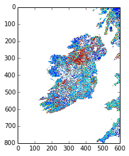


.. code:: python

    print type(lai_file0)
    print lai_file0.keys()

.. parsed-literal::

    <type 'dict'>
    ['Lai_1km', 'LaiStdDev_1km']


The function returns a dictionary with has keys
``['Lai_1km', 'LaiStdDev_1km', 'FparLai_QC']``:

.. code:: python

    print lai_file0['Lai_1km'].shape

.. parsed-literal::

    (800, 600)


Each of these datasets is of shape ``(1200, 1200)``, but we have read
only 600 (columns) and 800 (rows) in this case. Note that the numpy
indexing is ``(rows,cols)``.

We know how to create a mask from a vector dataset from thelast session:

.. code:: python

    # have to make sure have access to gdal data files 
    import os
    if 'GDAL_DATA' not in os.environ:
        os.environ["GDAL_DATA"] = '/opt/anaconda/share/gdal'
    
    from raster_mask import raster_mask
    
    # make a raster mask
    # from the layer IRELAND in world.shp
    filename = filelist[0]
    file_template = 'HDF4_EOS:EOS_GRID:"%s":MOD_Grid_MOD15A2:%s'
    file_spec = file_template%('data/%s'%filename,'Lai_1km')
                               
    mask = raster_mask(file_spec,\
                       target_vector_file = "data/world.shp",\
                       attribute_filter = "NAME = 'IRELAND'")
    
    
    plt.imshow(mask)
    plt.colorbar()


.. parsed-literal::

    <matplotlib.colorbar.Colorbar instance at 0x7efff3f65b48>


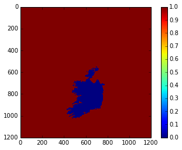


In this case, the data we want is only a small section of the whole
spatial dataset.

It would be convenient to extract *only* the part we want.

We can use ``numpy.where()`` to help with this:

.. code:: python

    # The mask is False for the area we want
    rowpix,colpix = np.where(mask == False)
    
    print rowpix,colpix

.. parsed-literal::

    [ 548  548  548 ..., 1024 1025 1025] [693 694 695 ..., 476 473 474]


``rowpix`` and ``colpix`` are lists of pixel coordinates where the
condition we specified is ``True`` (i.e. where ``mask`` is ``False``).

If we wanted to find the bounds of this area, we simply need to know the
minimum and maximum column and row in these lists:

.. code:: python

    mincol,maxcol = min(colpix),max(colpix)
    minrow,maxrow = min(rowpix),max(rowpix)
    
    # think about why the + 1 here!!!
    # what if maxcol and mincol were the same?
    ncol = maxcol - mincol + 1
    nrow = maxrow - minrow + 1
    
    print minrow,mincol,nrow,ncol

.. parsed-literal::

    548 422 478 348


We could use this information to extract *only* the area we want when we
read the data:

.. code:: python

    lai_file0 = get_lai('data/%s'%filelist[20],\
                        ncol=ncol,nrow=nrow,mincol=mincol,minrow=minrow)
    
    plt.imshow(lai_file0['Lai_1km'],interpolation='none')


.. parsed-literal::

    <matplotlib.image.AxesImage at 0x7efff43764d0>


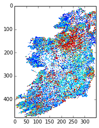


Now, lets extract this portion of the mask:

.. code:: python

    small_mask = mask[minrow:minrow+nrow,mincol:mincol+ncol]
    
    plt.imshow(small_mask,interpolation='none')


.. parsed-literal::

    <matplotlib.image.AxesImage at 0x7efff4321990>


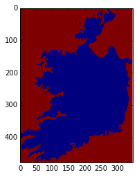


And combine the country mask with the small dataset:

As a recap, we can use the function ``raster_mask`` that we gave you
last time to develop a raster mask (!) from an ESRI shapefile
(``data/world.shp`` here).

We can then combine this mask with the QC-derived mask in the LAI
dataset.

The LAI mask (that will be ``lai.mask`` in the code below) is ``False``
for good data, as is the coutry mask.

To combine them, we want some operator ``X`` for which:

| ``True  X True  == True``
| ``True  X False == True``
| ``False X True  == True``
| ``False X False == False``

The operator to use then is an *or*, here, a bitwise or, ``|``.

.. code:: python

    lai_file0 = get_lai('data/%s'%filelist[20],\
                        ncol=ncol,nrow=nrow,mincol=mincol,minrow=minrow)
    
    layer = 'Lai_1km'
    lai = lai_file0[layer]
    small_mask = mask[minrow:minrow+nrow,mincol:mincol+ncol]
    
    # combined mask
    new_mask = small_mask | lai.mask
    
    plt.figure(figsize=(7,7))
    plt.imshow(new_mask,interpolation='none')
    
    lai = ma.array(lai,mask=new_mask)
    
    plt.figure(figsize=(7,7))
    plt.imshow(lai,interpolation='none')


.. parsed-literal::

    <matplotlib.image.AxesImage at 0x7efff41e7590>


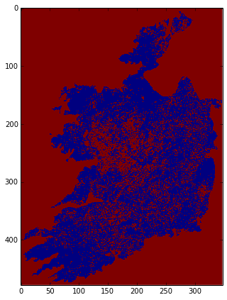


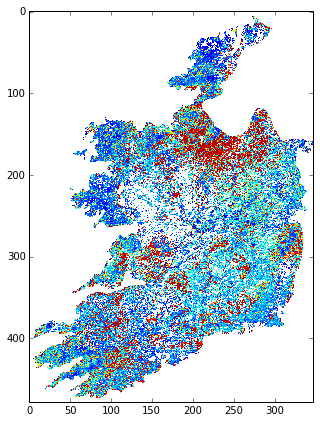


We should be used to writing loops around such functions.

In this case, we read *all* of the files in ``filelist`` and put the
data into the dictionary called ``lai`` here.

Because there are multiple layers in the datasets, we loop over layer
and append to each list indiviually:

.. code:: python

    # load 'em all ...
    
    # for United Kingdom here
    
    import numpy.ma as ma
    from raster_mask import raster_mask
    
    country = 'UNITED KINGDOM'
    
    # make a raster mask
    # from the layer UNITED KINGDOM in world.shp
    filename = filelist[0]
    file_template = 'HDF4_EOS:EOS_GRID:"%s":MOD_Grid_MOD15A2:%s'
    file_spec = file_template%('data/%s'%filename,'Lai_1km')
                               
    mask = raster_mask(file_spec,\
                       target_vector_file = "data/world.shp",\
                       attribute_filter = "NAME = '%s'"%country)
    # extract just the area we want
    # by getting the min/max rows/cols
    # of the data mask
    # The mask is False for the area we want
    rowpix,colpix = np.where(mask == False)
    mincol,maxcol = min(colpix),max(colpix)
    minrow,maxrow = min(rowpix),max(rowpix)
    ncol = maxcol - mincol + 1
    nrow = maxrow - minrow + 1
    # and make a small mask
    small_mask = mask[minrow:minrow+nrow,mincol:mincol+ncol]
    
    
    # data_fields with empty lists
    data_fields = {'LaiStdDev_1km':[],'Lai_1km':[]}
    
    # make a dictionary and put the filenames in it
    # along with the mask and min/max info
    lai = {'filenames':np.sort(filelist),\
           'minrow':minrow,'mincol':mincol,\
           'mask':small_mask}
    
    # combine the dictionaries
    lai.update(data_fields)
    
    # loop over each filename
    for f in np.sort(lai['filenames']):
        this_lai = get_lai('data/%s'%f,\
                           mincol=mincol,ncol=ncol,\
                           minrow=minrow,nrow=nrow)
        for layer in data_fields.keys():
            # apply the mask
            new_mask = this_lai[layer].mask | small_mask
            this_lai[layer] = ma.array(this_lai[layer],mask=new_mask)
            lai[layer].append(this_lai[layer])
            
.. code:: python

    # have a look at one of these
    
    i = 20
    
    import pylab as plt
    
    # just see what the shape is ...
    print lai['Lai_1km'][i].shape
    
    root = 'images/lai_uk'
    
    cmap = plt.cm.Greens
    
    f = lai['filenames'][i]
    fig = plt.figure(figsize=(7,7))
    # get some info from filename
    file_id = f.split('/')[-1].split('.')[-5][1:]
    print file_id
    plt.imshow(lai['Lai_1km'][i],cmap=cmap,interpolation='none',vmax=4.,vmin=0.0)
    # plot a jpg
    plt.title(file_id)
    plt.colorbar()
    plt.savefig('images/lai_uk_%s.jpg'%file_id)

.. parsed-literal::

    (1200, 566)
    2005161


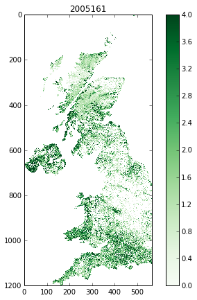


.. code:: python

    # thats quite good, so put as a function:
    import numpy.ma as ma
    import numpy as np
    import sys
    sys.path.insert(0,'python')
    from get_lai import get_lai
    from raster_mask import raster_mask
    
    
    def read_lai(filelist,datadir='data',country=None):
        '''
        Read MODIS LAI data from a set of files
        in the list filelist. Data assumed to be in
        directory datadir.
        
        Parameters:
        filelist : list of LAI files
        
        Options:
        datadir  : data directory
        country  : country name (in data/world.shp)
        
        Returns:
        lai dictionary
        '''
        if country:
            # make a raster mask
            # from the layer UNITED KINGDOM in world.shp
            file_template = 'HDF4_EOS:EOS_GRID:"%s":MOD_Grid_MOD15A2:%s'
            file_spec = file_template%('data/%s'%filelist[0],'Lai_1km')
                                       
            mask = raster_mask(file_spec,\
                               target_vector_file = "data/world.shp",\
                               attribute_filter = "NAME = '%s'"%country)
            # extract just the area we want
            # by getting the min/max rows/cols
            # of the data mask
            # The mask is False for the area we want
            rowpix,colpix = np.where(mask == False)
            mincol,maxcol = min(colpix),max(colpix)
            minrow,maxrow = min(rowpix),max(rowpix)
            ncol = maxcol - mincol + 1
            nrow = maxrow - minrow + 1
            # and make a small mask
            small_mask = mask[minrow:minrow+nrow,mincol:mincol+ncol]
        else:
            # no country
            mincol = 0
            maxcol = 0
            ncol = None
            nrow = None
    
        # data_fields with empty lists
        data_fields = {'LaiStdDev_1km':[],'Lai_1km':[]}
        
        # make a dictionary and put the filenames in it
        # along with the mask and min/max info
        lai = {'filenames':np.sort(filelist),\
               'minrow':minrow,'mincol':mincol,\
               'mask':small_mask}
        
        # combine the dictionaries
        lai.update(data_fields)
        
        # loop over each filename
        for f in np.sort(lai['filenames']):
            this_lai = get_lai('data/%s'%f,\
                               mincol=mincol,ncol=ncol,\
                               minrow=minrow,nrow=nrow)
            for layer in data_fields.keys():
                # apply the mask
                if country:
                    new_mask = this_lai[layer].mask | small_mask
                    this_lai[layer] = ma.array(this_lai[layer],mask=new_mask)
                lai[layer].append(this_lai[layer])   
        for layer in data_fields.keys():
            lai[layer] = ma.array(lai[layer])
                
        return lai
.. code:: python

    # test this ... the one in the file
    # does a cutout of the data area as well
    # which will keep the memory
    # requirements down
    from get_lai import read_lai
    
    lai = read_lai(filelist,country='IRELAND',verbose=True)
    
    # have a look at one of these
    
    i = 20
    
    # just see what the shape is ...
    print lai['Lai_1km'][i].shape
    
    root = 'images/lai_eire'
    
    cmap = plt.cm.Greens
    
    f = lai['filenames'][i]
    fig = plt.figure(figsize=(7,7))
    # get some info from filename
    file_id = f.split('/')[-1].split('.')[-5][1:]
    print file_id
    plt.imshow(lai['Lai_1km'][i],cmap=cmap,interpolation='none',vmax=4.,vmin=0.0)
    # plot a jpg
    plt.title(file_id)
    plt.colorbar()
    plt.savefig('%s_%s.jpg'%(root,file_id))

.. parsed-literal::

    creating mask of IRELAND
    ... MCD15A2.A2005001.h17v03.005.2007350235547.hdf
    ... MCD15A2.A2005009.h17v03.005.2007351235445.hdf
    ... MCD15A2.A2005017.h17v03.005.2007352033411.hdf
    ... MCD15A2.A2005025.h17v03.005.2007353055037.hdf
    ... MCD15A2.A2005033.h17v03.005.2007355050158.hdf
    ... MCD15A2.A2005041.h17v03.005.2007357014602.hdf
    ... MCD15A2.A2005049.h17v03.005.2007360165724.hdf
    ... MCD15A2.A2005057.h17v03.005.2007361230641.hdf
    ... MCD15A2.A2005065.h17v03.005.2007365024202.hdf
    ... MCD15A2.A2005073.h17v03.005.2008001043631.hdf
    ... MCD15A2.A2005081.h17v03.005.2008003173048.hdf
    ... MCD15A2.A2005089.h17v03.005.2008005154542.hdf
    ... MCD15A2.A2005097.h17v03.005.2008007175837.hdf
    ... MCD15A2.A2005105.h17v03.005.2008018085544.hdf
    ... MCD15A2.A2005113.h17v03.005.2008021020137.hdf
    ... MCD15A2.A2005121.h17v03.005.2008021193749.hdf
    ... MCD15A2.A2005129.h17v03.005.2008024061330.hdf
    ... MCD15A2.A2005137.h17v03.005.2008032075236.hdf
    ... MCD15A2.A2005145.h17v03.005.2008033192556.hdf
    ... MCD15A2.A2005153.h17v03.005.2008035054421.hdf
    ... MCD15A2.A2005161.h17v03.005.2008036173810.hdf
    ... MCD15A2.A2005169.h17v03.005.2008039132812.hdf
    ... MCD15A2.A2005177.h17v03.005.2008042090537.hdf
    ... MCD15A2.A2005185.h17v03.005.2008044115459.hdf
    ... MCD15A2.A2005193.h17v03.005.2008046140018.hdf
    ... MCD15A2.A2005201.h17v03.005.2008050015227.hdf
    ... MCD15A2.A2005209.h17v03.005.2008052203557.hdf
    ... MCD15A2.A2005217.h17v03.005.2008055145215.hdf
    ... MCD15A2.A2005225.h17v03.005.2008057010213.hdf
    ... MCD15A2.A2005233.h17v03.005.2008060214119.hdf
    ... MCD15A2.A2005241.h17v03.005.2008063115631.hdf
    ... MCD15A2.A2005249.h17v03.005.1998144165707.hdf
    ... MCD15A2.A2005257.h17v03.005.2008067051936.hdf
    ... MCD15A2.A2005265.h17v03.005.2008069073121.hdf
    ... MCD15A2.A2005273.h17v03.005.2008071050025.hdf
    ... MCD15A2.A2005281.h17v03.005.2008072202421.hdf
    ... MCD15A2.A2005289.h17v03.005.2008074194126.hdf
    ... MCD15A2.A2005297.h17v03.005.2008077061121.hdf
    ... MCD15A2.A2005305.h17v03.005.2008080055607.hdf
    ... MCD15A2.A2005313.h17v03.005.2008083165435.hdf
    ... MCD15A2.A2005321.h17v03.005.2008084043211.hdf
    ... MCD15A2.A2005329.h17v03.005.2008086063619.hdf
    ... MCD15A2.A2005337.h17v03.005.2008087175845.hdf
    ... MCD15A2.A2005345.h17v03.005.2008088144615.hdf
    ... MCD15A2.A2005353.h17v03.005.2008091004441.hdf
    ... MCD15A2.A2005361.h17v03.005.2008091025114.hdf
    ... done
    (478, 348)
    2005161


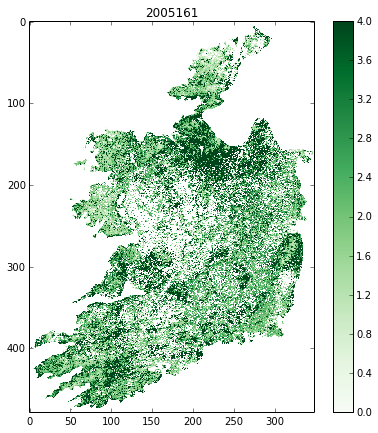


.. code:: python

    # make a movie
    
    import pylab as plt
    import os
    
    # just see what the shape is ...
    print lai['Lai_1km'].shape
    
    root = 'images/lai_country_eire'
    
    cmap = plt.cm.Greens
    
    for i,f in enumerate(lai['filenames']):
        fig = plt.figure(figsize=(7,7))
        # get some info from filename
        file_id = f.split('/')[-1].split('.')[-5][1:]
        print file_id
        plt.imshow(lai['Lai_1km'][i],cmap=cmap,interpolation='none',vmax=4.,vmin=0.0)
        # plot a jpg
        plt.title(file_id)
        plt.colorbar()
        plt.savefig('%s_%s.jpg'%(root,file_id))
        plt.close(fig)
        
    cmd = 'convert -delay 100 -loop 0 {0}_*.jpg {0}_movie.gif'.format(root)
    os.system(cmd)

.. parsed-literal::

    (46, 478, 348)
    2005001
    2005009
    2005017
    2005025
    2005033
    2005041
    2005049
    2005057
    2005065
    2005073
    2005081
    2005089
    2005097
    2005105
    2005113
    2005121
    2005129
    2005137
    2005145
    2005153
    2005161
    2005169
    2005177
    2005185
    2005193
    2005201
    2005209
    2005217
    2005225
    2005233
    2005241
    2005249
    2005257
    2005265
    2005273
    2005281
    2005289
    2005297
    2005305
    2005313
    2005321
    2005329
    2005337
    2005345
    2005353
    2005361


.. parsed-literal::

    0


.. figure:: files/images/lai_country_eire_movie.gif
   :alt: 

.. code:: python

    # The movie making works, so pack that into a function
    
    import pylab as plt
    import os
    
    root = 'images/lai_eire'
    
    def make_movie(lai,root,layer='Lai_1km',vmax=4.,vmin=0.,do_plot=False):
        '''
        Make an animated gif from MODIS LAI data in
        dictionary 'lai'.
        
        Parameters:
        lai    : data dictionary
        root   : root file /directory name of frames and movie
        
        layer  : data layer to plot 
        vmax   : max value for plotting
        vmin   : min value for plotting
        do_plot: set True if you want the individual plots
                 to display
        
        Returns:
        movie name    
        
        '''
        cmap = plt.cm.Greens
        
        for i,f in enumerate(lai['filenames']):
            fig = plt.figure(figsize=(7,7))
            # get some info from filename
            file_id = f.split('/')[-1].split('.')[-5][1:]
            print file_id
            plt.imshow(lai[layer][i],cmap=cmap,interpolation='none',\
                       vmax=vmax,vmin=vmin)
            # plot a jpg
            plt.title(file_id)
            plt.colorbar()
            plt.savefig('%s_%s.jpg'%(root,file_id))
            if not do_plot:
                plt.close(fig)
            
        cmd = 'convert -delay 100 -loop 0 {0}_*.jpg {0}_movie.gif'.format(root)
        os.system(cmd)
        return '{0}_movie.gif'.format(root)
.. code:: python

    # test it
    
    lai_uk = read_lai(filelist,country='UNITED KINGDOM')
    root = 'images/lai_UK'
    movie = make_movie(lai_uk,root)
    print movie

.. parsed-literal::

    2005001
    2005009
    2005017
    2005025
    2005033
    2005041
    2005049
    2005057
    2005065
    2005073
    2005081
    2005089
    2005097
    2005105
    2005113
    2005121
    2005129
    2005137
    2005145
    2005153
    2005161
    2005169
    2005177
    2005185
    2005193
    2005201
    2005209
    2005217
    2005225
    2005233
    2005241
    2005249
    2005257
    2005265
    2005273
    2005281
    2005289
    2005297
    2005305
    2005313
    2005321
    2005329
    2005337
    2005345
    2005353
    2005361
    images/lai_UK_movie.gif


.. figure:: files/images/lai_UK_movie.gif
   :alt: 

5.2 Interpolation
-----------------

5.2.1 Univariate interpolation
~~~~~~~~~~~~~~~~~~~~~~~~~~~~~~

So, we can load the data we want from multiple MODIS hdf files that we
have downloaded from the NASA server into a 3D masked numpy array, with
a country boundary mask (projected int the raster data coordinate
system) from a vector dataset.

Let's start to explore the data then.

You should have an array of LAI for Ireland:

.. code:: python

    type(lai['Lai_1km'])


.. parsed-literal::

    numpy.ma.core.MaskedArray


Let's plot the LAI for some given pixels.

First, we might like to identify which pixels actually have any data.

A convenient function for this would be ``np.where`` that returns the
indices of items that are ``True``.

Since the data mask is ``False`` for good data, we take the complement
``~`` so that good data are \`True:

.. code:: python

    data = lai['Lai_1km']
    np.where(~data.mask)


.. parsed-literal::

    (array([ 3,  3,  3, ..., 39, 39, 39]),
     array([326, 328, 329, ..., 472, 472, 475]),
     array([ 82, 145,  83, ...,  86,  87,  51]))


An example good pixel this is (3,329,145). Let's look at this for all
time periods:

.. code:: python

    data = lai['Lai_1km']
    
    r = 329
    c = 83
    
    pixel = data[:,r,c]
    
    # plot red stars at the data points
    plt.plot(np.arange(len(pixel))*8,pixel,'r*')
    # plot a black (k) dashed line (--)
    plt.plot(np.arange(len(pixel))*8,pixel,'k--')
    plt.xlabel('doy')
    plt.ylabel('LAI')
    plt.title('pixel %03d %03d'%(r,c))


.. parsed-literal::

    <matplotlib.text.Text at 0x7effdf7e54d0>


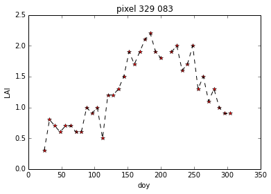


The data follow the trend of what we might expect for LAI development,
but they are clearly a little noisy.

We also have access to uncertainty information (standard deviation):

.. code:: python

    # copy the data in case we change it any
    
    data = lai['Lai_1km'].copy()
    sd   = lai['LaiStdDev_1km'].copy()
    
    r = 329
    c = 83
    
    pixel    = data[:,r,c]
    pixel_sd =   sd[:,r,c]
    
    x = np.arange(len(pixel))*8
    
    # plot red stars at the data points
    plt.plot(x,pixel,'r*')
    # plot a black (k) dashed line (--)
    plt.plot(x,pixel,'k--')
    # plot error bars:
    # 1.96 because that is the 95% confidence interval
    plt.errorbar(x,pixel,yerr=pixel_sd*1.96)
    plt.xlabel('doy')
    plt.ylabel('LAI')
    plt.title('pixel %03d %03d'%(r,c))

.. parsed-literal::

    /opt/anaconda/lib/python2.7/site-packages/numpy/ma/core.py:3847: UserWarning: Warning: converting a masked element to nan.
      warnings.warn("Warning: converting a masked element to nan.")


.. parsed-literal::

    <matplotlib.text.Text at 0x7effdf34bc50>


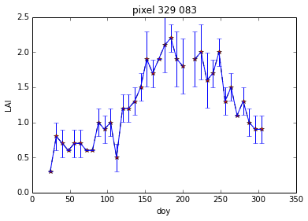


We would generally expect LAI to be quite smoothly varying over time.
Visualising the data with 95% confidence intervals is quite useful as we
can now 'imagine' some smooth line that would generally go within these
bounds.

Some of the uncertainty estimates are really rather small though, which
are probably not reliable.

Let's inflate them:

.. code:: python

    
    data = lai['Lai_1km'].copy()
    sd   = lai['LaiStdDev_1km'].copy()
    
    r = 329
    c = 83
    
    pixel    = data[:,r,c]
    pixel_sd =   sd[:,r,c]
    # threshold
    thresh = 0.25
    pixel_sd[pixel_sd<thresh] = thresh
    
    x = np.arange(len(pixel))*8
    
    # plot red stars at the data points
    plt.plot(x,pixel,'r*')
    # plot a black (k) dashed line (--)
    plt.plot(x,pixel,'k--')
    # plot error bars:
    # 1.96 because that is the 95% confidence interval
    plt.errorbar(x,pixel,yerr=pixel_sd*1.96)
    plt.xlabel('doy')
    plt.ylabel('LAI')
    plt.title('pixel %03d %03d'%(r,c))


.. parsed-literal::

    <matplotlib.text.Text at 0x7effdf476c50>


.. image:: Interpolation_files/Interpolation_51_1.png


This is perhaps a bit more realistic ...

The data now have some missing values (data gaps) and, as we have noted,
are a little noisy.

A Python module we can use for many scientific functions is
```scipy`` <http://docs.scipy.org/doc/scipy>`__, in particular here, the
```scipy`` interpolation
functions <http://docs.scipy.org/doc/scipy/reference/interpolate.html>`__.

We need to make a careful choice of the interpolation functions.

We might, in many circumstances simply want something that interpolates
between data points, i.e. that goes through the data points that we
have.

Many interpolators will not provide extrapolation, so in the example
above we could not get an estimate of LAI prior to the first sample and
after the last.

The best way to deal with that would be to have multiple years of data.

Instead here, we will repeat the dataset three times to mimic this:

.. code:: python

    from scipy import interpolate
    
    pixel = data[:,r,c]
    
    # original x,y
    y_ = pixel
    x_ = (np.arange(len(y_))*8.+1)[~pixel.mask]
    y_ = y_[~pixel.mask]
    
    # extend: using np.tile() to repeat data
    y_extend = np.tile(y_,3)
    # extend: using vstack to stack 3 different arrays
    x_extend = np.hstack((x_-46*8,x_,x_+46*8))
.. code:: python

    # plot the extended dataset
    plt.figure(figsize=(12,3))
    plt.plot(x_extend,y_extend,'b')
    plt.plot(x_,y_,'k+')
    plt.plot([0.,0.],[0.,2.5],'r')
    plt.plot([365.,365.],[0.,2.5],'r')
    plt.xlim(-356,2*365)
    plt.xlabel('day of year')
    plt.ylabel('LAI')


.. parsed-literal::

    <matplotlib.text.Text at 0x7effdfba8110>


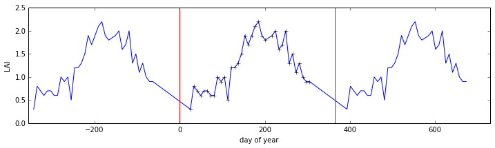


.. code:: python

    # define xnew at 1 day interval
    xnew = np.arange(1.,366.)
    
    # linear interpolation
    f = interpolate.interp1d(x_extend,y_extend,kind='linear')
    ynew = f(xnew)
.. code:: python

    plt.plot(xnew,ynew)
    plt.plot(x_,y_,'r+')
    plt.xlim(1,366)


.. parsed-literal::

    (1, 366)


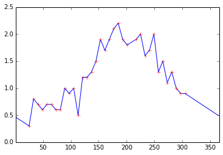


.. code:: python

    # cubic interpolation
    f = interpolate.interp1d(x_extend,y_extend,kind='cubic')
    ynew = f(xnew)
    plt.plot(xnew,ynew)
    plt.plot(x_,y_,'r+')
    plt.xlim(1,366)


.. parsed-literal::

    (1, 366)


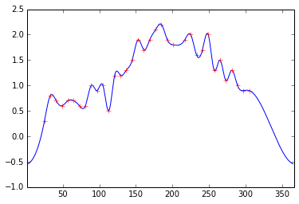


.. code:: python

    # nearest neighbour interpolation
    f = interpolate.interp1d(x_extend,y_extend,kind='nearest')
    ynew = f(xnew)
    plt.plot(xnew,ynew)
    plt.plot(x_,y_,'r+')
    plt.xlim(1,366)


.. parsed-literal::

    (1, 366)


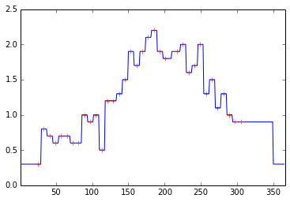


Depending on the problem you are trying to solve, different
interpolation schemes will be appropriate. For categorical data (e.g.
'snow', coded as 1 and 'no snow' coded as 1), for instance, a nearest
neighbour interpolation might be a good idea.

5.2.2 Smoothing
~~~~~~~~~~~~~~~

One issue with the schemes above is that they go exactly through the
data points, but a more realistic description of the data might be one
that incorporated the uncertainty information we have. Visually, this is
quite easy to imagine, but how can we implement such ideas?

One way of thinking about this is to think about other sources of
information that we might bring to bear on the problem. One such would
be that we expect the function to be 'quite smooth'. This allows us to
consider applying smoothness as an additional constraint to the
solution.

Many such problems can be phrased as convolution operations.

Convolution is a form of digital filtering that combines two sequences
of numbers :math:`y` and :math:`w` to give a third, the result :math:`z`
that is a filtered version of :math:`y`, where for each element
:math:`j` of :math:`y`:

.. math::


     z_j = \sum_{i=-n}^{i=n}{w_i y_{j+i}}

where :math:`n` is the half width of the filter :math:`w`. For a
smoothing filter, the elements of this will sum to 1 (so that the
magnitude of :math:`y` is not changed).

To illustrate this in Python:

.. code:: python

    # a simple box smoothing filter
    # filter width 11
    w = np.ones(11)
    # normalise
    w = w/w.sum()
    # half width
    n = len(w)/2
    
    # Take the linear interpolation of the LAI above as the signal 
    # linear interpolation
    x = xnew
    f = interpolate.interp1d(x_extend,y_extend,kind='linear')
    y = f(x)
    
    # where we will put the result
    z = np.zeros_like(y)
    
    # This is a straight implementation of the
    # equation above
    for j in xrange(n,len(y)-n):
        for i in xrange(-n,n+1):
            z[j] += w[n+i] * y[j+i]
.. code:: python

    plt.plot(x,y,'k--',label='y')
    plt.plot(x,z,'r',label='z')
    plt.xlim(x[0],x[-1])
    plt.legend(loc='best')
    plt.title('smoothing with filter width %d'%len(w))


.. parsed-literal::

    <matplotlib.text.Text at 0x7effdfb0ebd0>


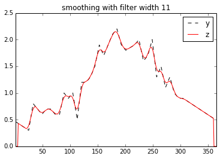


As we suggested, the result of convolving :math:`y` with the filter
:math:`w` (of width 31 here) is :math:`z`, a smoothed version of
:math:`y`.

You might notice that the filter is only applied once we are ``n``
samples into the signal, so we get 'edge effects'. There are various
ways of dealing with edge effects, such as repeating the signal (as we
did above, for much the same reason), reflecting the signal, or assuming
the signal to be some constant value (e.g. 0) outside of its defined
domain.

If we make the filter wider (width 31 now):

.. code:: python

    # a simple box smoothing filter
    # filter width 31
    w = np.ones(31)
    # normalise
    w = w/w.sum()
    # half width
    n = len(w)/2
    
    # Take the linear interpolation of the LAI above as the signal 
    # linear interpolation
    x = xnew
    f = interpolate.interp1d(x_extend,y_extend,kind='linear')
    y = f(x)
    
    # where we will put the result
    z = np.zeros_like(y)
    
    # This is a straight implementation of the
    # equation above
    for j in xrange(n,len(y)-n):
        for i in xrange(-n,n+1):
            z[j] += w[n+i] * y[j+i]
            
    plt.plot(x,y,'k--',label='y')
    plt.plot(x,z,'r',label='z')
    plt.xlim(x[0],x[-1])
    plt.legend(loc='best')
    plt.title('smoothing with filter width %d'%len(w))


.. parsed-literal::

    <matplotlib.text.Text at 0x7effdf266750>


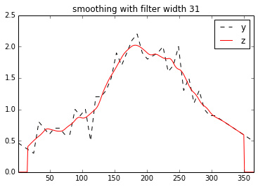


Then the signal is 'more' smoothed.

There are *many* filters implemented in
```scipy.signal`` <http://docs.scipy.org/doc/scipy/reference/signal.html>`__
that you should look over.

A very commonly used smoothing filter is the
`Savitsky-Golay <http://en.wikipedia.org/wiki/Savitzky–Golay_filter_for_smoothing_and_differentiation>`__
filter for which you define the window size and filter order.

As with most filters, the filter width controls the degree of smoothing
(see examples above). The filter order (related to polynomial order) in
essence controls the shape of the filter and defines the 'peakiness' of
the response.

.. code:: python

    import sys
    sys.path.insert(0,'python')
    # see http://wiki.scipy.org/Cookbook/SavitzkyGolay
    from savitzky_golay import *
    
    window_size = 31
    order = 1
    
    # Take the linear interpolation of the LAI above as the signal 
    # linear interpolation
    x = xnew
    f = interpolate.interp1d(x_extend,y_extend,kind='linear')
    y = f(x)
    
    z = savitzky_golay(y,window_size,order)
    
    plt.plot(x,y,'k--',label='y')
    plt.plot(x,z,'r',label='z')
    plt.xlim(x[0],x[-1])
    plt.legend(loc='best')
    plt.title('smoothing with filter width %d order %.2f'%(window_size,order))


.. parsed-literal::

    <matplotlib.text.Text at 0x7effbd7ed410>


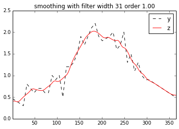


.. code:: python

    import sys
    sys.path.insert(0,'python')
    # see http://wiki.scipy.org/Cookbook/SavitzkyGolay
    from savitzky_golay import *
    
    window_size = 61
    order = 2
    
    # Take the linear interpolation of the LAI above as the signal 
    # linear interpolation
    x = xnew
    f = interpolate.interp1d(x_extend,y_extend,kind='linear')
    y = f(x)
    
    z = savitzky_golay(y,window_size,order)
    
    plt.plot(x,y,'k--',label='y')
    plt.plot(x,z,'r',label='z')
    plt.xlim(x[0],x[-1])
    plt.legend(loc='best')
    plt.title('smoothing with filter width %d order %.2f'%(window_size,order))


.. parsed-literal::

    <matplotlib.text.Text at 0x7effdf401790>


If the samples :math:`y` have uncertainty (standard deviation
:math:`\sigma_j` for sample :math:`j`) associated with them, we can
incorporate this into smoothing, although many of the methods in
``scipy`` and ``numpy`` do not directly allow for this.

Instead, we call an optimal interpolation scheme (a regulariser) here
that achieves this. This also has the advantage of giving an estimate of
uncertainty for the smoothed samples.

In this case, the parameters are: ``order`` (as above, but only integer
in this implementation) and ``wsd`` which is an estimate of the
variation (standard deviation) in the signal that control smoothness.

.. code:: python

    tile = 'h17v03'
    year = '2005'
    
    # specify the file with the urls in
    ifile= 'data/modis_lai_%s_%s.txt'%(tile,year)
    
    fp = open(ifile)
    filelist = [url.split('/')[-1].strip() for url in fp.readlines()]
    fp.close()
    import sys
    sys.path.insert(0,'files/python')
    
    from get_lai import *
    
    try:
        data = lai['Lai_1km']
        sd = lai['LaiStdDev_1km']
    except:
        lai = read_lai(filelist,country='IRELAND')
        data = lai['Lai_1km']
        sd = lai['LaiStdDev_1km']
        
    thresh = 0.25
    sd[sd<thresh] = thresh
    
    r = 472
    c = 84
    from smoothn import *
    
    # this is about the right amount of smoothing here
    gamma = 5.
    
    pixel = data[:,r,c]
    pixel_sd =   sd[:,r,c]
    
    x = np.arange(46)*8+1
    
    order = 2
    z = smoothn(pixel,s=gamma,sd=pixel_sd,smoothOrder=2.0)[0]
    
    # plot
    plt.plot(x,pixel,'k*',label='y')
    plt.errorbar(x,pixel,pixel_sd*1.96)
    plt.plot(x,z,'r',label='z')
    # lower and upper bounds of 95% CI
    
    plt.xlim(1,366)
    plt.ylim(0.,2.5)
    plt.legend(loc='best')


.. parsed-literal::

    <matplotlib.legend.Legend at 0x7effdf736410>


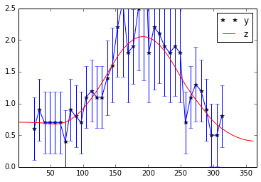


.. code:: python

    # test it on a new pixel
    
    r = 472
    c = 86
    
    gamma = 5
    
    pixel = data[:,r,c]
    pixel_sd =   sd[:,r,c]
    
    x = np.arange(46)*8+1
    
    order = 2
    z = smoothn(pixel,s=gamma,sd=pixel_sd,smoothOrder=2.0)[0]
    
    # plot
    plt.plot(x,pixel,'k*',label='y')
    plt.errorbar(x,pixel,pixel_sd*1.96)
    plt.plot(x,z,'r',label='z')
    
    plt.xlim(1,366)
    plt.legend(loc='best')
    z.ndim


.. parsed-literal::

    1


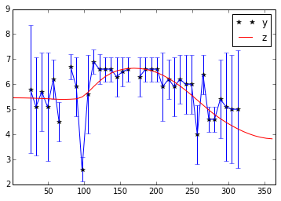


.. code:: python

    # and test it on a new pixel
    
    r = 472
    c = 84
    
    #r = 9
    #c = 277
    gamma = 5.
    
    pixel = data[:,r,c]
    pixel_sd =   sd[:,r,c]
    
    x = np.arange(46)*8+1
    
    order = 2
    # solve for gamma - degree of smoothness 
    zz = smoothn(pixel,sd=pixel_sd,smoothOrder=2.0)
    z = zz[0]
    print zz[1],zz[2]
    
    gamma = zz[1]
    
    # plot
    plt.plot(x,pixel,'k*',label='y')
    plt.errorbar(x,pixel,pixel_sd*1.96)
    plt.plot(x,z,'r',label='z')
    
    plt.xlim(1,366)
    plt.legend(loc='best')

.. parsed-literal::

    7.56265788653 True


.. parsed-literal::

    <matplotlib.legend.Legend at 0x7effe019ead0>


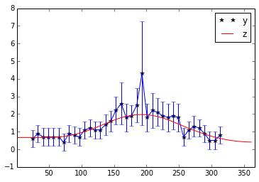


To apply this approach to our 3D dataset, we could simply loop over all
pixels.

Note that *any* per-pixel processing will be slow ... but this is quite
a fast smoothing method, so is feasible here.

.. code:: python

    # we have put in an axis control to smoothn
    # here so it will only smooth over doy
    # This will take a few minutes to process
    # we switch on verbose mode to get some feedback
    # on progress
    
    # make a mask of pixels where there is at least 1 sample
    # over the time period
    mask = (data.mask.sum(axis=0) == 0)
    mask = np.array([mask]*data.shape[0])
    
    z = smoothn(data,s=5.0,sd=sd,smoothOrder=2.0,axis=0,TolZ=0.05,verbose=True)[0]
    z = ma.array(z,mask=mask)

.. parsed-literal::

    tol 1.0 nit 0
    tol 1.03767913976 nit 1
    tol 0.695375818129 nit 2
    tol 0.55340286659 nit 3
    tol 0.379048609608 nit 4
    tol 0.297133997656 nit 5
    tol 0.211254020382 nit 6
    tol 0.161703395437 nit 7
    tol 0.118022633002 nit 8
    tol 0.089141179031 nit 9
    tol 0.0662378920796 nit 10


.. code:: python

    plt.figure(figsize=(9,9))
    plt.imshow(z[20],interpolation='none',vmax=6)
    plt.colorbar()


.. parsed-literal::

    <matplotlib.colorbar.Colorbar instance at 0x7effe816f758>


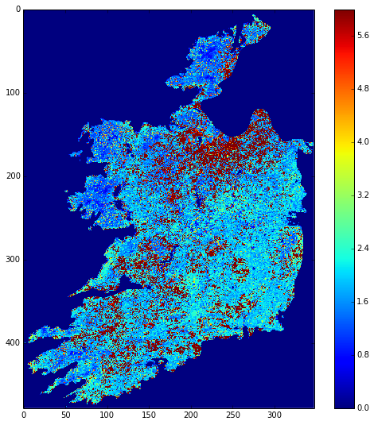


.. code:: python

    # similarly, take frame 20
    # and smooth that
    
    ZZ = smoothn(z[20],smoothOrder=2.)
    # self-calibrated smoothness term
    s = ZZ[1]
    print 's =',s
    Z = ZZ[0]
    plt.figure(figsize=(9,9))
    plt.imshow(Z,interpolation='none',vmax=6)
    plt.colorbar()

.. parsed-literal::

    s = 0.731142059593


.. parsed-literal::

    <matplotlib.colorbar.Colorbar instance at 0x7effdfe09c68>


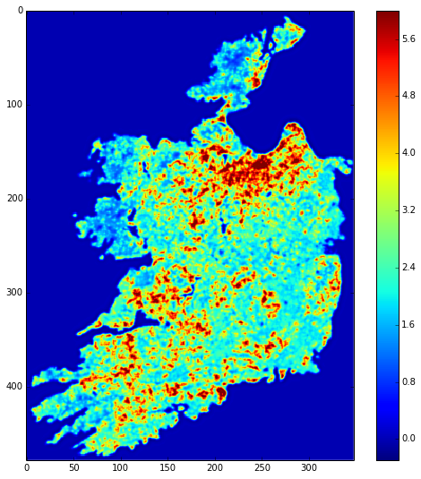


.. code:: python

    # similarly, take frame 20
    # and smooth that
    
    ZZ = smoothn(z,s=s,smoothOrder=2.,axis=(1,2),verbose=True)
    
    Z = ZZ[0]
    plt.figure(figsize=(9,9))
    plt.imshow(Z[30],interpolation='none',vmax=6)
    plt.colorbar()

.. parsed-literal::

    tol 1.0 nit 0


.. parsed-literal::

    <matplotlib.colorbar.Colorbar instance at 0x7effdff0e050>


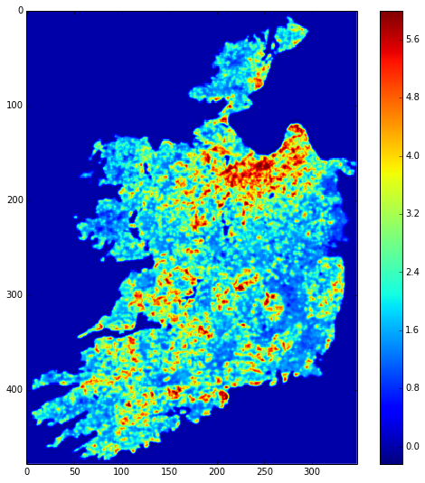


.. code:: python

    x = np.arange(46)*8+1.
    try:
        plt.plot(x,np.mean(Z,axis=(1,2)))
        plt.plot(x,np.min(Z,axis=(1,2)),'r--')
        plt.plot(x,np.max(Z,axis=(1,2)),'r--')
    except:
        plt.plot(x,np.mean(Z,axis=2).mean(axis=1))
        plt.plot(x,np.min(Z,axis=2).min(axis=1),'r--')
        plt.plot(x,np.max(Z,axis=2).max(axis=1),'r--')
        
    plt.title('LAI variation of Eire')


.. parsed-literal::

    <matplotlib.text.Text at 0x7effe83b9550>


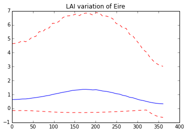


.. code:: python

    # or doing this pixel by pixel ...
    # which is slower than using axis
    
    order = 2
    
    # pixels that have some data
    mask = (~data.mask).sum(axis=0)
    
    odata = np.zeros((46,) + mask.shape)
    
    rows,cols = np.where(mask>0)
    
    len_x = len(rows)
    order = 2
    gamma = 5.
    
    for i in xrange(len_x):
        r,c = rows[i],cols[i]
        # progress bar
        if i%(len_x/20) == 0:
            print '... %4.2f percent'%(i*100./float(len_x))
        pixel    = data[:,r,c]
        pixel_sd = sd[:,r,c]
    
        zz = smoothn(pixel,s=gamma,sd=pixel_sd,smoothOrder=order,TolZ=0.05)
        odata[:,rows[i],cols[i]] = zz[0]


.. parsed-literal::

    ... 0.00 percent
    ... 5.00 percent
    ... 10.00 percent
    ... 15.00 percent
    ... 20.00 percent
    ... 25.00 percent
    ... 30.00 percent
    ... 35.00 percent
    ... 40.00 percent
    ... 45.00 percent
    ... 50.00 percent
    ... 55.00 percent
    ... 60.00 percent
    ... 65.00 percent
    ... 70.00 percent
    ... 75.00 percent
    ... 80.00 percent
    ... 85.00 percent
    ... 90.00 percent
    ... 95.00 percent


.. code:: python

    import pylab as plt
    import os
    
    root = 'images/lai_eire_colourZ'
    
    for i,f in enumerate(lai['filenames']):
        fig = plt.figure(figsize=(7,7))
        # get some info from filename
        file_id = f.split('/')[-1].split('.')[-5][1:]
        print file_id
        plt.imshow(Z[i],interpolation='none',vmax=6.,vmin=0.0)
        # plot a jpg
        plt.title(file_id)
        plt.colorbar()
        plt.savefig('%s_%s.jpg'%(root,file_id))
        plt.close(fig)

.. parsed-literal::

    2005001
    2005009
    2005017
    2005025
    2005033
    2005041
    2005049
    2005057
    2005065
    2005073
    2005081
    2005089
    2005097
    2005105
    2005113
    2005121
    2005129
    2005137
    2005145
    2005153
    2005161
    2005169
    2005177
    2005185
    2005193
    2005201
    2005209
    2005217
    2005225
    2005233
    2005241
    2005249
    2005257
    2005265
    2005273
    2005281
    2005289
    2005297
    2005305
    2005313
    2005321
    2005329
    2005337
    2005345
    2005353
    2005361


.. code:: python

    cmd = 'convert -delay 100 -loop 0 {0}_*.jpg {0}_movie2.gif'.format(root)
    os.system(cmd)


.. parsed-literal::

    0


.. figure:: files/images/lai_eire_colourZ_movie2.gif
   :alt: 

5.3 Function fitting
~~~~~~~~~~~~~~~~~~~~

Sometimes, instead of applying some arbitrary smoothing function to
data, we want to extract particular infromation from the time series.

One way to approach this is to fit some function to the time series at
each location.

Let us suppose that we wish to characterise the phenology of vegetation
in Ireland.

.. figure:: http://www2.geog.ucl.ac.uk/~plewis/geogg124/_images/zhang1.png
   :alt: 

One way we could do this would be to look in the lai data for the most
rapid changes.

Another would be to explicitly fit some mathematical function to the LAI
data that would would expect to descrive typical LAI trajectories.

One example of such a function is the double logistic. A logistic
function is:

.. math::


    \hat{y} = p_0 - p_1 \left( \frac{1}{1 + e^{p_2 (t - p_3)}} + \frac{1}{1 + e^{p_4 (t - p_5)}} -1\right)

We can give a function for a double logistic:

.. code:: python

    def dbl_logistic_model ( p, t ):
            """A double logistic model, as in Sobrino and Juliean, 
            or Zhang et al"""
            return p[0] - p[1]* ( 1./(1+np.exp(p[2]*(t-p[3]))) + \
                                  1./(1+np.exp(-p[4]*(t-p[5])))  - 1 )
       
.. code:: python

    tile = 'h17v03'
    year = '2005'
    
    # specify the file with the urls in
    ifile= 'data/modis_lai_%s_%s.txt'%(tile,year)
    
    fp = open(ifile)
    filelist = [url.split('/')[-1].strip() for url in fp.readlines()]
    fp.close()
    import sys
    sys.path.insert(0,'python')
    
    from get_lai import *
    
    try:
        data = lai['Lai_1km']
        sd = lai['LaiStdDev_1km']
    except:
        lai = read_lai(filelist,country='IRELAND')
        data = lai['Lai_1km']
        sd = lai['LaiStdDev_1km']
        
    thresh = 0.25
    sd[sd<thresh] = thresh
    
    # test pixel
    r = 472
    c = 84
    
    
    y = data[:,r,c]
    mask = ~y.mask
    y = np.array(y[mask])
    x = (np.arange(46)*8+1.)[mask]
    unc = np.array(sd[:,r,c][mask])
And see what this looks like:

.. code:: python

    # define x (time)
    x_full = np.arange(1,366) 
    
    # some default values for the parameters
    p = np.zeros(6)
    
    # some stats on y
    ysd = np.std(y)
    ymean = np.mean(y)
    
    # some rough guesses at the parameters
    
    p[0] = ymean - 1.151*ysd;   # minimum  (1.151 is 75% CI)
    p[1] = 2*1.151*ysd          # range
    p[2] = 0.19                 # related to up slope
    p[3] = 120                  # midpoint of up slope
    p[4] = 0.13                 # related to down slope
    p[5] = 220                  # midpoint of down slope
    
    y_hat = dbl_logistic_model(p,x_full)
    
    plt.clf()
    plt.plot(x_full,y_hat)
    plt.plot(x,y,'*')
    plt.errorbar(x,y,unc*1.96)


.. parsed-literal::

    <Container object of 3 artists>


.. image:: Interpolation_files/Interpolation_90_1.png


We could manually 'tweak' the parameters until we got a better 'fit' to
the observations.

First though, let's define a measure of 'fit':

.. math::


   Z_i = \frac{\hat{y}_i - y_i}{\sigma_i}

.. math::


   Z^2 = \sum_i{Z_i^2} =  \sum_i{\left( \frac{\hat{y}_i - y_i}{\sigma_i} \right)^2}

and implement this as a mismatch function where we have data points:

.. code:: python

    def mismatch_function(p, x, y, unc):
        y_hat = dbl_logistic_model(p, x)
        diff = (y_hat - y)/unc
        return diff
    
    
    Z = mismatch_function(p,x,y,unc)
    
    plt.plot([1,365.],[0,0.],'k-')
    plt.xlim(0,365)
    plt.plot(x,Z,'*')
    
    
    print 'Z^2 =',(Z**2).sum()

.. parsed-literal::

    Z^2 = 113.325251358


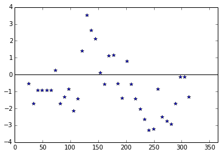


Now lets change p a bit:

.. code:: python

    p[0] = ymean - 1.151*ysd;   # minimum  (1.151 is 75% CI)
    p[1] = 2*1.151*ysd          # range
    p[2] = 0.19                 # related to up slope
    p[3] = 140                  # midpoint of up slope
    p[4] = 0.13                 # related to down slope
    p[5] = 220                  # midpoint of down slope
    
    Z = mismatch_function(p,x,y,unc)
    
    plt.plot([1,365.],[0,0.],'k-')
    plt.xlim(0,365)
    plt.plot(x,Z,'*')
    
    
    print 'Z^2 =',(Z**2).sum()

.. parsed-literal::

    Z^2 = 105.478274642


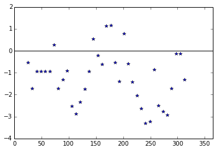


We have made the mismatch go down a little ...

Clearly it would be tedious (and impractical) to do a lot of such
tweaking, so we can use methods that seek the minimum of some function.

One such method is implemented in ``scipy.optimize.leastsq``:

.. code:: python

    from scipy import optimize
    
    # initial estimate is in p
    print 'initial parameters:',p[0],p[1],p[2],p[3],p[4],p[5]
    
    # set some bounds for the parameters
    bound = np.array([(0.,10.),(0.,10.),(0.01,1.),\
                      (50.,300.),(0.01,1.),(50.,300.)])
    
    
    # test pixel
    r = 472
    c = 84
    
    
    y = data[:,r,c]
    mask = ~y.mask
    y = np.array(y[mask])
    x = (np.arange(46)*8+1.)[mask]
    unc = np.array(sd[:,r,c][mask])
    
    # define function to give Z^2
    
    def sse(p,x,y,unc):
        '''Sum of squared error'''
        # penalise p[3] > p[5]
        err = np.max([0.,(p[3] - p[5])])*1e4
        return (mismatch_function(p,x,y,unc)**2).sum()+err
    
    # we pass the function:
    #
    # sse               : the name of the function we wrote to give 
    #                     sum of squares of Z_i
    # p                 : an initial estimate of the parameters
    # args=(x,y,unc)    : the other information (other than p) that
    #                     mismatch_function needs
    # approx_grad       : if we dont have a function for the gradien
    #                     we have to get the solver to approximate it
    #                     which takes time ... see if you can work out
    #                     d_sse / dp and use that to speed this up!
    
    psolve = optimize.fmin_l_bfgs_b(sse,p,approx_grad=True,iprint=-1,\
                                    args=(x,y,unc),bounds=bound)
    
    print psolve[1]
    pp = psolve[0]
    plt.plot(x,y,'*')
    plt.errorbar(x,y,unc*1.96)
    y_hat = dbl_logistic_model(pp,x_full)
    plt.plot(x_full,y_hat)
    
    print 'solved parameters: ',pp[0],pp[1],pp[2],pp[3],pp[4],pp[5]
    
    # if we define the phenology as the parameter p[3]
    # and the 'length' of the growing season:
    print 'phenology',pp[3],pp[5]-pp[3]

.. parsed-literal::

    initial parameters: 0.468054306457 1.78821571141 0.19 140.0 0.13 220.0
    23.2758024553
    solved parameters:  0.615259703304 2.86129713068 0.035948726095 158.837861729 0.0384066709502 227.612228424
    phenology 158.837861729 68.7743666946


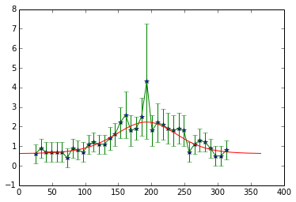


.. code:: python

    # and run over each pixel ... this will take some time
    
    # pixels that have some data
    mask = (~data.mask).sum(axis=0)
    
    pdata = np.zeros((7,) + mask.shape)
    
    rows,cols = np.where(mask>0)
    len_x = len(rows)
    
    # lets just do some random ones to start with
    #rows = rows[::10]
    #cols = cols[::10]
    
    len_x = len(rows)
    
    
    for i in xrange(len_x):
        r,c = rows[i],cols[i]
        # progress bar
        if i%(len_x/40) == 0:
            print '... %4.2f percent'%(i*100./float(len_x))
        
        y = data[:,r,c]
        mask = ~y.mask
        y = np.array(y[mask])
        x = (np.arange(46)*8+1.)[mask]
        unc = np.array(sd[:,r,c][mask])
        
        # need to get an initial estimate of the parameters
        
        # some stats on y
        ysd = np.std(y)
        ymean = np.mean(y)
    
        p[0] = ymean - 1.151*ysd;   # minimum  (1.151 is 75% CI)
        p[1] = 2*1.151*ysd          # range
        p[2] = 0.19                 # related to up slope
        p[3] = 140                  # midpoint of up slope
        p[4] = 0.13                 # related to down slope
        p[5] = 220                  # midpoint of down slope
    
        
        # set factr to quite large number (relative error in solution)
        # as it'll take too long otherwise
        psolve = optimize.fmin_l_bfgs_b(sse,p,approx_grad=True,iprint=-1,\
                                    args=(x,y,unc),bounds=bound,factr=1e12)
    
        pdata[:-1,rows[i],cols[i]] = psolve[0]
        pdata[-1,rows[i],cols[i]] = psolve[1] # sse


.. parsed-literal::

    ... 0.00 percent
    ... 2.50 percent
    ... 5.00 percent

.. code:: python

    plt.figure(figsize=(10,10))
    plt.imshow(pdata[3],interpolation='none',vmin=137,vmax=141)
    plt.title('green up doy')
    plt.colorbar()
    
    plt.figure(figsize=(10,10))
    plt.imshow(pdata[5]-pdata[3],interpolation='none',vmin=74,vmax=84)
    plt.title('season length')
    plt.colorbar()
    
    plt.figure(figsize=(10,10))
    plt.imshow(pdata[0],interpolation='none',vmin=0.,vmax=6.)
    plt.title('min LAI')
    plt.colorbar()
    
    plt.figure(figsize=(10,10))
    plt.imshow(pdata[1]+pdata[0],interpolation='none',vmin=0.,vmax=6.)
    plt.title('max LAI')
    plt.colorbar()
    
    plt.figure(figsize=(10,10))
    plt.imshow(np.sqrt(pdata[-1]),interpolation='none',vmax=np.sqrt(500))
    plt.title('RSSE')
    plt.colorbar()
.. code:: python

    # check a few pixels
    
    c = 200
    
    for r in xrange(200,400,25):
        y = data[:,r,c]
        mask = ~y.mask
        y = np.array(y[mask])
        x = (np.arange(46)*8+1.)[mask]
        unc = np.array(sd[:,r,c][mask])
        
        x_full = np.arange(1,366) 
        
        # some default values for the parameters
        pp = pdata[:-1,r,c]
        plt.figure(figsize=(7,7))
        plt.title('r %d c %d'%(r,c))
        plt.plot(x,y,'*')
        plt.errorbar(x,y,unc*1.96)
        y_hat = dbl_logistic_model(pp,x_full)
        plt.plot(x_full,y_hat)
        
        print 'solved parameters: ',pp[0],pp[1],pp[2],pp[3],pp[4],pp[5]
        
        # if we define the phenology as the parameter p[3]
        # and the 'length' of the growing season:
        print 'phenology',pp[3],pp[5]-pp[3]
