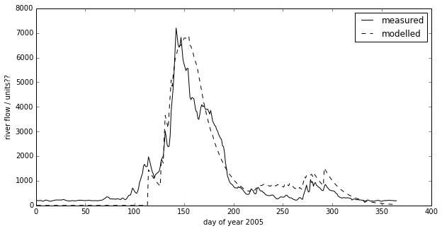
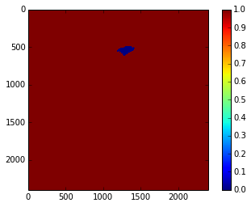

6a. Assessed Practical
======================

6.1 Introduction
----------------

6.1.1 Site, Data and Task overview
~~~~~~~~~~~~~~~~~~~~~~~~~~~~~~~~~~

These notes describe the practical you must submit for assessment in
this course.

The practical comes in two parts: (1) data preparation; (2) modelling.

It is important that you complete both parts of this exercise, as you
will need to make use of the code and results in the work you submit for
assessment for this course.

-  **Data Preparation**

   The first task you must complete is to produce a dataset of the
   proportion of HUC catchment 13010001 (Rio Grande headwaters in
   Colorado, USA) that is covered by snow for **two consecutive years**,
   along with associated datasets on temperature (in C) and river
   discharge at the Del Norte monitoring station. You **may not** use
   data from the year 2005, as this is given to you in the illustrations
   above.

   The dataset you produce must have a value for the mean snow cover,
   temperature and discharge in the catchment for every day over each
   year.

   Your write up **must** include fully labelled graph(s) of snow cover,
   temperature and discharge for the catchment for each year (with units
   as appropriate), along with some summary statistics (e.g. mean or
   median, minimum, maximum, and the timing of these).

   You **must** provide evidence of how you got these data (i.e. the
   code and commands you ran to produce the data).

-  **Modelling**

   You will have prepared two years of data above. Use one of these
   years to calibrate the (snowmelt) hydrological model (described
   below) and one year to test it.

   The model parameter estimate *must* be objective (i.e. you can't just
   arbitrarily choose a set) and ideally optimal, and you *must* state
   the equation of the cost function you will try to minimise and
   explain the approach used.

   You **must** state the values of the model parameters that you have
   estimated and show evidence for how you went about calculating them.
   Ideally, you should also state the uncertainty in these parameter
   estimates (not critical to pass this section though).

   You **must** quantify the goodness of fit between your measured flow
   data and that produced by your model, booth for the calibration
   exercise and the validation.

You **must** work individually on this task. If you do not, it will be
treated as plagiarism. By reading these instructions for this exercise,
we assume that you are aware of the UCL rules on plagiarism. You can
find more information on this matter in your student handbook. If in
doubt about what might constitute plagiarism, ask one of the course
convenors.

What you are going to do is to build, calibrate and test a (snowmelt)
hydrological model, driven by observations in the Rio Grande Headwaters
in Colorado, USA.

**You will need to process two years of data (N.B. *not* 2005 as that is
given in the illustrations).**

The purpose of the model is to describe the streamflow at the Del Norte
measurement station, just on the edge of the catchment.

The average climate for Del Norte is:

.. figure:: files/images/usco0103climatedelnorte.png
   :alt: 

Further general information is available from various
`websites <http://www.usclimatedata.com/climate.php?location=USCO0103>`__,
including
`NOAA <http://www4.ncdc.noaa.gov/cgi-win/wwcgi.dll?wwDI~StnSrch~StnID~10100138>`__.

You can visualise the site
`here <http://mesonet.agron.iastate.edu/sites/site.php?station=CO2184&network=COCLIMATE>`__.

First then, we should look at the streamflow data. These data are in the
file `delnorte.dat <files/data/delnorte.dat>`__ for the years 2000 to
2010 inclusive. You can get further data from http://waterdata.usgs.gov
if you wish.

.. code:: python

    # load a pre-cooked version of the data for 2005 (NB -- Dont use this year!!!
    # except perhaps for testing)
    
    # load the data from a pickle file
    import pickle
    pkl_file = open('data/data.pkl', 'rb')
    data = pickle.load(pkl_file)
    pkl_file.close()
    
    # set up plot
    plt.figure(figsize=(10,7))
    plt.xlim(data['doy'][0],data['doy'][-1]+1)
    plt.xlabel('day of year 2005')
    
    # plot data
    plt.plot(data['doy'],data['temp'],'r',label='temperature / C')
    plt.plot(data['doy'],data['snowprop']*100,'b',label='snow cover %')
    plt.plot(data['doy'],100-data['snowprop']*100,'c',label='snow free cover %')
    plt.plot(data['doy'],data['flow']/100.,'g',label='river flow / 100')
    
    
    plt.legend(loc='best')

::


    ---------------------------------------------------------------------------
    IOError                                   Traceback (most recent call last)

    <ipython-input-1-5000a1503e2d> in <module>()
          4 # load the data from a pickle file
          5 import pickle
    ----> 6 pkl_file = open('data/data.pkl', 'rb')
          7 data = pickle.load(pkl_file)
          8 pkl_file.close()


    IOError: [Errno 2] No such file or directory: 'data/data.pkl'


we have plotted the streamflow (scaled) in green, the snow cover in
blue, and the non snow cover in cyan and the temperature in red. It
should be apparent that thge hydrology is snow melt dominated, and to
describe this (i.e. to build the simplest possible model) we can
probably just apply some time lag function to the snow cover.

6.1.2 The Model
~~~~~~~~~~~~~~~

We will build a mass balance model, in terms of 'snow water equivalent':

The basis of a model is going to be something of the form:

.. math::


   SWE = k * snowProportion

where :math:`SWE` is the 'snow water equivalent', the amount of snow in
the entire snow pack in the catchment. :math:`snowProportion` here then,
is the proportion of snow cover in the catchment. We lump together
density and volume terms into the coefficient :math:`k`.

:math:`SWE` then is the 'mass' (of water) that is available for melting
on a particular day. We can obtain :math:`snowProportion` from satellite
data, so we only need the area / density term :math:`k`, which we can
suppose to be constant over time.

The simplest model of snowmelt is one where we assume that a proportion
of this :math:`SWE` is released (melted) as a function of temperature.
In its simplest form, this is simply a temperature threshold:

``meltDays = np.where(temperature > tempThresh)[0]``

On these melt days then, we add ``k * snowProportion`` of water into the
system. For the present, we will ignore direct precipitation. So:

``for d in meltDays:     water = K * snowProportion[d]``

Now we have a mechanism to release snow melt into the catchment, but
there will always be some delay in the water reaching the monitoring
station from far away regions, compared to nearby areas. The function
that describes this delay can be called a network response function. It
is often modelled as a Laplace function (an exponential). The idea is
that if we have a 'flash' input to the catchment, this `network response
function <http://www.google.co.uk/search?q=network+response+function&ie=utf-8&oe=utf-8&aq=t&rls=org.mozilla:en-US:official&client=firefox-a#sclient=psy-ab&hl=en&client=firefox-a&hs=qgI&rls=org.mozilla:en-US%3Aofficial&source=hp&q=network+response+function+hydrology&pbx=1&oq=network+response+function+hydrology&aq=f&aqi=&aql=&gs_sm=e&gs_upl=2213l4483l0l4547l10l9l0l0l0l0l226l961l6.2.1l9l0&bav=on.2,or.r_gc.r_pw.r_cp.,cf.osb&fp=d48ede2c1f2a6462&biw=1098&bih=673>`__
will give us what we would measure as a hydrograph at the monitoring
station (or elsewhere).

We can parameterise this with a decay factor, p, so that if the amount
of water on day d is 1, the amount on day d+1 is p, on d+2, p^2 etc:

``n = np.arange(len(snowProportion)) - d m = p ** n m[np.where(n<0)]=0``

so here, ``m`` is the decay function:

.. figure:: files/images/laplace.png
   :alt: 

for day 150. This model will transfer a large amount of water of the
peak day, then less and less as time goes by. So, a simple model then is
of the form:

.. code:: python

    def model_accum(data,tempThresh,k,p):
        meltDays = np.where(data['temp'] > tempThresh)[0]
        accum = data['snowprop']*0.
        for d in meltDays:
            water = k * data['snowprop'][d]
            n = np.arange(len(data['snowprop'])) - d
            m = p ** n
            m[np.where(n<0)]=0
            accum += m * water
        return accum
    
    
    tempThresh = 8.5
    k = 2000.0
    p = 0.95
    
    # test it
    accum = model_accum(data,tempThresh,k,p)
This is a very simple model. It has three parameters (``tempThresh``,
``k``, ``p``) and is driven only by temperature and snow cover data. And
yet, we see that even with a rough guess at what the parameters ought to
be, we can get a reasonable match with the observed flow data:

.. code:: python

    plt.figure(figsize=(10,5))
    plt.plot(data['doy'],data['flow'],'k',label='measured')
    plt.plot(data['doy'],accum,'k--',label='modelled')
    plt.ylabel('river flow / units??')
    plt.xlabel('day of year 2005')
    plt.legend(loc='best')


.. parsed-literal::

    <matplotlib.legend.Legend at 0x1c0b4ed0>





6.2 Data Preparation
--------------------

6.2.1 Statement of the task
~~~~~~~~~~~~~~~~~~~~~~~~~~~

The first task you must complete is to produce a dataset of the
proportion of HUC catchment 13010001 (Rio Grande headwaters) that is
covered by snow for **two years**, along with associated datasets on
temperature and river discharge at the Del Norte monitoring station.

The dataset you produce must have a value for the mean snow cover,
temperature and discharge in the catchment for every day over each year.

Your write up **must** include a fully labelled graph of snow cover,
temperature and discharge for the catchment for each year, along with
some summary statistics (e.g. mean or median, minimum, maximum, and the
timing of these).

.. figure:: files/images/snow.png
   :alt: 

You should aim to complete this task soon after Reading Week.

6.2.2 Some Advice
~~~~~~~~~~~~~~~~~

You would probably want to use a **daily** snow product for this task,
such as that available from MODIS, so make sure you know what that is
and explore the characteristics of the dataset.

You will notice from the figure above (the figure should give you some
clue as to a suitable data product) that there will be areas of each
image for which you have no information (described in the dataset QC).
You will need to decide what to do about 'missing data'. For instance,
you might consider interpolating over missing values.

The simplest thing might be to produce a mean snow cover over what
samples are available (ignoring the missing values). But whilst that may
be sufficient to pass this section, it is far from ideal.

Whilst you only need to produce an average daily value for the
catchment, a better approach would be to try to estimate snow cover for
each pixel in the catchment (e.g. so you could do spatially explicit
modelling with such data). I stress that this is not strictly necessary,
but would be an interesting thing to do if you feel able.

However you decide to process the data, you must give a rationale for
why you have taken the approach you have done.

You will notice that if you use MODIS data, you have access to both data
from Terra (MOD10A) and Aqua (MYD10A), which potentially gives you two
samples per day. Think about how to take that into account. Again, the
simplest thing to do might be to just use one of these. That is likely
to be sufficient, but it would be much better to include both datasets.

You should be able to hunt around to find the temperature and discharge
data you want, but we take you through finding them in the advice below.

6.2.3 Data Advice
~~~~~~~~~~~~~~~~~

6.2.3.1 MODIS snow cover data
^^^^^^^^^^^^^^^^^^^^^^^^^^^^^

For MODIS data, you will need to work out which data product you want
and how to download it. To help you with this, we have included urls of
the MODIS Terra snow data product ``MOD10A1`` and Aqua product
``MYD10A1`` in the files ``files/robot_snow.????.txt``:

.. code:: python

    !ls -l data/robot_snow.????.txt

.. parsed-literal::

    -rw-rw-r-- 1 plewis plewis  9034752 Nov  6 09:12 files/data/robot_snow.2000.txt
    -rw-rw-r-- 1 plewis plewis 10820568 Nov  6 09:12 files/data/robot_snow.2001.txt
    -rw-rw-r-- 1 plewis plewis 16321938 Nov  6 09:12 files/data/robot_snow.2002.txt
    -rw-rw-r-- 1 plewis plewis 22423068 Nov  6 09:12 files/data/robot_snow.2003.txt
    -rw-rw-r-- 1 plewis plewis  7633374 Nov  6 09:12 files/data/robot_snow.2004.txt
    -rw-rw-r-- 1 plewis plewis 18872448 Nov  6 09:12 files/data/robot_snow.2005.txt
    -rw-rw-r-- 1 plewis plewis 11433078 Nov  6 09:12 files/data/robot_snow.2006.txt
    -rw-rw-r-- 1 plewis plewis 22663686 Nov  6 09:12 files/data/robot_snow.2007.txt
    -rw-rw-r-- 1 plewis plewis 22668990 Nov  6 09:12 files/data/robot_snow.2008.txt
    -rw-rw-r-- 1 plewis plewis 22705317 Nov  6 09:12 files/data/robot_snow.2009.txt
    -rw-rw-r-- 1 plewis plewis 22712370 Nov  6 09:13 files/data/robot_snow.2010.txt
    -rw-rw-r-- 1 plewis plewis 17129166 Nov  6 09:13 files/data/robot_snow.2011.txt
    -rw-rw-r-- 1 plewis plewis 22756824 Nov  6 09:13 files/data/robot_snow.2012.txt
    -rw-rw-r-- 1 plewis plewis 18104898 Nov  6 09:13 files/data/robot_snow.2013.txt


.. code:: python

    !head -10 < data/robot_snow.2007.txt

.. parsed-literal::

    ftp://n4ftl01u.ecs.nasa.gov/MOSA/MYD10A1.005/2007.01.01/MYD10A1.A2007001.h00v08.005.2008309053908.hdf
    ftp://n4ftl01u.ecs.nasa.gov/MOSA/MYD10A1.005/2007.01.01/MYD10A1.A2007001.h00v09.005.2008309053510.hdf
    ftp://n4ftl01u.ecs.nasa.gov/MOSA/MYD10A1.005/2007.01.01/MYD10A1.A2007001.h00v10.005.2008309053824.hdf
    ftp://n4ftl01u.ecs.nasa.gov/MOSA/MYD10A1.005/2007.01.01/MYD10A1.A2007001.h01v08.005.2008309053759.hdf
    ftp://n4ftl01u.ecs.nasa.gov/MOSA/MYD10A1.005/2007.01.01/MYD10A1.A2007001.h01v09.005.2008309053913.hdf
    ftp://n4ftl01u.ecs.nasa.gov/MOSA/MYD10A1.005/2007.01.01/MYD10A1.A2007001.h01v10.005.2008309053817.hdf
    ftp://n4ftl01u.ecs.nasa.gov/MOSA/MYD10A1.005/2007.01.01/MYD10A1.A2007001.h01v11.005.2008309053918.hdf
    ftp://n4ftl01u.ecs.nasa.gov/MOSA/MYD10A1.005/2007.01.01/MYD10A1.A2007001.h02v06.005.2008309053503.hdf
    ftp://n4ftl01u.ecs.nasa.gov/MOSA/MYD10A1.005/2007.01.01/MYD10A1.A2007001.h02v08.005.2008309053822.hdf
    ftp://n4ftl01u.ecs.nasa.gov/MOSA/MYD10A1.005/2007.01.01/MYD10A1.A2007001.h02v09.005.2008309054221.hdf


We can use the usual tools to explore the MODIS hdf files:

.. code:: python

    import gdal
    target_vector_file = file
    modis_file = 'data/MYD10A1.A2003026.h09v05.005.2008047035848.hdf'
    g = gdal.Open(modis_file)
    data_layer = 'MOD_Grid_Snow_500m:Fractional_Snow_Cover'
    
    subdatasets = g.GetSubDatasets()
    for fname, name in subdatasets:
        print name
        print "\t", fname
    
    fname = 'HDF4_EOS:EOS_GRID:"%s":%s'%(modis_file,data_layer)
    raster = gdal.Open(fname)

.. parsed-literal::

    [2400x2400] Snow_Cover_Daily_Tile MOD_Grid_Snow_500m (8-bit unsigned integer)
    	HDF4_EOS:EOS_GRID:"files/data/MYD10A1.A2003026.h09v05.005.2008047035848.hdf":MOD_Grid_Snow_500m:Snow_Cover_Daily_Tile
    [2400x2400] Snow_Spatial_QA MOD_Grid_Snow_500m (8-bit unsigned integer)
    	HDF4_EOS:EOS_GRID:"files/data/MYD10A1.A2003026.h09v05.005.2008047035848.hdf":MOD_Grid_Snow_500m:Snow_Spatial_QA
    [2400x2400] Snow_Albedo_Daily_Tile MOD_Grid_Snow_500m (8-bit unsigned integer)
    	HDF4_EOS:EOS_GRID:"files/data/MYD10A1.A2003026.h09v05.005.2008047035848.hdf":MOD_Grid_Snow_500m:Snow_Albedo_Daily_Tile
    [2400x2400] Fractional_Snow_Cover MOD_Grid_Snow_500m (8-bit unsigned integer)
    	HDF4_EOS:EOS_GRID:"files/data/MYD10A1.A2003026.h09v05.005.2008047035848.hdf":MOD_Grid_Snow_500m:Fractional_Snow_Cover


6.2.3.2 Boundary Data
^^^^^^^^^^^^^^^^^^^^^

Boundary data, such as catchments, might typically come as `ESRI
shapefiles <http://en.wikipedia.org/wiki/Shapefile>`__ or may be in
other vector formats. There tends to be variable quality among different
databases, but a reliable source for catchment data the USA is the
`USGS <http://water.usgs.gov/GIS/huc.html>`__. One set of catchments in
the tile we have is the Rio Grande headwaters, which we can
`see <http://water.usgs.gov/GIS/huc_rdb.html>`__ has a HUC 8-digit code
of 13010001. The full dataset is easily found from the
`USGS <http://water.usgs.gov/GIS/dsdl/huc250k_shp.zip>`__ or
`locally <files/data/huc250k_shp.zip>`__. Literature and associated data
concerning this area can be found
`here <http://water.usgs.gov/lookup/getwatershed?13010001>`__.
Associated `GIS data are
here <http://water.usgs.gov/lookup/getgislist?type=huc&value=13010001>`__,
including the `watershed boundary
data <http://water.usgs.gov/GIS/dsdl/ds573_wbdhuc8.ZIP>`__.

Data more specific to our particular catchment of interest can be found
on the `Rio Grande Data Project
pages <http://txpub.usgs.gov/USACE/resources.aspx>`__.

You should download the file
`Hydrologic\_Units.zip <http://txpub.usgs.gov/USACE/data/water_resources/Hydrologic_Units.zip>`__
or get this `locally <files/data/Hydrologic_Units.zip>`__. Obviously,
you will need to ``unzip`` this file to get at the shapefile
```Hydrologic_Units/HUC_Polygons.shp`` <files/data/Hydrologic_Units/HUC_Polygons.shp>`__
within it.

You can explore the shape file with the following:

.. code:: python

    !ogrinfo data/Hydrologic_Units/HUC_Polygons.shp HUC_Polygons | head -89 | tail -16

.. parsed-literal::

    OGRFeature(HUC_Polygons):2
      HUC (Integer) = 13010001
      REG_NAME (String) = Rio Grande Region
      SUB_NAME (String) = Rio Grande Headwaters
      ACC_NAME (String) = Rio Grande Headwaters
      CAT_NAME (String) = Rio Grande Headwaters. Colorado.
      HUC2 (Integer) = 13
      HUC4 (Integer) = 1301
      HUC6 (Integer) = 130100
      REG (Integer) = 13
      SUB (Integer) = 1301
      ACC (Integer) = 130100
      CAT (Integer) = 13010001
      CAT_NUM (String) = 13010001
      Shape_Leng (Real) = 313605.66409400001
      Shape_Area (Real) = 3458016895.23000001907


This tells us that we want **HUC feature 2** (catchment 13010001).

We can produce a mask with ``raster_mask``, but in this case, we need to
use a function ``raster_mask2``:

.. code:: python

    import sys
    sys.path.insert(0,'python')
    
    from raster_mask import *
.. code:: python

    m = raster_mask2(fname,\
                    target_vector_file="data/Hydrologic_Units/HUC_Polygons.shp",\
                    attribute_filter=2)

.. code:: python

    plt.imshow(m)
    plt.colorbar()


.. parsed-literal::

    <matplotlib.colorbar.Colorbar instance at 0x2b6b7fcd6cb0>





The catchment is only a very small portion of the dataset, so you should
make sure that you perform masking when you read the dataset in and only
extract the area of data that you want.

6.2.3.3 Discharge Data
^^^^^^^^^^^^^^^^^^^^^^

The river discharge data are in the file
```data/delnorte.dat`` <data/delnorte.dat>`__.

If you examine the file:

.. code:: python

    !head -35 < data/delnorte.dat

.. parsed-literal::

    # ---------------------------------- WARNING ----------------------------------------
    # The data you have obtained from this automated U.S. Geological Survey database
    # have not received Director's approval and as such are provisional and subject to
    # revision.  The data are released on the condition that neither the USGS nor the
    # United States Government may be held liable for any damages resulting from its use.
    # Additional info: http://waterdata.usgs.gov/nwis/help/?provisional
    #
    # File-format description:  http://waterdata.usgs.gov/nwis/?tab_delimited_format_info
    # Automated-retrieval info: http://waterdata.usgs.gov/nwis/?automated_retrieval_info
    #
    # Contact:   gs-w_support_nwisweb@usgs.gov
    # retrieved: 2011-09-30 09:35:31 EDT       (caww02)
    #
    # Data for the following 1 site(s) are contained in this file
    #    USGS 08220000 RIO GRANDE NEAR DEL NORTE, CO
    # -----------------------------------------------------------------------------------
    #
    # Data provided for site 08220000
    #    DD parameter statistic   Description
    #    01   00060     00003     Discharge, cubic feet per second (Mean)
    #
    # Data-value qualification codes included in this output: 
    #     A  Approved for publication -- Processing and review completed.  
    #     e  Value has been estimated.  
    # agency_cd	site_no	datetime	01_00060_00003	01_00060_00003_cd
    # 5s	15s	20d	14n	10s
    USGS	08220000	2000-01-01	190	A:e
    USGS	08220000	2000-01-02	170	A:e
    USGS	08220000	2000-01-03	160	A:e
    USGS	08220000	2000-01-04	160	A:e
    USGS	08220000	2000-01-05	170	A:e
    USGS	08220000	2000-01-06	180	A:e
    USGS	08220000	2000-01-07	170	A:e
    USGS	08220000	2000-01-08	190	A:e
    USGS	08220000	2000-01-09	190	A:e


you will see comment lines that start with ``#``, followed by data
lines.

The easiest way to read these data would be to use:

.. code:: python

    file = 'data/delnorte.dat'
    data = np.loadtxt(file,usecols=(2,3),unpack=True,dtype=str)
.. code:: python

    # so you have the dates in
    data[0]


.. parsed-literal::

    array(['2000-01-01', '2000-01-02', '2000-01-03', ..., '2010-12-29',
           '2010-12-30', '2010-12-31'], 
          dtype='|S10')


.. code:: python

    # and the stream flow in data[1]
    plt.plot(data[1].astype(float))


.. parsed-literal::

    [<matplotlib.lines.Line2D at 0x2b6b7c573950>]


.. image:: Practical_files/Practical_40_1.png


You will need to convert the date field (i.e. the data in ``data[0]``)
into the day of year.

This is readily accomplished using ``datetime``:

.. code:: python

    import datetime
    # transform the first one
    ds = np.array(data[0][0].split('-')).astype(int)
    print ds
    year,doy = datetime.datetime(ds[0],ds[1],ds[2]).strftime('%Y %j').split()
    print year,doy

.. parsed-literal::

    [2000    1    1]
    2000 001


6.2.3.4 Temperature data
^^^^^^^^^^^^^^^^^^^^^^^^

We can directly access temperature data from
`here <http://ccc.atmos.colostate.edu/cgi-bin/dlydb.pl?yrbeg=2000&yrend=2020&station=52184+DEL+NORTE&proc=2+-+List+Format+%28see+docs%29>`__.

The format of ```delNorteT.dat`` <files/data/delNorteT.dat>`__ is given
here.

The first three fields are date fields (``YEAR``, ``MONTH`` and
``DAY``), followed by ``TMAX``, ``TMIN``, ``PRCP``, ``SNOW``, ``SNDP``.

You should read in the temperature data for the days and years that you
want.

For temperature, you might take a **mean of TMAX and TMIN**.

**Note that these are in Fahrenheit. You should convert them to
Celcius.**

Note also that there are missing data (values ``9998`` and ``9999``).
You will need to filter these and interpolate the data in some way. A
median might be a good approach, but any interpolation will suffice.

With that processing then, you should have a dataset, Temperature that
will look something like (in cyan, for the year 2005):

.. figure:: files/images/temperature.png
   :alt: 

6.3 Coursework
--------------

You need to submit you coursework in the usual manner by the usual
submission date.

You **must** work individually on this task. If you do not, it will be
treated as plagiarism. By reading these instructions for this exercise,
we assume that you are aware of the UCL rules on plagiarism. You can
find more information on this matter in your student handbook. If in
doubt about what might constitute plagiarism, ask one of the course
convenors.

6.3.1 Summary of coursework requirements
~~~~~~~~~~~~~~~~~~~~~~~~~~~~~~~~~~~~~~~~

-  **Data Preparation**

   The first task you must complete is to produce a dataset of the
   proportion of HUC catchment 13010001 (Rio Grande headwaters in
   Colorado, USA) that is covered by snow for **two consecutive years**,
   along with associated datasets on temperature (in C) and river
   discharge at the Del Norte monitoring station.

   You **may not** use data from the year 2005, as this is given to you
   in the illustrations above.

   The dataset you produce must have a value for the mean snow cover,
   temperature and discharge in the catchment for every day over each
   year.

   Your write up **must** include fully labelled graph(s) of snow cover,
   temperature and discharge for the catchment for each year (with units
   as appropriate), along with some summary statistics (e.g. mean or
   median, minimum, maximum, and the timing of these).

   You **must** provide evidence of how you got these data (i.e. the
   code and commands you ran to produce the data).

-  **Modelling**

   You will have prepared two years of data above. Use one of these
   years to calibrate the (snowmelt) hydrological model (described
   below) and one year to test it.

   The model parameter estimate *must* be objective (i.e. you can't just
   arbitrarily choose a set) and ideally optimal, and you *must* state
   the equation of the cost function you will try to minimise and
   explain the approach used.

   You **must** state the values of the model parameters that you have
   estimated and show evidence for how you went about calculating them.
   Ideally, you should also state the uncertainty in these parameter
   estimates (not critical to pass this section though).

   You **must** quantify the goodness of fit between your measured flow
   data and that produced by your model, booth for the calibration
   exercise and the validation.

6.3.2 Summary of Advice
~~~~~~~~~~~~~~~~~~~~~~~

The first task involves pulling datasets from different sources. No
individual part of that should be too difficult, but you must put this
together from the material we have done so far. It is more a question of
organisation then.

Perhaps think first about where you want to end up with on this (the
'output'). This might for example be a dictionary with keys ``temp``,
``doy``, ``snow`` and ``flow``, where each of these would be an array
with 365 values (or 366 in a leap year).

Then consider the datasets you have: these are: (i) a stack of MODIS
data with daily observations; (ii) temperature data in a file; (iii)
flow data in a file.

It might be a little fiddly getting the data you want from the flow and
temperature data files, but its not very complicated. You will need to
consider flagging invalid observations and perhaps interpolating between
these.

Processing the MODIS data might take a little more thought, but it is
much the same process. Again, we read the datasets in, trying to make
this efficient on data size by only using the area of the vector data
mask as in a previous exercise. The data reading will be very similar to
reading the MODIS LAI product, but you need to work out and implement
what changes are necessary. As advised abovem you should use the
``raster_mask2()`` function for creating the spatial data masks. Again,
you will need to interpolate or perhaps smooth between observations, and
then process the snow cover proportions to get an average over the
catchment.

The second task revolves around using the model that we have developed
above in the function ``model_accum()``. You have been through previous
examples in Python where you attempt to estimate some model parameters
given an initial estimate of the parameters and some cost function to be
minimised. Solving the model calibration part of problem should follow
those same lines then. Testing (validation) should be easy enough. Don't
forget to include the estimated parameters (and other relevant
information, e.g. your initial estimate, uncertainties if available) in
your write up.

There is quite a lot of data presentation here, and you need to provide
*evidence* that you have done the task. Make sure you use images (e.g.
of snow cover varying), graphs (e.g. modelled and predicted flow, etc.),
and tables (e.g. model parameter estimates) throughout, as appropriate.

If, for some reason, you are unable to complete the first part of the
practical, you should submit what you can for that first part, and
continue with calibrating the model using the 2005 dataset that we used
above. This would be far from ideal as you would not have completed the
required elements for either part in that case, but it would generall be
better than not submitting anything.

6.3.3 Further advice
~~~~~~~~~~~~~~~~~~~~

There is plenty of scope here for going beyond the basic requirements,
if you get time and are interested (and/or want a higher mark!).

You will be given credit for all additional work included in the write
up, **once you have achieved the basic requirements**. So, there is no
point (i.e. you will not get credit for) going off on all sorts of
interesting lines of exploration here *unless* you have first completed
the core task.

6.3.4 Structure of the Report
~~~~~~~~~~~~~~~~~~~~~~~~~~~~~

The required elements of the report are:

::


        Introduction (5%)
        Data Preparation (45%)
        Modelling (45%)
        Discussion/Conclusions (5%)

The figures in brackets indicate the percentage of marks that we will
award for each section of the report.

Introduction (5%)
^^^^^^^^^^^^^^^^^

This should be of around 2-3 pages.

It should introduce the purpose of the study, being at a base level, ‘to
build and calibrate a snow/hydrological model in Python’.

It should provide some background to building models of this sort (their
purpose/role) and include some review of the types of models that might
be built, with reference to the literature (journals).

A pass mark for this section will describe and explain the purpose of
the study and examine some of the context to such modelling, with
appropriate literature being cited. Higher or lower marks will depend on
the depth that this goes into and the clarity of expression.

Data Preparation (45%)
^^^^^^^^^^^^^^^^^^^^^^

This should contain around 3-4 pages of text, other than codes, figures
and tables.

For a pass mark in this section, you must :

-  introduce the study site, giving general site characteristics, with
   appropriate figures.
-  provide an overview of the data used in the study (snow cover,
   temperature, flow data) and produce visualisations of the data you
   are using (images, graphs, tables as appropriate) alongside
   appropriate summary statistics.
-  fully demonstrate how you got these data to this point of processing
   -- i.e. submit appropriate Python codes and/or unix commands that
   when run in the sequence you describe would produce the data you have
   described.

The weighting here on the study site description is 5% and on the rest,
40%.

You can obtain higher marks here by going beyond the basics in your
approaches to the data or modelling. You still need to demonstrate that
you have done the core 'pass' material.

Modelling
^^^^^^^^^

This should contain around 3-4 pages of text, other than codes, figures
and tables.

For a pass mark in this section, you must :

-  provide an overview of the model that is constructed here, explaining
   the role of each parameter.
-  explain the way in which model calibration and validation is to be
   undertaken.
-  provide an overview of results of the calibration and validation
   along with relevant visualisations (images, graphs, tables as
   appropriate).
-  fully demonstrate how you got these results -- i.e. submit
   appropriate Python codes and/or unix commands that when run in the
   sequence you describe would produce the results you have described.

The weighting here is 5% for the model description and on the rest, 40%.

For a mildly improved mark, you should examine and discuss the model
assumptions in the context of any modelling literature you looked at in
the Introduction. For a significantly improved mark, you could try
improving the model.

Discussion and Conclusions
^^^^^^^^^^^^^^^^^^^^^^^^^^

This section should be around 2 pages. It should provide a discussion
and analysis of your results and you should draw appropriate conclusions
from these.

You can also use this section to critique the model/data/methods, and
suggest ways that you would improve things. If you do this, you must
give some indication of how that would be achieved. You will get no
credit for simply saying ‘next time I would make the code more
efficient’, for example.

Very good/excellent marks would normally require you to cite appropriate
literature.

A sufficient effort for a pass would make a reasonable effort at
discussing these results in the context of some literature and draw a
few (non trivial) conclusions from the study.

6.3.5 Computer Code
~~~~~~~~~~~~~~~~~~~

General requirements
^^^^^^^^^^^^^^^^^^^^

You will obviously need to submit computer codes as part of this
assessment. Some flexibility in the style of these codes is to be
expected. For example, some might write a class that encompasses the
functionality for all tasks. Some poeple might have multiple versions of
codes with different functionality. All of these, and other reasonable
variations are allowed.

All codes needed to demonstrate that you have performed the core tasks
are required to be included in the submission. You should include all
codes that you make use of in the main body of the text in the main
body. Any other codes that you want to refer to (e.g. something you
tried out as an enhancement and didn’t quite get there) you can include
in appendices.

All codes should be well-commented. Part of the marks you get for code
will depend on the adequacy of the commenting.

Degree of original work required and plagiarism
^^^^^^^^^^^^^^^^^^^^^^^^^^^^^^^^^^^^^^^^^^^^^^^

If you use a piece of code verbatim that you have taken from the course
pages or any other source, **you must acknowledge this** in comments in
your text. **Not to do so is plagiarism**. Where you have taken some
part (e.g. a few lines) of someone else’s code, **you should also
indicate this**. If some of your code is heavily based on code from
elsewhere, **you must also indicate that**.

Some examples. You may recognise this snippet of code from above.

The first example is guilty of strong plagiarism, it does not seek to
acknowledge the source of this code, even though it is just a direct
copy, pasted into a method called ``model()``:

.. code:: python

    def model(tempThresh=9.0,K=2000.0,p=0.96):
        '''need to comment this further ...
    
        '''
        import numpy as np
        meltDays = np.where(temperature > tempThresh)[0]
        accum = snowProportion*0.
        for d in meltDays:
            water = K * snowProportion[d]
            n = np.arange(len(snowProportion)) - d
            m = p ** n
            m[np.where(n<0)]=0
            accum += m * water
        return accum
This is **not** acceptable.

This should probably be something along the lines of:

.. code:: python

    def model(tempThresh=9.0,K=2000.0,p=0.96):
        '''need to comment this further ...
    
        This code is taken directly from
        "Modelling delay in a hydrological network"
        by P. Lewis http://www2.geog.ucl.ac.uk/~plewis/geogg122/DelNorte.html
        and wrapped into a method.
        '''
        # my code: make sure numpy is imported
        import numpy as np
    
        # code below verbatim from Lewis
        meltDays = np.where(temperature > tempThresh)[0]
        accum = snowProportion*0.
        for d in meltDays:
            water = K * snowProportion[d]
            n = np.arange(len(snowProportion)) - d
            m = p ** n
            m[np.where(n<0)]=0
            accum += m * water
        # my code: return accumulator
        return accum
Now, we acknowledge that this is in essence a direct copy of someone
else’s code, and clearly state this. We do also show that we have added
some new lines to the code, and that we have wrapped this into a method.

In the next example, we have seen that the way m is generated is in fact
rather inefficient, and have re-structured the code. It is partially
developed from the original code, and acknowledges this:

.. code:: python

    def model(tempThresh=9.0,K=2000.0,p=0.96):
        '''need to comment this further ...
    
        This code after the model developed in
        "Modelling delay in a hydrological network"
        by P. Lewis
        http://www2.geog.ucl.ac.uk/~plewis/geogg122/DelNorte.html
    
        My modifications have been to make the filtering more efficient.
        '''
        # my code: make sure numpy is imported
        import numpy as np
    
        # code below verbatim from Lewis unless otherwise indicated
        meltDays = np.where(temperature > tempThresh)[0]
        accum = snowProportion*0.
    
        # my code: pull the filter block out of the loop
        n = np.arange(len(snowProportion))
        m = p ** n
    
        for d in meltDays:
            water = K * snowProportion[d]
    
            # my code: shift the filter on by one day
            # ...do something clever to shift it on by one day
    
            accum += m * water
        # my code: return accumulator
        return accum
This example makes it clear that significant modifications have been
made to the code structure (and probably to its efficiency) although the
basic model and looping comes from an existing piece of code. It clearly
highlights what the actual modifications have been. Note that this is
not a working example!!

Although you are supposed to do this piece of work on your own, there
might be some circumstances under which someone has significantly helped
you to develop the code (e.g. written the main part of it for you &
you’ve just copied that with some minor modifications). You **must**
acknowledge in your code comments if this has happened. On the whole
though, this should not occur, as you **must** complete this work on
your own.

If you take a piece of code from somewhere else and all you do is change
the variable names and/or other cosmetic changes, you **must**
acknowledge the source of the original code (with a URL if available).

Plagiarism in coding is a tricky issue. One reason for that is that
often the best way to learn something like this is to find an example
that someone else has written and adapt that to your purposes. Equally,
if someone has written some tool/library to do what you want to do, it
would generally not be worthwhile for you to write your own but to
concentrate on using that to achieve something new. Even in general code
writing (i.e. when not submitting it as part of your assessment) you and
anyone else who ever has to read your code would find it of value to
make reference to where you found the material to base what you did on.
The key issue to bear in mind in this work, as it is submitted ‘as your
own work’ is that, to avoid being accused of plagiarism and to allow a
fair assessment of what you have done, you must clearly acknowledge
which parts of it are your own, and the degree to which you could claim
them to be your own.

For example, based on ... is absolutely fine, and you would certainly be
given credit for what you have done. In many circumstances ‘taken
verbatim from ...’ would also be fine (provided it is acknowledged) but
then you would be given credit for what you had done with the code that
you had taken from elsewhere (e.g. you find some elegant way of doing
the graphs that someone has written and you make use of it for
presenting your results).

The difference between what you submit here and the code you might write
if this were not a piece submitted for assessment is that you the vast
majority of the credit you will gain for the code will be based on the
degree to which you demonstrate that you can write code to achieve the
required tasks. There would obviously be some credit for taking codes
from the coursenotes and bolting them together into something that
achieves the overall aim: provided that worked, and you had commented it
adequately and acknowledge what the extent of your efforts had been, you
should be able to achieve a pass in that component of the work. If there
was no original input other than vbolting pieces of existing code
together though, you be unlikely to achieve more than a pass. If you get
less than a pass in another component of the coursework, that then puts
you in danger of an overall fail.

Provided you achieve the core tasks, the more original work that you
do/show (that is of good quality), the higher the mark you will get.
Once you have achieved the core tasks, even if you try something and
don’t quite achieve it, is is probably worth including, as you may get
marks for what you have done (or that fact that it was a good or
interesting thing to try to do).

Documentation
^^^^^^^^^^^^^

Note: All methods/functions and classes must be documented for the code
to be adequate. Generally, this will contain:

-  some text on the purpose of the method (/function/class)

-  some text describing the inputs and outputs, including reference to
   any relevant details such as datatype, shape etc where such things
   are of relevance to understanding the code.

-  some text on keywords, e.g.:

.. code:: python

    def complex(real=0.0, imag=0.0):
        """Form a complex number.
    
        Keyword arguments:
        real -- the real part (default 0.0)
        imag -- the imaginary part (default 0.0)
    
        Example taken verbatim from:
        http://www.python.org/dev/peps/pep-0257/
        """
        if imag == 0.0 and real == 0.0: return complex_zero

You should look at the `document on good docstring
conventions <http://www.python.org/dev/peps/pep-0257/>`__ when
considering how to document methods, classes etc.

To demonstrate your documentation, you **must** include the help text
generated by your code after you include the code. e.g.:

.. code:: python

    def print_something(this,stderr=False):
        '''This does something.
    
        Keyword arguments:
        stderr -- set to True to print to stderr (default False)
        '''
    
        if stderr:
            # import sys.stderr
            from sys import stderr
    
            # print to stderr channel, converting this to str
            print >> stderr,str(this)
    
            # job done, return
            return
    
        # print to stdout, converting this to str
        print str(this)
    
        return

Then the help text would be:

.. code:: python

    help(print_something)

.. parsed-literal::

    Help on function print_something in module __main__:
    
    print_something(this, stderr=False)
        This does something.
        
        Keyword arguments:
        stderr -- set to True to print to stderr (default False)
    


The above example represents a ‘good’ level of commenting as the code
broadly adheres to the style suggestions and most of the major features
are covered. It is not quite ‘very good/excellent’ as the description of
the purpose of the method (rather important) is trivial and it fails to
describe the input this in any way. An excellent piece would do all of
these things, and might well tell us about any dependencies (e.g.
requires sys if stderr set to True).

An inadequate example would be:

.. code:: python

    def print_something(this,stderr=False):
        '''This prints something'''
        if stderr:
            from sys import stderr
            print >> stderr,str(this)
            return
        print str(this)
It is inadequate because it still only has a trivial description of the
purpose of the method, it tells us nothing about inputs/outputs and
there is no commenting inside the method.

Word limit
^^^^^^^^^^

There is no word limit per se on the computer codes, though as with all
writing, you should try to be succint rather than overly verbose.

Code style
^^^^^^^^^^

A good to excellent piece of code would take into account issues raised
in the `style guide <http://www.python.org/dev/peps/pep-0008/>`__. The
‘degree of excellence’ would depend on how well you take those points on
board.
